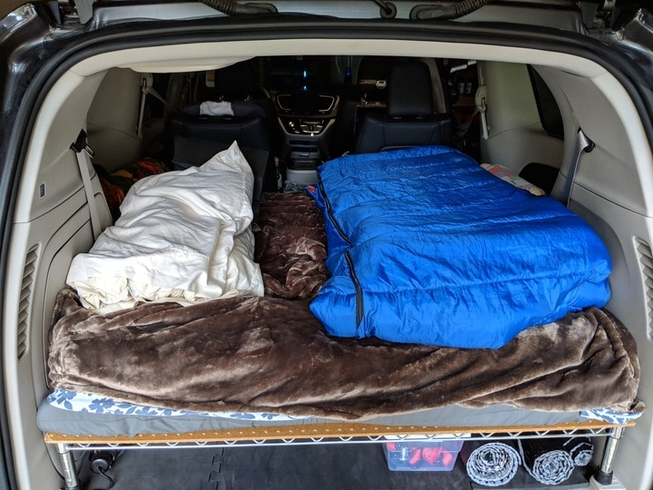
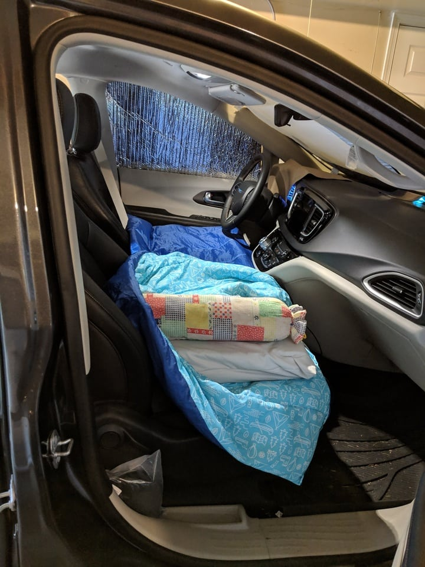
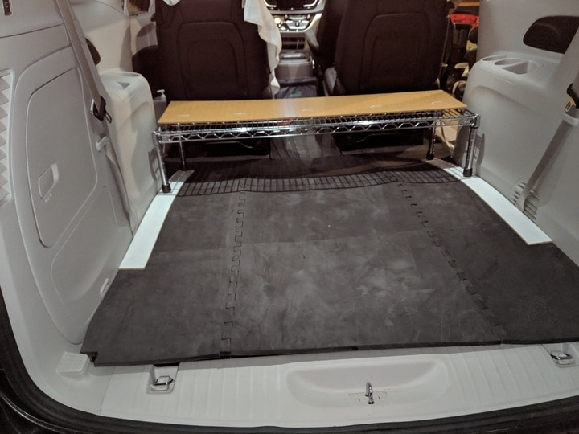
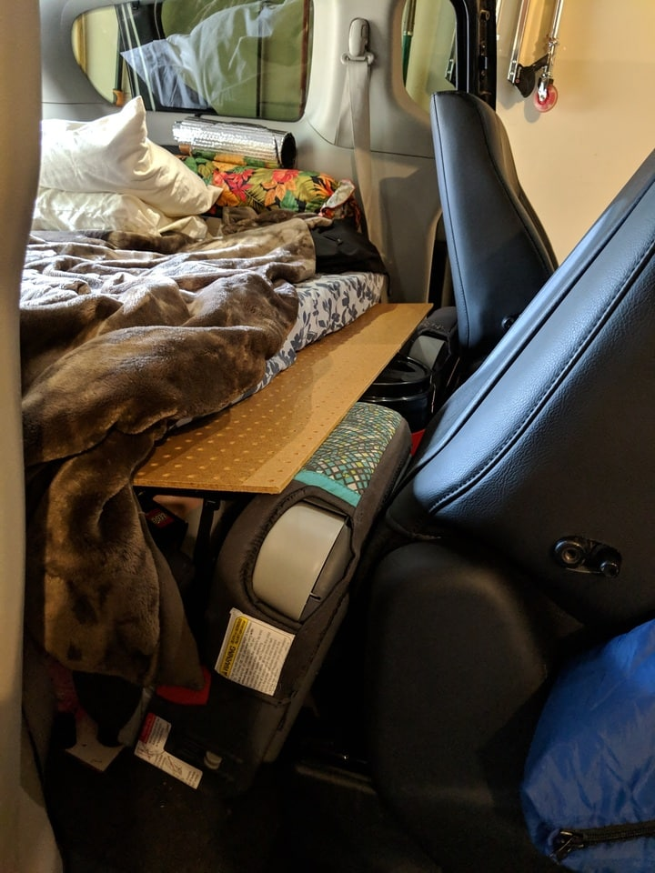
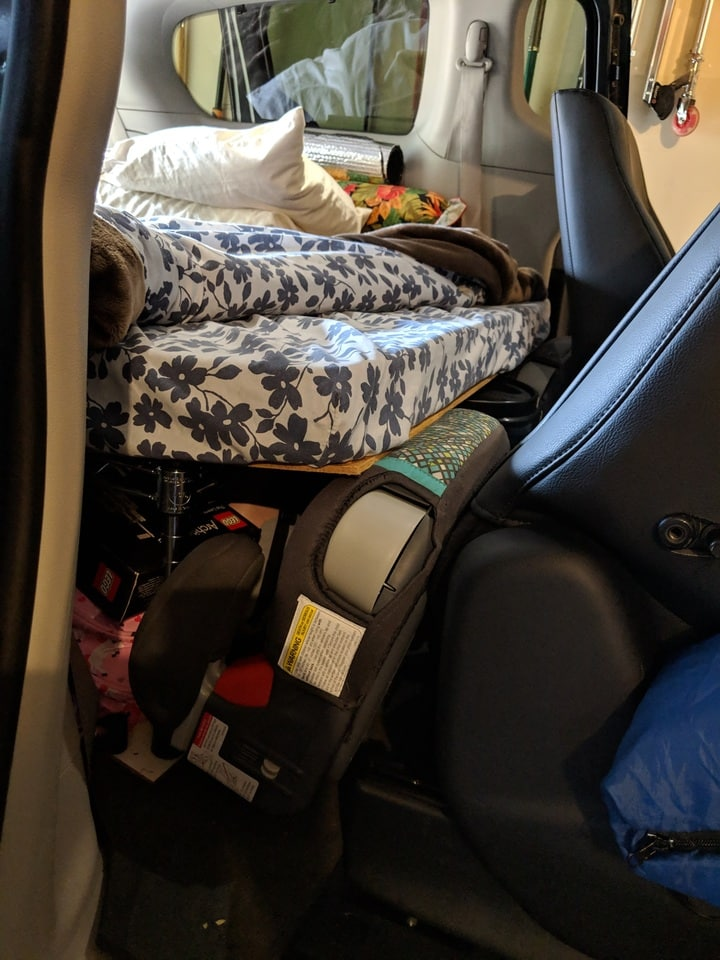
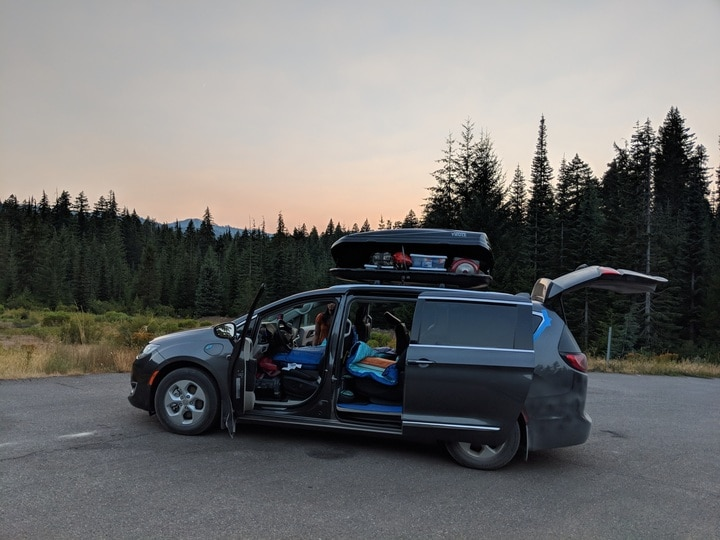

We wanted to be able to sleep in our Pacifica, and for it to be more comfortable and faster to get to bed and get going than a random motel. We're picky sleepers and need our room to be dark, quiet, cool, and the bed to be right. Most motels don't have all of these things right, so we usually don't sleep especially well.

When we can plug our van in, we're very close - our window shades block light, the built-in noise cancellation and fan cover most sounds, the climate system keeps exactly 64F, and we have the same bed and bedding every night. On our last trip, we were set up and in bed 20 minutes after parking. In the morning, we started driving 25 minutes after waking up.

Our van has no bathroom or showers, so we have to find them around us or do without. It's a small space for four people, so we have to take turns getting dressed and can't bring much with us.

Most importantly, we still have to find a place to plug in. When unplugged, if the van is turned on without the brake pressed, the fan runs but the heater and A/C don't. We sleep with the van off and a window cracked and warmer bedding. This loses most of the sound isolation and it isn't much warmer than outside but is more comfortable than a tent. With a down comforter and sleeping bags, we're able to sleep down to lows of about 30F.

Our next goals are to either get the van to heat itself unplugged or learn how to find overnight plug-in parking without a days-in-advance reservation and at a much-lower-than-motel cost. We also need to work out better ways to store our stuff and get changed easily.

## Kid Bed Platforms
The kid bed platforms go across the front and second row seats. They are 17" x 48" OSB boards wrapped with 1/2" foam and custom covers and then inserted into rectangular sleeping bags. They are large enough for the kids (for now, ages 5 and 7) and fully fill the space between the seat backs and the next row up or the dashboard, so they don't move around. The van seat bottoms are not flat, so we bought some triangular foam yoga wedges to provide a flat surface underneath them. The one which goes across the front row also has two square foam pads so that it sits on both the seats and center console.

We originally set up sleeping bags on top of the platforms, but keeping them wrapped around means we keep all the kid bedding together and don't have to pack and unpack it every night.

## Adult Bed Platform
We initially tried sleeping behind the second row seats on our camping pads, but that didn't work. There's not enough length from the trunk lid to the second row seat bases for me (5' 10") to stretch out. The floor slopes downward 8" during that length, which is very hard to flatten out. Finally, there was no room for our stuff unless it was all on top of the bed, which made setup very time consuming.

We built a platform from three 18" x 48" metal rack shelves, with the legs cut to the correct lengths to make a flat surface. It sits from on the plastic pegs just inside the trunk lid to just behind the second row seat bases. 

We used zip ties and a section of pegboard to make a slide out which extends 8" more behind the second row seats. With the pegboard put away, the second row seats can slide back almost as far as normal. With the pegboard forward, our bed extends to a bit behind the second row seats when tilted and slid fully forward, which makes them *just* long enough for me to stretch out. The kids' booster seat bases fill the remaining gap.

On top of the shelves, we added a set of interlocking foam squares so we don't feel the shelf bars and edges, and then put a 3" memory foam mattress pad cut to fit (50"w x 54"l) on top. We cut another 50"w x 8"l foam segment to cover the pegboard slide-out. The mattress still "bottoms out" if I'm sleeping on my side, though I'm adjusting to it. We may add another 1" of firmer foam to prevent this.

The shelf feet started cutting into the floor in the van, so we added rubber feet and then also another set of the interlocking foam cut to fit with strips of melamine on top. This protects the floor of the van and keeps the bed from sinking on one foot or another and becoming uneven after a night or two.

The platform is 7.5" above the floor in the back, allowing us to store six 48L plastic bins (23"w x 16.25"l x 6"h) underneath. We pack bins with clothes, food, or cooking supplies, or we can have things which don't fit (camp stove) by themselves.

## Other Features
To control light, we made window shades from Reflectix for each of the six side windows and the rear window. We spray painted one side matte black, so the shades are subtle when black side out. We bought a normal folding windshield shade for the front. We also cut a few fake leather strips to cover the charging indicator LEDs and the instrument cluster, which can't be turned off when the van is on.

For summer unplugged camping, we bought mosquito screens which fit around the front doors and made screens with a magnetic strip to put over the sliding door windows. We also got a USB powered fan. The van is hotter than outside during the summer, so these help keep temperatures reasonable.

