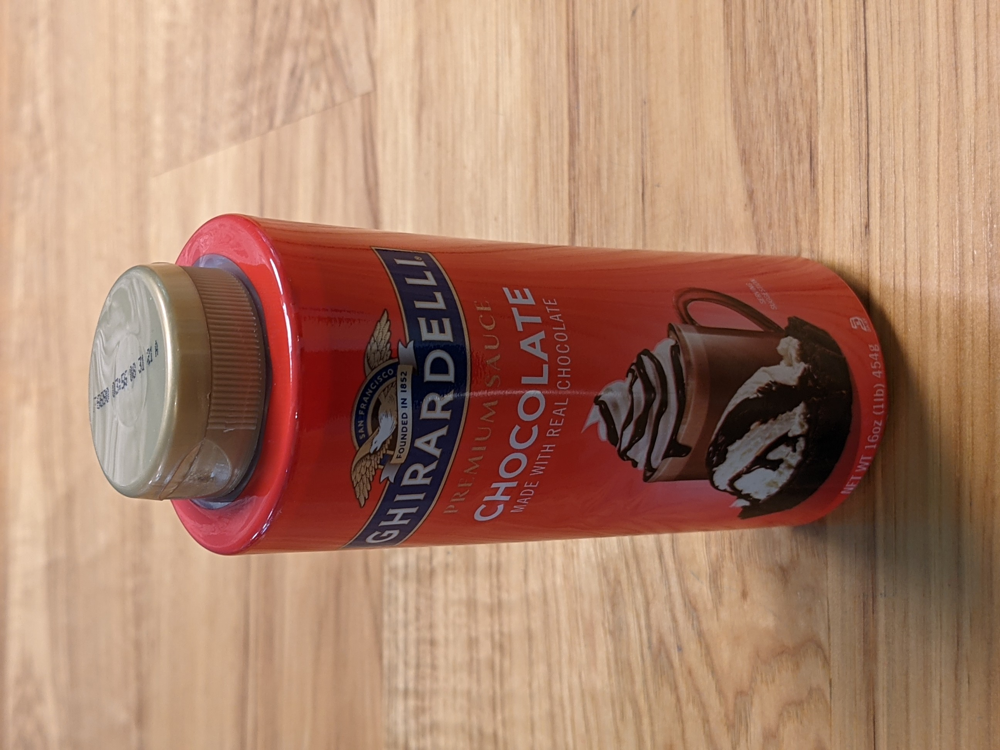
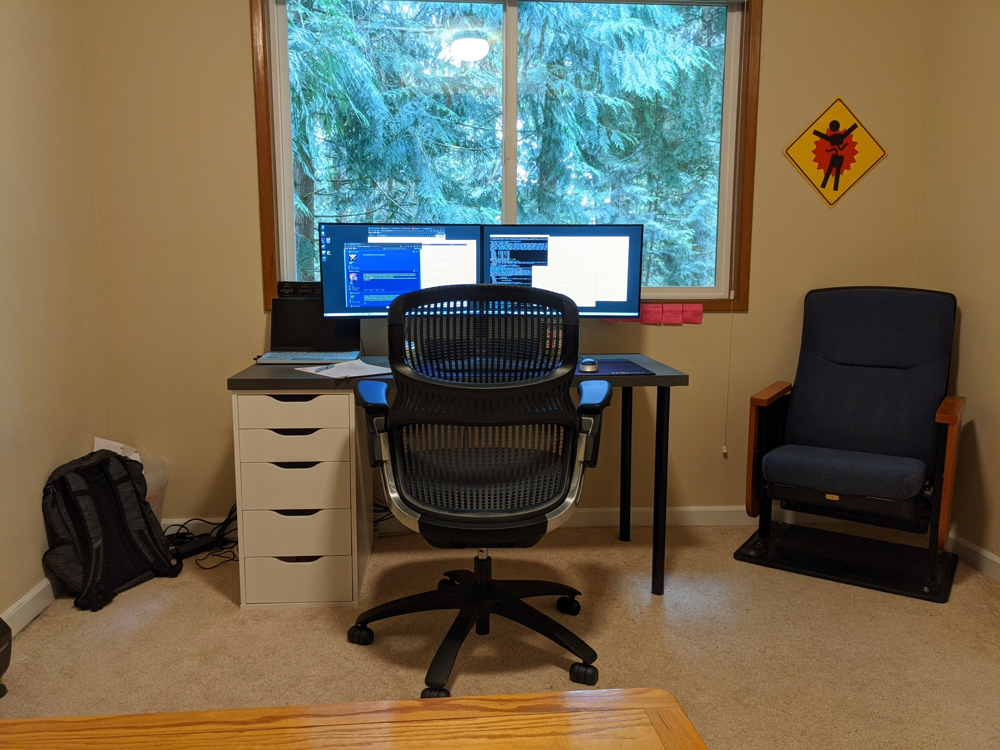
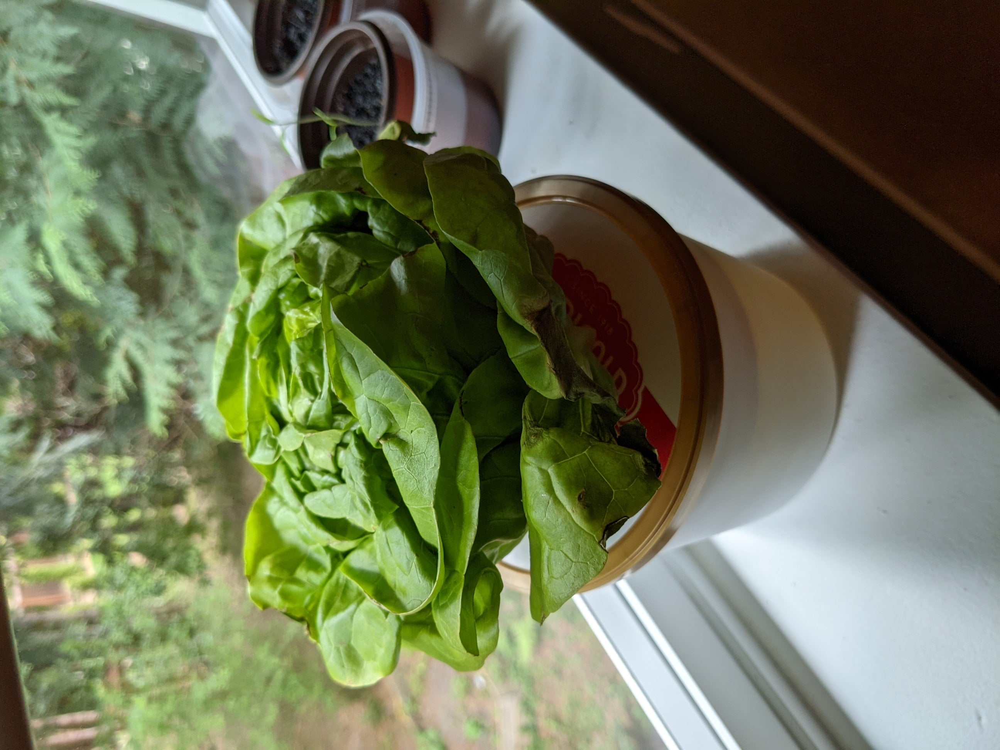
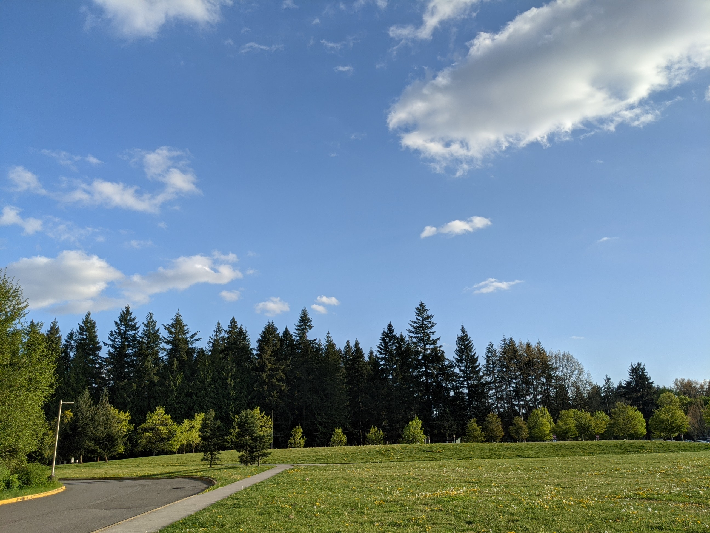

    <label class="orig">Original [856 KB]</label>
    <label class="opt">Optimized [390 KB]</label>
    
    

    <label class="orig">Original [1,037 KB]</label>
    <label class="opt">Optimized [444 KB]</label>
    
    

    <label class="orig">Original [1,395 KB]</label>
    <label class="opt">Optimized [804 KB]</label>
    
    

    <label class="orig">Original [1,315 KB]</label>
    <label class="opt">Optimized [748 KB]</label>
    
    

