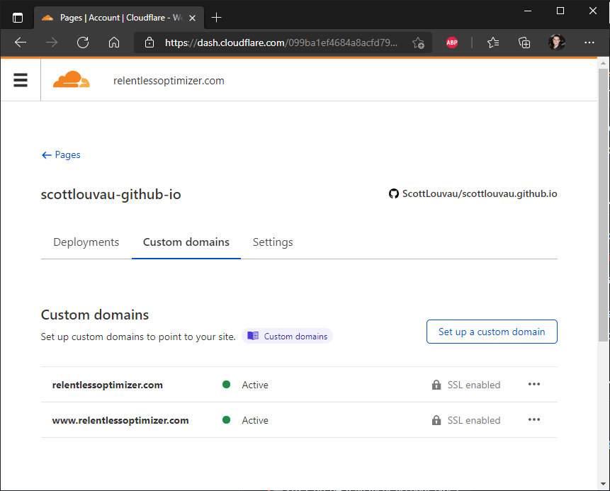

This blog is hosted on CloudFlare Pages with CloudFlare-managed DNS, and I finally have DNS resolution working fully. The documentation was confusing and incomplete - here is what I needed to know.

## Buy Your Custom Domain Early

CloudFlare provides DNS hosting and domain management, but you can't (currently) buy a domain from them initially. I had to buy my domain via domain.com, wait **60 days** so that it could be transferred, and then go to CloudFlare to have them take over DNS management. 

CloudFlare Pages requires CloudFlare DNS management for custom domains, so I had to host on GitHub Pages for the first 60 days.

## CloudFlare Configuration

You need DNS entries and you need CloudFlare Pages to know the custom domain names for resolution to fully work. You also want **both** the apex domain (relentlessoptimizer.com) and www (www.relentlessoptimizer.com) to resolve to the website. 

CloudFlare Pages has a "wizard-like" setup process which will do both pieces of configuration, so:

1. Log in to CloudFlare.
2. Select "Pages" on the right side navigation.
3. Select the name of your CloudFlare Pages Site.
4. Select "Custom domains".
5. Select "Set up a custom domain" and follow the steps.
6. Do this for both your apex domain and "www" (relentlessoptimizer.com, www.relentlessoptimizer.com).
7. Wait a while and test the name resolution.

## Why CloudFlare Pages?

I wanted to host on CloudFlare Pages instead of GitHub Pages mostly because:

* CloudFlare offers unlimited bandwidth (vs 100 GB), even in the free tier

* CloudFlare provides basic no-JS analytics

In my brief page performance testing, it looks like CloudFlare provides slightly lower latency globally than GitHub Pages, though they both seem to have globally distributed by site (so it won't take seconds to load in Australia, for example).

## Minor Gotchas

I want to briefly call out a few other problems I ran into setting up the site. 

This blog uses Hugo and is hosted in a GitHub repository. You can get GitHub Pages or CloudFlare Pages to build a Hugo site for you, but the version of Hugo that CloudFlare Pages uses was too old. I ended up setting up a GitHub Action to do the Hugo build and publish the outputs to a branch, and then I deploy to CloudFlare Pages with no build action from that branch.

Also, CloudFlare Pages offers some analytics, but it looks like they don't keep anything longer than 28 days and they aren't really geared to show views per post (just the top few URLs). I'm trying to build my own simple analytics using my Raspberry Pi. More on that in another post.
  