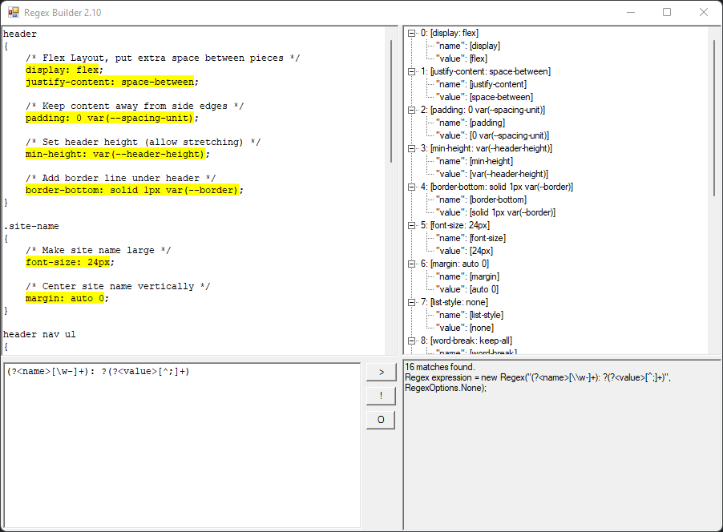

Today I'm [releasing](https://github.com/ScottLouvau/RegexBuilder/releases/tag/v2.10) a new version of [Regex Builder](https://github.com/ScottLouvau/RegexBuilder), **14 years** after the previous release, thanks to an email from a fan. Regular Expressions (regexes) are a powerful way to search text, but also hard to write and **very** hard to debug, kind of like SQL queries. I wrote Regex Builder originally around 2004 (!!) to help me to iterate on regexes more quickly.

I was testing the Visual Studio html editor at the time, and I liked regexes as an easy way to have my tests navigate around in the editor. After too many iterations trying to get a regex to work, I made a little Windows Forms app to let me see matches instantly, so that I could test it against several examples fast. I open sourced the code and made my last release in 2007, and haven't touched it since other than briefly in 2017 to move it to GitHub when the [old hosting site shut down](https://devblogs.microsoft.com/bharry/shutting-down-codeplex/).

Fast forward 14 years. I got an email yesterday thanking me for writing Regex Builder, telling me that the 'help' URLs were broken, and asking for the ability to copy all matches to the clipboard. (Thanks, Serdar, for the great suggestions!)

In most of my programming experience, owning a software product has been like owning a house - constant maintenance to keep it working against the relentless forces of decay. I built a tool with a web front end in 2012, and by 2014 I couldn't get the front end to compile without an unknown amount of effort.

I was about to reply to my user to say that it would be too hard to update the tool when I decided to just try it, and much to my surprise, Visual Studio 2019 was able to migrate and build the project and .NET 4.7.2 was happy to run it on the very first try.

Today was a reminder for me of how easy maintaining software **could be** if we all cared more about compatibility. I know that Windows Forms had been declared dead and then reincarnated since Regex Builder was first written, so I feel very lucky that the foundations had been rebuilt when I wandered back to get it building again. (Thanks to the .NET and Visual Studio teams for the energy they've put into compatibility, especially recently, to make stories like mine possible.)

Regex Builder is a lot like Windows Forms - there are newer, fancier tools out there to solve the same problem today, but it's simple and focused on helping you solve a problem quickly. If you need to iterate on Regular Expressions often or you have them fail to match when software runs and want to be able to "double-click to debug" them, Regex Builder is under 60 KB and might be worth a look. =)