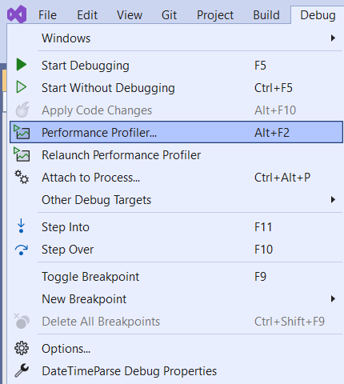
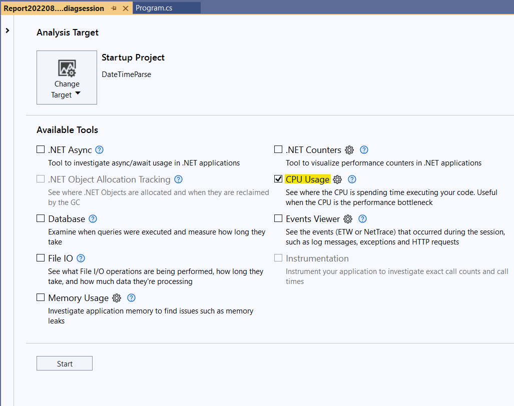
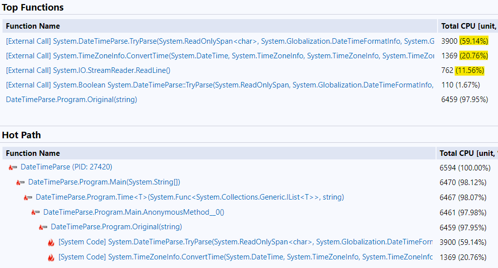
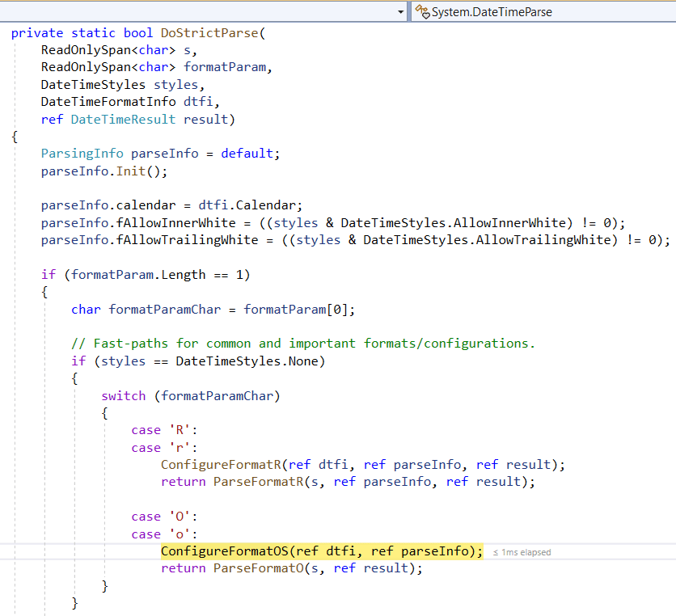
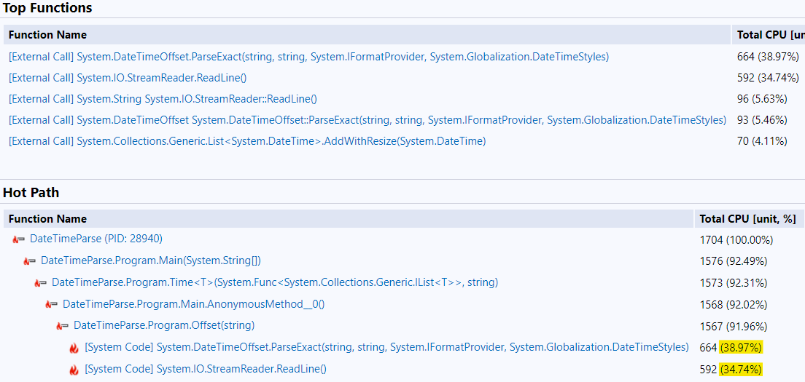
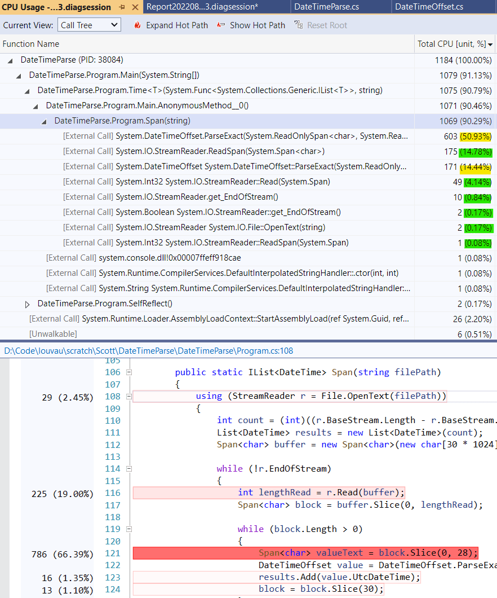
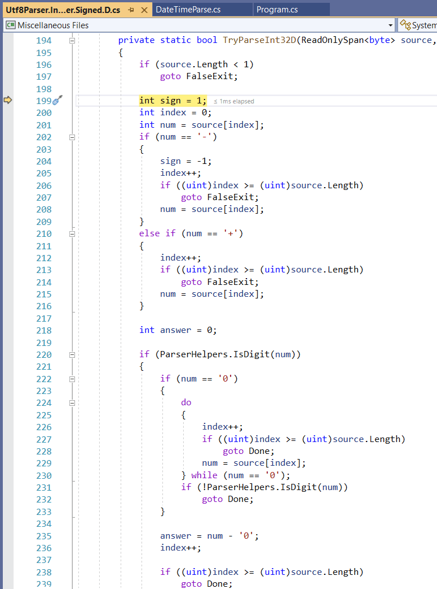
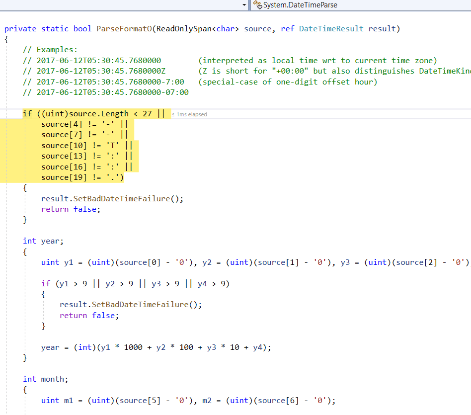
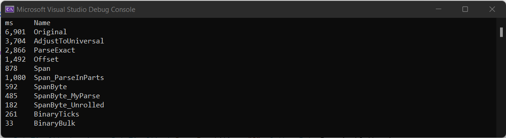

I love the Visual Studio C# Performance Profiler, and am shocked to find out how many engineers around me haven't used it before. It's very easy to quickly check the performance of your code and you'd be amazed how often there are significant performance bottlenecks there that are very easy to fix.

Check out "[How to Optimize Existing Code]()" for an overview of the process, or keep reading to walk through an example with me.

## The Scenario

Your code processes files that contain large numbers of events in a simple text format. Each line starts with a DateTime ("2022-04-14T02:32:53.4028225Z"). The files can be very large - as many as 100 million events - so that the system doesn't have too many files to pass around and manage. You want to count the number of events in different time ranges and quickly find specific events in a time range.

To focus on DateTime parsing as our sole performance problem, we'll work with files with *just* DateTimes in them, instead of the real log files. I'll talk more about that at the end.

## Initial Code

You start with the most common C# APIs for File Operations and Date Parsing - File.OpenText, StreamReader.ReadLine, DateTime.Parse. The DateTimes are converted to the local time zone by DateTime.Parse, which you don't want, so you convert them back with DateTime.ToUniversalTime().

```c#
using (StreamReader r = File.OpenText(filePath))
{
    List<DateTime> results = new List<DateTime>();

    while (true)
    {
        string? line = r.ReadLine();
        if (line == null) { break; }

        DateTime value = DateTime.Parse(line).ToUniversalTime();
        results.Add(value);
    }

    return results;
}
```

You run this on a sample log with 100 million DateTimes, and it takes **69 seconds**. This isn't terrible, but you would like to be able to go through a file in just a second or two if possible. Could that be achieved?

You make a scaled sample of **10 million DateTimes**, which takes 6.9 seconds (6,901 milliseconds) to parse, and run it under the Performance Profiler in Visual Studio (which is even in the free Community Edition). 

If our goal for 100 million DateTimes is two seconds, we would need to parse 10 million in **200 ms**. This means our runtime is currently more than 30x slower than our goal, which might seem very difficult to achieve. Let's see what we can do.

## Profiler Setup

When profiling C#, your runtime will often be spent (ultimately) down in .NET Framework APIs, so you'll want to know what they are doing. To make this easier, set some Tools -> Options to help:

* Enable **Debugging -> General -> Enable .NET Framework Stepping**
* Disable **Debugging -> General -> Enable Just My Code**
* Enable **Debugging -> Symbols -> Microsoft Symbol Servers**

Next, invoke the Profiler from Debug -> Performance Profiler.



Make sure the target it set to your **Console App Project** and **CPU Usage** is enabled, then click Run. For future iterations, select **Debug -> Relaunch Performance Profiler** to re-run immediately.



I'm running on .NET 6.0 on Windows 11 on a 2020 Lenovo IdeaPad Flex 5 (Ryzen 7 4700U, 16 GB RAM) if you'd like to put these results in context.

So, what does the initial code profile look like?

## Initial Code Profile



On the **Hot Path** at the bottom, you can see Program.Original (with my test code) is 98% of the runtime. This means my data isn't muddled by things happening before or after what I want to measure.

Under **Top Functions**, we see 60% of the runtime is in DateTime.TryParse and another 21% is in ConvertTime (probably what ToUniversalTime calls). This means I should focus on the DateTime parsing (as opposed to the I/O) to speed up this code. Since 20% of the runtime is just converting the DateTimes back to UTC, I'll probably get a significant gain by avoiding the change to local time in the first place.

## Different DateTime.Parse arguments

First, we can pass a DateTimeStyle argument to ask .NET to keep the DateTime as Universal - DateTimeStyles.AdjustToUniversal. Does that help?

```c#
using (StreamReader r = File.OpenText(filePath))
{
    List<DateTime> results = new List<DateTime>();

    while (true)
    {
        string? line = r.ReadLine();
        if (line == null) { break; }

        DateTime value = DateTime.Parse(line, CultureInfo.InvariantCulture, DateTimeStyles.AdjustToUniversal);
        results.Add(value);
    }

    return results;
}
```

The runtime goes down from **6,901 ms** to **3,704 ms**, about twice as fast! 

It's very common that you find significant improvements like this that are very safe and easy to make when you're starting to optimize something. If we didn't need this code to be drastically faster, we could stop right here with twice the speed for about 15 minutes of effort.

## DateTime.ParseExact?

How about if we use DateTime.ParseExact to tell .NET exactly what format to expect? In this case, we're adding a new condition - we will require the DateTimes in the log to be in a specific format, rather than any format that DateTime.Parse accepts. Our logs always have DateTimes like 2022-04-14T02:32:53.4028225Z, so we decide this is a safe restriction.

```c#
using (StreamReader r = File.OpenText(filePath))
{
    List<DateTime> results = new List<DateTime>();

    while (true)
    {
        string? line = r.ReadLine();
        if (line == null) { break; }

        // Fast [~2,550 ms], but returns adjusted to DateTimeKind.Local. Adding DateTimeStyles.AdjustToUniversal makes it much slower [~5,875 ms].
        DateTime value = DateTime.ParseExact(line, "O", CultureInfo.InvariantCulture);//, DateTimeStyles.AdjustToUniversal);

        results.Add(value);
    }

    return results;
}
```

Here we get something interesting. DateTime.ParseExact is faster - the runtime goes from our previous **3,704 ms** to **2,866 ms** - but only **without** the AdjustToUniversal flag. DateTime.Parse was faster with the flag, but DateTime.ParseExact is slower. I stepped into the code and found out why. The code has a "fast path" for the "O" format, but only when the flags are DateTimeStyles.None.



Assuming we really want the DateTimes as UTC in code, this isn't going to work. Note that if we're just looking for DateTimes in a range, it would - we could just convert the range edges to local time.

## DateTimeOffset?

.NET also introduced a newer type called DateTimeOffset, which explicitly encodes the time zone. It's larger (16 bytes instead of 8 bytes per value) but maybe the parsing methods were more recently written and more heavily tuned. Let's try.

```c#
using (StreamReader r = File.OpenText(filePath))
{
    List<DateTime> results = new List<DateTime>();

    while (true)
    {
        string? line = r.ReadLine();
        if (line == null) { break; }

        // ~3,500
        //DateTimeOffset value = DateTimeOffset.Parse(line);

        // ~1,400
        DateTimeOffset value = DateTimeOffset.ParseExact(line, "O", CultureInfo.InvariantCulture);
        results.Add(value.UtcDateTime);
    }

    return results;
}
```

The default DateTimeOffset.Parse overload is (a bit) slower than DateTime.Parse with the flag, but DateTimeOffset.ParseExact is the fastest thing we've seen yet with a nearly zero cost conversion to UTC. We're down from **2,866 ms** to **1,492 ms**, doubling our performance again! Excellent.

Let's run the profiler again to see what the bottlenecks now are with this code.



In this variation, DateTimeOffset.ParseExact and StreamReader.ReadLine now consume about equal time. This means any ReadLine()-based reading of the file will probably take at least 700 ms. Let's switch gears and try to speed up the I/O. As a side effect, this will take us toward different variations of DateTime.Parse, so we might also see gains there.

In .NET, when you read a file and split it into parts, you have to create a new string (and a new copy in memory) for each part. Could we avoid this?

## Span\<char\>

In fact, we can! .NET introduced the Span\<T\> type in .NET Core 2 to help. A Span can reference a whole array or a slice of an array, without copying anything. In the case of File I/O, this means we could read in a big block of a file and then operate on little slices of it without making copies. Span is also a struct, not an object, so Span itself also doesn't need to be allocated.

In this pass I'm going to try a few more improvements. I can see how long the file is, so I will construct the output List\<DateTime\> and pass the capacity so that it doesn't need to resize during the reading. 

Also, I know that each DateTime is 28 characters long, and my files have two bytes for Windows-style newlines, for a total of 30 bytes for each DateTime. Therefore, instead of looking for newlines, I'll read a block from the file and look at each 30 byte chunk, interpreting it as a DateTime. **Note that** again, I'm adding a new requirement - the DateTimes must always be exaclty 28 bytes long (no writing only whole seconds or milliseconds) and the lines but have two byte delimiters (\r\n). I need to check these new requirements to ensure they're ok to assume.

Here's the code I end up with:

```c#
using (StreamReader r = File.OpenText(filePath))
{
    int count = (int)((r.BaseStream.Length - r.BaseStream.Position) / 30);
    List<DateTime> results = new List<DateTime>(count);
    Span<char> buffer = new Span<char>(new char[30 * 1024]);

    while (!r.EndOfStream)
    {
        int lengthRead = r.Read(buffer);
        Span<char> block = buffer.Slice(0, lengthRead);

        while (block.Length > 0)
        {
            Span<char> valueText = block.Slice(0, 28);
            DateTimeOffset value = DateTimeOffset.ParseExact(valueText, "O", CultureInfo.InvariantCulture);
            results.Add(value.UtcDateTime);
            block = block.Slice(30);
        }
    }

    return results;
}
```

The runtime drops from **1,492 ms** to **878 ms**, which is now **7.8x faster than the original code**. How is the runtime split between File I/O and parsing now? The "Hot Path" didn't show enough of the calls under my test method, so I clicked on it to look at the Call Tree View.



I see that 66% of the time is in parsing and about 20% is in File I/O, so we would have to figure out even faster DateTime parsing to make much further progress. 

[Also, quick aside: You can see the code with runtimes annotated below the table. That's great! You can also see the highlight for the 66% is wrong - it's on the Span.Slice line, but it really belongs to DateTimeOffset.ParseExact. When profiling Release code, line number mappings back aren't always right. Trust the table over the highlighted code.] 

Is there anything left we can do?

## Custom DateTime Parsing

We currently require our DateTimes to be a constant format, so what if we skip a lot of DateTime logic and just parse the parts as integers, then construct a DateTime from them?

```c#
using (StreamReader r = File.OpenText(filePath))
{
    int count = (int)((r.BaseStream.Length - r.BaseStream.Position) / 30);
    List<DateTime> results = new List<DateTime>(count);
    Span<char> buffer = new Span<char>(new char[30 * 1024]);

    while (true)
    {
        int lengthRead = r.Read(buffer);
        Span<char> block = buffer.Slice(0, lengthRead);
        if (block.Length == 0) { break; }

        while (block.Length > 0)
        {
            Span<char> t = block.Slice(0, 28);

            DateTime value = new DateTime(
                int.Parse(t.Slice(0, 4), NumberStyles.None),
                int.Parse(t.Slice(5, 2), NumberStyles.None),
                int.Parse(t.Slice(8, 2), NumberStyles.None),
                int.Parse(t.Slice(11, 2), NumberStyles.None),
                int.Parse(t.Slice(14, 2), NumberStyles.None),
                int.Parse(t.Slice(17, 2), NumberStyles.None),
                DateTimeKind.Utc
            );

            // Add sub-seconds (no ctor takes below milliseconds as parts)
            value = value.AddTicks(int.Parse(t.Slice(20, 7), NumberStyles.None));

            results.Add(value);
            block = block.Slice(30);
        }
    }

    return results;
}
```

Here I'm parsing each part separately as an integer. I pass NumberStyles.None to tell .NET it doesn't need to look for a leading plus or minus sign or thousands separators.

The runtime goes from **878 ms** to **1,080 ms**. This approach is **slower**. Sometimes that happens. We need to try something else.

## Span\<byte\>

You might also know that .NET was built before UTF-8 really took off, and so .NET String and Char are two bytes per character (UTF-16, or, more properly, "UCS-2"). Our file on disk is UTF-8 (thankfully) - exactly 300,000,000 bytes for 10,000,000 DateTimes - so .NET is quietly converting the file to UTF-16 as we read it. Would eliminating that conversion be faster?

We might expect this to help the File I/O, but maybe not the parsing. On the other hand, we're now switching to the most recent and likely most optimized parsing methods in the .NET Framework.

After switching to UTF-8 (Span\<byte\> and byte), here's the code:

```c#
using (Stream stream = File.OpenRead(filePath))
{
    int count = (int)((stream.Length - stream.Position) / 30);
    List<DateTime> results = new List<DateTime>(count);

    Span<byte> buffer = new Span<byte>(new byte[30 * 1024]);

    long length = stream.Length;
    while (stream.Position < length)
    {
        int lengthRead = stream.Read(buffer);
        Span<byte> block = buffer.Slice(0, lengthRead);

        while (block.Length > 0)
        {
            Span<byte> t = block.Slice(0, 28);
            int unused = 0;
            bool success = true;

            // Parse and build DateTime from integer parts (year, month, day, ...)
            success &= Utf8Parser.TryParse(t.Slice(0, 4), out int year, out unused);
            success &= Utf8Parser.TryParse(t.Slice(5, 2), out int month, out unused);
            success &= Utf8Parser.TryParse(t.Slice(8, 2), out int day, out unused);
            success &= Utf8Parser.TryParse(t.Slice(11, 2), out int hour, out unused);
            success &= Utf8Parser.TryParse(t.Slice(14, 2), out int minute, out unused);
            success &= Utf8Parser.TryParse(t.Slice(17, 2), out int second, out unused);
            success &= Utf8Parser.TryParse(t.Slice(20, 7), out int ticks, out unused);

            DateTime value = new DateTime(year, month, day, hour, minute, second, DateTimeKind.Utc);
            value = value.AddTicks(ticks);

            if (!success) throw new FormatException("...");

            results.Add(value);
            block = block.Slice(30);
        }
    }

    return results;
}
```

While .NET does not have full DateTime parsing on Span\<byte\>, it does have number parsing, so we can construct the DateTime from parts just like our previous attempt. (And even though that wasn't faster for Span\<char\>, the same idea might work here).

How does it do?

The runtime goes from **878 ms** (Span and DateTimeOffset.ParseExact, our previous best) to **592 ms**. We're now **11.6x faster** than the original code.

We're starting to get close to our 200 ms goal. Note that the code has started to get weirder and more complex with the last few optimizations. Our first changes kept the code pretty clear, but we've started trading higher complexity (and stricter input file requirements) for our gains. It's worth thinking about whether our team will still be comfortable owning and maintaining this code.

## Handwritten Parsing Function

I didn't expect to be able to achieve much more speed parsing DateTimes - we're using some very optimized methods now - but let's  step into the framework code again and see if it's doing any extra work we don't want.



Utf8Parser has code to look for sign characters (but no NumberStyles.None flag to pass) and is designed to stop at the first non-digit (for when you don't know how long the number will be). Could we write a simpler implementation ourselves?

I want to **just parse digits** and only care about stopping on errors after every digit has been chewed through. Here's what that looks like:

```c#
private const byte Zero = (byte)'0';
public static int MyParse(ReadOnlySpan<byte> value, ref bool success)
{
    int result = 0;

    for (int i = 0; i < value.Length; ++i)
    {
        byte digit = (byte)(value[i] - Zero);

        result *= 10;
        result += digit;
        success &= (digit <= 9);
    }

    return result;
}
```

I go through every byte, multiplying the previous sum by 10 and adding the digit. I use the fact that byte is an unsigned type to identify all out of range values with a single condition (digit <= 9). Values before '0' in the UTF-8 table will wrap around as large positive byte values and fail the check.

This is a big step up in change complexity - I've now got a new fundamental method to test. Again it's worth asking if the team will be ok with the additional code, though a number parsing function is about as simple as reimplementing framework code can be. 

Let's start calling this new method and see if we get any gains from it.

```c#
            using (Stream stream = File.OpenRead(filePath))
            {
                int count = (int)((stream.Length - stream.Position) / 30);
                List<DateTime> results = new List<DateTime>(count);

                Span<byte> buffer = new Span<byte>(new byte[30 * 1024]);

                long length = stream.Length;
                while (stream.Position < length)
                {
                    int lengthRead = stream.Read(buffer);
                    Span<byte> block = buffer.Slice(0, lengthRead);

                    while (block.Length > 0)
                    {
                        Span<byte> t = block.Slice(0, 28);
                        bool success = true;

                        DateTime value = new DateTime(
                            MyParse(t.Slice(0, 4), ref success),
                            MyParse(t.Slice(5, 2), ref success),
                            MyParse(t.Slice(8, 2), ref success),
                            MyParse(t.Slice(11, 2), ref success),
                            MyParse(t.Slice(14, 2), ref success),
                            MyParse(t.Slice(17, 2), ref success),
                            DateTimeKind.Utc);

                        // Add sub-seconds (no ctor to pass with other parts)
                        value = value.AddTicks(MyParse(t.Slice(20, 7), ref success));

                        if (!success) throw new FormatException("...");

                        results.Add(value);
                        block = block.Slice(30);
                    }
                }

                return results;
            }
```

The outer method doesn't change much. One good thing is that we could easily change back to Utf8Parser.TryParse if we decided not to keep the custom method later.

The custom parsing brings us down from **592 ms** to **485 ms**. Better, but not a huge improvement for quite a bit more custom code.

## Fully Unrolled Custom Parsing

If we want to keep going, we probably need to drop the loop and hardcode four digits for year, two for month, and so on.This may seem crazy, but the .NET Framework does exactly this in some code paths I was stepping into earlier. Here's where the "fast-path" for DateTimeOffset.ParseExact went:



I'll write this with no error handling at all initially. This will show me the best case performance, allow me to separately see the "tax" for validation as I try to add it, and save me the effort of writing validation at all if the performance is disappointing even without it.

Here's the happy-path-only parsing:

```c#
// 190 with AggressiveInlining vs 320 without
[MethodImpl(MethodImplOptions.AggressiveInlining)]
private static DateTime DateTimeParseOUnrolled(Span<byte> t)
{
    int year = 1000 * t[0] + 100 * t[1] + 10 * t[2] + t[3] - 1111 * Zero;
    int month = 10 * t[5] + t[6] - 11 * Zero;
    int day = 10 * t[8] + t[9] - 11 * Zero;
    int hour = 10 * t[11] + t[12] - 11 * Zero;
    int minute = 10 * t[14] + t[15] - 11 * Zero;
    int second = 10 * t[17] + t[18] - 11 * Zero;

    DateTime value = new DateTime(year, month, day, hour, minute, second, DateTimeKind.Utc);

    // Add sub-seconds (no ctor to pass with other parts)
    int subseconds = 1000000 * t[20] + 100000 * t[21] + 10000 * t[22] + 1000 * t[23] + 100 * t[24] + 10 * t[25] + t[26] - 1111111 * Zero;
    value = value.AddTicks(subseconds);
    return value;
}
```

And the calling method:

```c#
using (Stream stream = File.OpenRead(filePath))
{
    int count = (int)((stream.Length - stream.Position) / 30);
    List<DateTime> results = new List<DateTime>(count);

    Span<byte> buffer = new Span<byte>(new byte[30 * 1024]);

    long length = stream.Length;
    while (stream.Position < length)
    {
        int lengthRead = stream.Read(buffer);
        Span<byte> block = buffer.Slice(0, lengthRead);

        while (block.Length >= 28)
        {
            Span<byte> t = block.Slice(0, 28);
            DateTime value = DateTimeParseOUnrolled(t);

            //if (!success) throw new FormatException("...");

            results.Add(value);
            block = block.Slice(30);
        }
    }

    return results;
}
```

Note my addition of **MethodImplOptions.AggressiveInlining**. I wrote this code inline originally, then refactored it into a method and saw the performance drop by a third. At this point, either method call overhead is starting to matter, or conditions in the calling code (block.Length >= 28) are helping to cut out bounds checks in the inner code, perhaps.

The runtime goes from **485 ms** to **182 ms**, reaching our performance goal.

It's a good thing, too, because I'm not sure where we'd get further gains. The I/O is in bulk with no conversions and no copying, and the DateTime parsing is about as minimal as it could be.

This code would need some detailed comments and to have some validation added back in to really be used. As-is, however, we're now parsing **54 million** text DateTimes per second!

We don't need to go further, but if we did, I would probably choose to start changing the rules about our inputs and outputs. If we were doing this work repeatedly on the same file, could we just save a copy already converted to DateTime instead?

## DateTime UTC Ticks as Binary

To find out, I decided to write a binary file where I write each DateTime.ToUniversalTime().Ticks using BinaryWriter and then read it in with BinaryReader. I might or might not be able to get the provider of the files to send them like this. However, if I'm processing them repeatedly, I could write out this version on the first pass through, and then find it and skip the text file on subsequent passes.

```c#
using (BinaryReader r = new BinaryReader(File.OpenRead(Path.ChangeExtension(filePath, ".bin"))))
{
    int count = (int)((r.BaseStream.Length - r.BaseStream.Position) / 8);

    // Make a List correctly pre-sized
    List<DateTime> results = new List<DateTime>(count);

    // Read UTC ticks values directly and construct DateTimes from them
    for (int i = 0; i < count; ++i)
    {
        long ticks = r.ReadInt64();
        results.Add(new DateTime(ticks, DateTimeKind.Utc));
    }

    return results;
}
```

One nice thing is the code becomes a lot simpler again.

Runtime? **261 ms**, so surprisingly a bit slower than our no-verification text-parsing implementation. We're making separate calls for every 8 byte value, which ultimately limits our speed.

## Binary DateTimes in Bulk

Finally, down to the last option I know how to do. Could we just read the whole file of DateTime Ticks bytes and "cast it" to a DateTime array? Amazingly, yes, modern C# has a way to do that.

We make a DateTime array the correct size, reinterpret it as a byte array, and ask the Stream to read directly into it.

```c#
using (Stream stream = File.OpenRead(Path.ChangeExtension(filePath, ".bin")))
{
    int count = (int)((stream.Length - stream.Position) / 8);

    // Make a DateTime array the correct size
    DateTime[] results = new DateTime[count];

    // Read the Ticks bytes directly into the array, interpreting them as DateTimes with no per-value conversion
    stream.Read(MemoryMarshal.Cast<DateTime, byte>(results.AsSpan()));

    return results;
}
```

If you see "MemoryMarshal" and get nervous, you've got good instincts. This very low level loading is trusting the bytes on disk to be valid, and trusting the .NET representation of DateTimes (and arrays of them) not to change. These are new requirements worth considering carefully. If we temporarily cache copies of the logs in this form, that might be fine. Storing them long term like this may not be safe.

What's the runtime of this craziness? **34 ms!** It's so fast I have to scale up to the full 100M DateTimes to get a reliable measurement. 100M DateTimes in binary is 760 MB and is parsed (well, loaded, really) in 340 ms, which is about 2.2 GB/s. This is as fast as the drive in my laptop can read, so we've hit a hardware limit with this particular variation as well.

## Reshaping the Problem

Note that all of these implementations still build a set of DateTimes. If the real task was to find the rows in a given time range (or count them), we really don't need an array of all of them, and we don't need to decode all of them. We could write a file with, say, only every 32nd DateTime. We load the small file, binary search for the desired range, and then find the exact range bounds in the main file.

If we don't care about full ticks precision, we could ask for the DateTimes with fewer fractional seconds, and save both space and parsing time. The binary format could potentially be represented with four bytes per value instead, though we have to figure out how to expand it back to eight bytes each to load. (Two digit years never hurt anyone, right? /s)

If we find we're often working with small ranges in the files, another really simple idea would be to push back on the 100 million rows per file design. Could we get down to 10 million and still achieve our other goals? Could we keep the smaller files for a while and merge them into big files only after we won't be processing them anymore?

I listed some design decisions up front, but hopefully your engineer mind perked up and wondered if those requirements were really strict and necessary or if they were somewhat flexible if a good enough reason came along.

## What about the other log fields?

We've gone through this whole set of experiments with files with just DateTimes in them. What about the full messages with other fields? It would be slower, obviously. If we know that newlines will appear right before the DateTimes, looking for newlines in a Span\<byte\> can be done very, very quickly with .NET, so we might be able to stay close to the "Unrolled" performance. The file could be much bigger than the DateTimes, however, so we'll be reading many more bytes and we might hit our disk read speed limit.

Another option (along the lines of writing a separate binary file) is we could read the main log once and write a separate file with only the DateTimes in it, which would make exactly this example what we're planning to process. How do we find the rows in the original file, then? We would probably have to write both the DateTimes and a byte offset in the main file where that row could be found.

## Why no multithreading?

You may object that I never tried to multi-thread this method. Why? Basically, I always want to see what I can get from one thread before I add more. If I can reach the goal in one thread, I can leave the other cores for other work, other processes, or requests from other users. In addition, if we can find a way to parallelize above the level of this code, we don't need to parallelize in here. For example, if we're processing multiple logs, we can have one thread work on each file separately with no coordination or merging of results to figure out. 

Speaking of coordination, it's often difficult to write multi-threaded code where the threads aren't sitting around waiting for each other. In **this** case, I could split up a file into chunks, allocate a big, perfectly sized array, and have each thread fill in a segment of it. Many problems aren't this simple. If we don't know exactly how many results there will be or exactly how to split the input evenly, we have more work to do properly merging the results.

If you have a problem where you don't have multi-threading above your code, you can't hit your goal in one thread, and you can figure out how to have threads easily split up the work and coordinate the results, go for it. I would just suggest sticking to one thread first until you hit those limits. =)

## Conclusion

We started with a simple problem - parsing DateTimes - and optimized it dramatically in a series of steps. The changes went from minor alterations that probably any team would be willing to maintain to some pretty weird and bespoke craziness. Such is the world of performance.

What was the overall speedup we achieved?

| ms        | Name                                      | Speedup    | DateTimes/s |
| --------- | ----------------------------------------- | ---------- | ----------- |
| 6,901     | Original                                  | 1.00x      | 1,450,000   |
| 3,704     | AdjustToUniversal                         | 1.86x      | 2,700,000   |
| 2,866     | ParseExact (output not UTC)               | 2.41x      | 3,490,000   |
| **1,492** | **DateTimeOffset**                        | **4.62x**  | 6,720,000   |
| **878**   | **Span<char> + DateTimeOffset**           | **7.86x**  | 11,390,000  |
| 1,080     | Span<char> + int.TryParse parts           | **6.39x**  | 9,260,000   |
| **592**   | **Span<byte> + Utf8Parser**               | **11.66x** | 16,900,000  |
| 485       | Span<byte> + handwritten parse            | 14.23x     | 20,600,000  |
| 182       | Span<byte> + unrolled parse (no checking) | 37.91x     | 54,900,000  |
| 261       | Binary UTC Ticks                          | 26.44x     | 38,300,000  |
| 34        | Binary bulk into DateTime[]               | 202.98x    | 297,000,000 |

So we could get 4.6x faster just by swapping the parsing method (to DateTimeOffset.ParseExact), 7.8x faster by switching to Span for I/O, and 11.6x faster still with standard parsing. Custom code got us to 37.9x, though a production-safe version would need error checking and would be slower.

Finally, loosening the input requirements and switching to binary can get you a 200x speedup on this problem, if really need it, and can load 297 million DateTimes per second.

You might think that optimizing "real code" will not be this simple, but if you take the time to build a simple but realistic console app sample, it can be. (And, seeing how many iterations we went through here, hopefully you can see why that's really important).



If you'd like to try running this yourself, [grab the code](img/DateTimeParse.zip) and try it out. If you find any faster ways to do it, please [let me know](mailto:scottlo@outlook.com)!