*Editor's Note: This is the first guest post from my wife, Darinee!*

Our neighbor gave the kids a couple of light projectors for Christmas, a galaxy one and an aurora one.  They project red, green, blue, and white lights to the ceiling in very organic ways.  They're very cool!  I have since conscripted the aurora projector for the living room.  The projector came with a remote control to adjust things like color, speed, and the stars.  However, who wants another IR remote to store and keep track of?  Not me!  So, I created a WiFi IR remote which I connected with Home Assistant so I can control the projector from anywhere. 

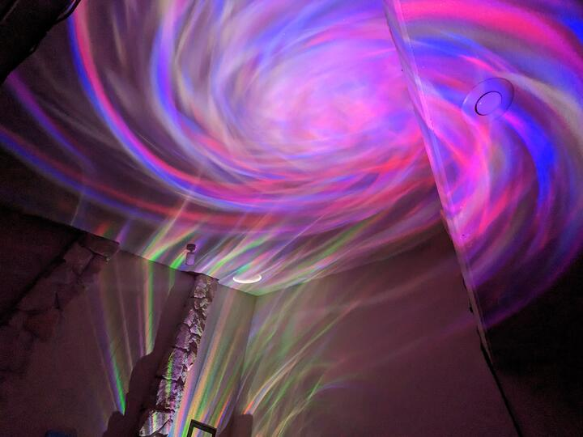

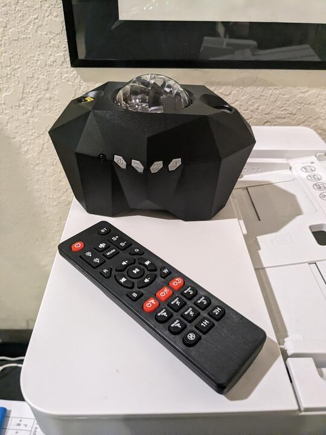

## Reading the Codes

The first thing to do was figure out what kind of remote it was - IR (infrared) or RF (radio).  Since both frequencies are outside visible range, you can't just look at it when you press the button.  But, many phone cameras can ["see" IR](https://www.quora.com/Can-your-phone-camera-see-infrared-light), which may not be good if you're trying to create amazing phone pictures without unintentional interferences, but great for this purpose. And in fact the aurora remote is an IR remote.

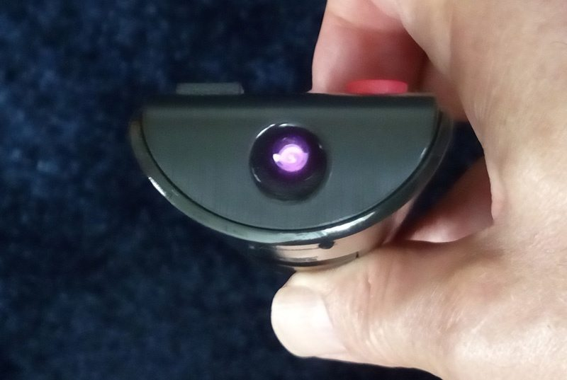 

Next, I needed to figure out what codes are that the remote sends.

I used a D1 Mini (clone) module which uses the ESP8266 microcontroller which I flashed with [Tasmota](https://tasmota.github.io/docs/).  Tasmota is an open-source firmware used for controlling ESP8266- and ESP32-based microcontrollers.  It also supports integration with a home automation hub without the use of an external cloud service.  It provides a web UI to assign functions to pins and can communicate over MQTT.

I had an IR receiver module, so all I had to do was hook it up to one of the pins and assign in the Tasmota configuration.  

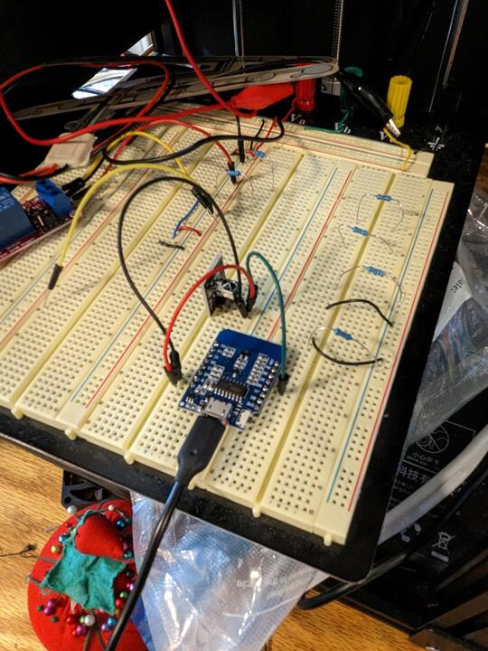
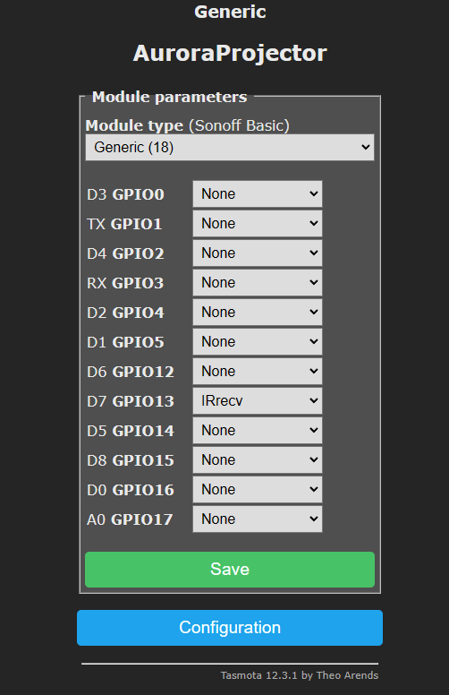

Then I simply pointed the remote at it and pressed each button.  Tasmota logs each command in its Console, which I recorded.  Underneath it uses the [IRremoteESP8266 library](https://github.com/crankyoldgit/IRremoteESP8266) which is the same library I would use anyway if I had written the firmware myself.

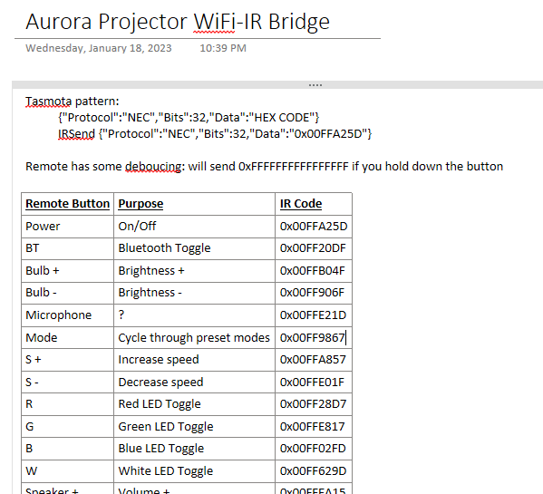


## Prototype IR Blaster

With codes in hand, now I needed to send the IR signals to the base unit itself.  I did this by hooking up an [IR transmitter](https://smile.amazon.com/Gikfun-Digital-Receiver-Transmitter-Arduino/dp/B0816P2545/ref=sr_1_4) to my D1 mini and configured it appropriately in Tasmota.

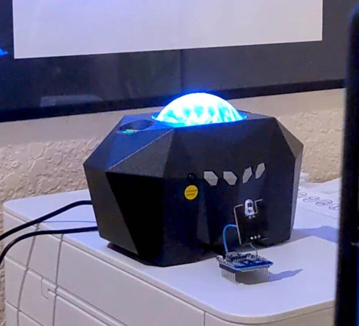

Then I issued Tasmota commands via its Console to have it send codes.  It worked, hooray!
```
IRSend {"Protocol":"NEC","Bits":32,"Data":"0x00FFA25D"}
```

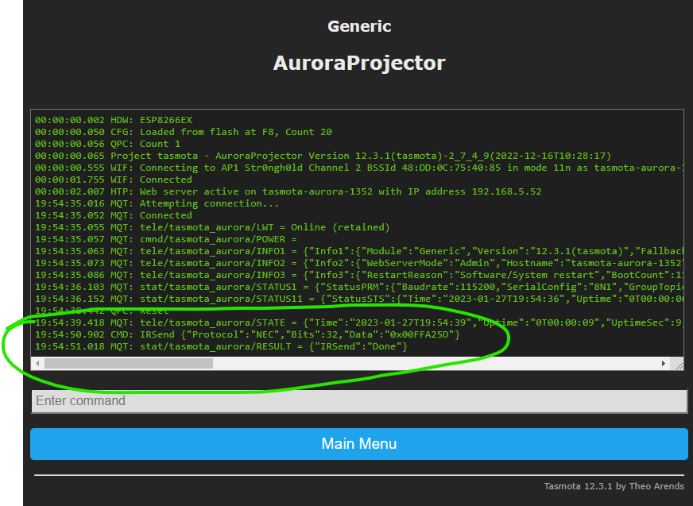


## Home Assistant Configuration
At this point, I wanted to see it working end-to-end via Home Assistant, which is what we use to control our home's smart devices without an external cloud service dependency.  To do this, I first enabled MQTT on the D1 Mini, which is how secure communications can happen between HA and Tasmota devices.  Then I created a new Dashboard in HA which issues MQTT messages when you press the buttons.  Tasmota receives the MQTT messages and sends the appropriate payload with the IR transmitter. 

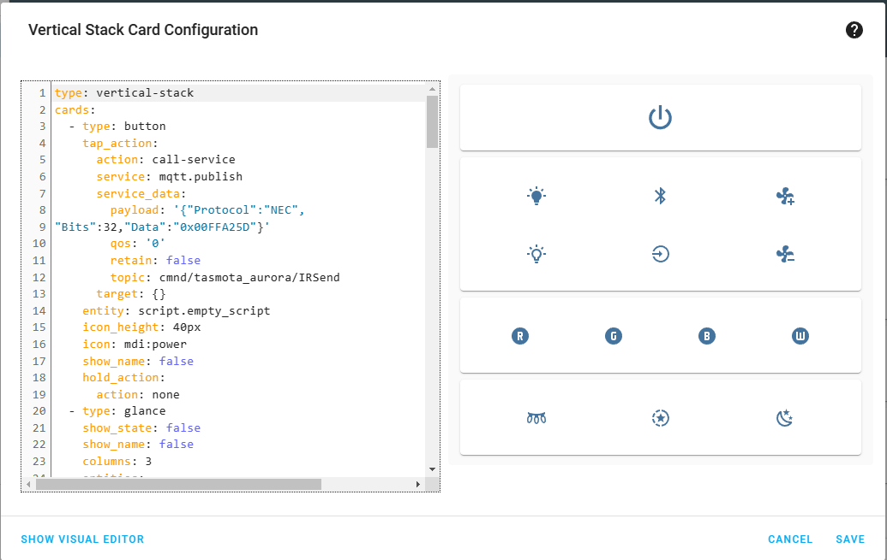

## Final IR Blaster (Integration within the Base Unit)
So, it was working end-to-end, but it looked sloppy and required an extra USB cable for power -- was there a way I could make this look cleaner?  I figured I could open up the machine and see if I can find a way to integrate the blaster more seeamlessly.  There were four enclosure screws hidden under the rubber foot pads, and there was lots of space inside to embed the D1 Mini and transmitter.

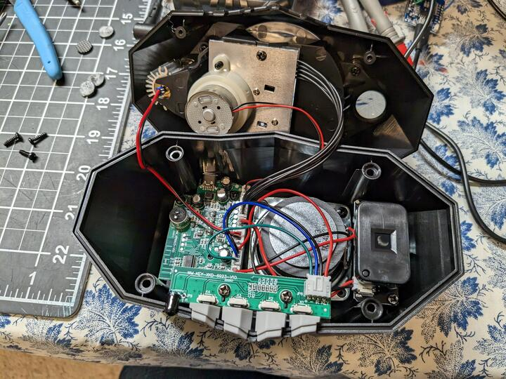

For power, I wanted 5V that would be on whenever the unit was plugged in, which I found right in the middle of the main PCB.  How convenient!

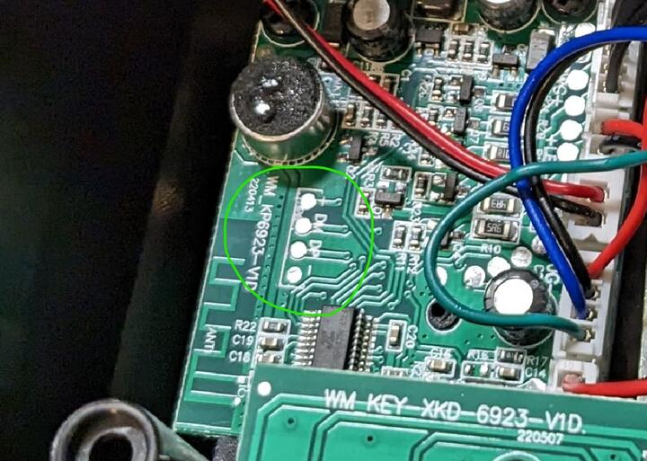

I hooked up to that power and stuck the IR transmitter close by to the receiver.  And, since I had the unit opened already, I snuck in a bluetooth connection NFC tag.  So now if you want to connect to the unit via bluetooth, all you have to do is scan your phone near the side.

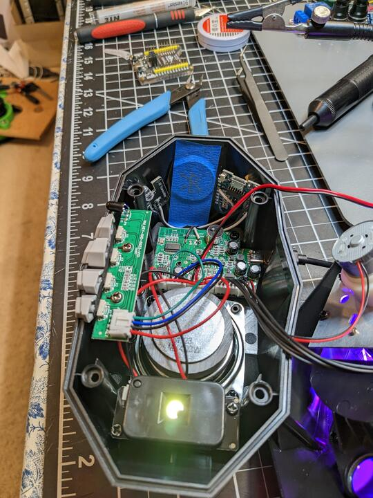

Finally, I put it back together, and it looks just like the stock projector - just smarter inside. 🎉 

Side notes:
* For space reasons, I wanted to use an ESP-12F module, which is simply the core ESP8266 chip, but it needs 3.3V, so you have to add a regulator to convert from 5V.  It also requires additional circuitry to boot (a few pulldown and pullup resistors).  Ultimately in the end it was easier to stick the full D1 Mini inside, as there was plenty of room anyway.
* The range for the IR transmitter module I used really sucks.  In fact, Tasmota themselves recommend against it, per their [IR Remote](https://tasmota.github.io/docs/IR-Remote/) documentation.  This actually led me down a huge troubleshooting path because I thought something was broken - turns out it was just not close enough and pointing in the right direction.
* The transmitter module has 3 pins but you only need to hook up DATA and GND.
* Home Assistant doesn't know the "state" of the unit; it is merely telling the IR remote to send signals.  Maybe some time in the future, I'll find a signal pin on the board that will tell me whether the unit is on or not and reflect that in HA.  Or, I'll just hook up the whole unit to a smart USB A outlet.... that is an upcoming project. :)

