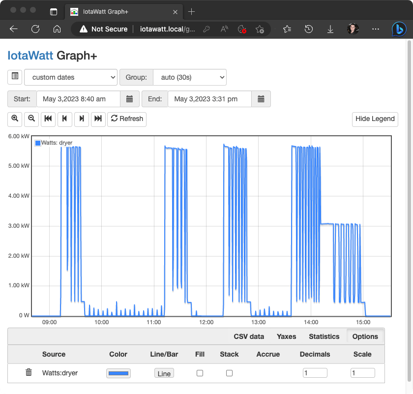
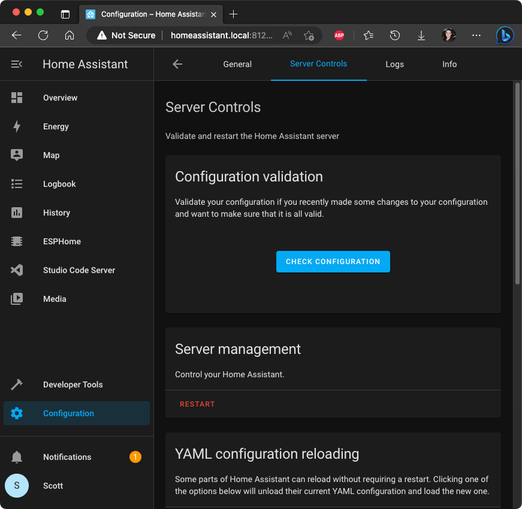
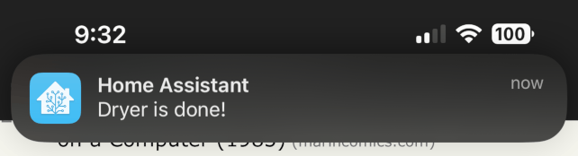

I do the laundry in our house, and it often takes most of a day because I don't hear the dryer finish. I set a timer on my phone, but it's often not done when I go check on it. Today Darinee and I finally implemented a "Dryer is done" notification on my phone, so I'll know exactly when it's time.

We run a [Home Assistant](https://www.home-assistant.io/) server so that we can have smart devices without tons of different apps, privacy leaks, or devices dying because the manufacturer turns off the services they need.

Last year we set up an [IotaWatt](https://iotawatt.com/) to see how much of our power use is heating and cooling, car charging, and "everything else". It's also been useful for finding surprise power use and reducing it, but that's another story.

These two devices make a "dryer done" notification easy. First, we looked at the IotaWatt's built-in reporting to see what a few dryer cycles look like:



The dryer uses about 5,500 watts when the heating element is on, and about 450 watts when laundry is just tumbling right at the end. The little spikes afterward are the "wrinkle care" tumbling happening periodically.

In Home Assistant we can add a binary sensor to **configuration.yaml** to identify when a dryer cycle is running. We'll mark the dryer "on" when it uses more than 400 watts for more than five minutes. This will pick up drying cycles but won't trigger another load for the wrinkle care pulses. We'll wait for two minutes of under 400 watts to consider the cycle done, just in case some of the "tumble-only" periods are under 400 watts briefly.

To edit Home Assistant configuration files directly, go to the web interface (usually http://homeassistant.local:8123) and click on '**Studio Code Server**' on the left bar. We add the new sensor definition:

### configuration.yaml

```yaml
binary_sensor:
  - platform: template
    sensors:
      dryer_running:
        friendly_name: "Dryer Running"
        delay_on: "00:05:00"
        delay_off: "00:02:00"
        value_template: >-
          {{ states('sensor.dryer')|float > 400 }}
```

With the sensor defined, we can add an Automation to send a notification to my phone when the dryer is done:

### automations.yaml

```yaml
- id: '1683153015371'
  alias: Dryer Done
  description: ''
  trigger:
  - platform: state
    entity_id: binary_sensor.dryer_running
    from: 'on'
    to: 'off'
  condition: []
  action:
  - service: notify.mobile_app_scotts_i14
    data:
      message: Dryer is done!
  mode: single
```

To test and load the new configuration in Home Assistant, click '**Configuration**', then '**Settings**', and then '**Check Configuration**' to verify your YAML is valid and '**RESTART**' to load it.

If you don't see these options in Settings, make sure your user is an **Administrator** (in Configuration -> People & Zones) and that '**Advanced Mode**' is on (click your user name in the bottom left and find the toggle for it).



...and that's it! We ran a test load and we got: 



I'll never miss the dryer finishing again, and never go down to check it and find it's not really done. Like many home automations, I can't believe it took me this long to do it.