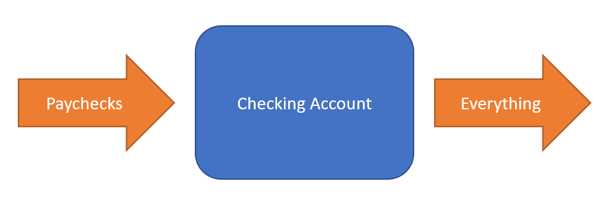
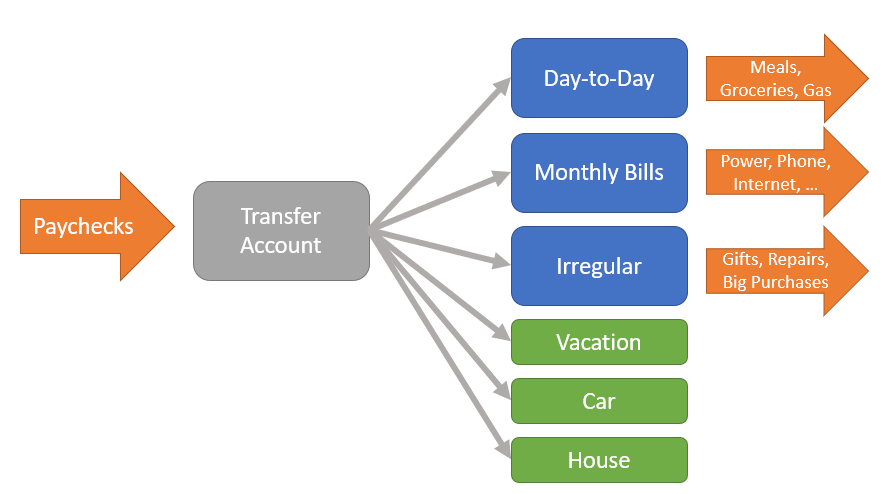

When we got our first real jobs, we put our paychecks into our checking account and bought everything from there. It couldn't be easier, and I'm sure many people do the same thing. The problem was that while we didn't spend more than we had, we also weren't saving up anything. When we wanted to take a vacation, it wasn't clear how we would pay for it. When we had an unexpected expense (a gift for someone, a car repair, or whatever) our account would be knocked down and we'd have to cut back for a while to try to refill it. It felt like we were constantly being knocked off track and forced to make cuts.

This went on until we decided we wanted to buy a house and realized we needed to save up a down payment. At the time we couldn't imagine saving up so much money. We read some articles about budgeting and tried tracking all of our expenses, but it felt like **too much work**. What we really wanted was a way to control our spending and do some saving without a lot of effort or a lot of compromises.

Eventually, we settled on the idea of having multiple accounts (doesn't sound simple, does it?) and have stuck with that system ever since. First, we put our paychecks into a **transfer account** instead of our checking account, so that we could split up the money for different goals. Then, in addition to our checking account for **day-to-day** use, we opened a new account for our **monthly bills**, one for **irregular spending**, and **one for each savings goal** (next car, house down payment, vacations). 

We added up our monthly bills and transferred the total to the bills account each month. Now we don't have to worry about the power bill knocking us off track. We added up our "day-to-day" purchases going back a month or two and transferred that amount to our checking account, so we weren't really cutting back spending overall. We set aside a little big for each goal and put the rest in "irregular spending".

While simple, this change **really helped**. Our monthly bills didn't catch us off guard anymore! We were automatically saving for irregular expenses, so we often could pay for them without transferring money from anywhere else. We could just look at the day-to-day account to decide how much to spend. If we wanted to eat out and the balance looked good, we could go for something fancier. If the balance was low, hot dogs at Costco or stay home. At first we didn't allocate much to our other savings goals, but *even a little was much better than nothing*. Similarly, when deciding to take a vacation or looking at our next car, we again had one account balance to check to decide what we should spend.

When we got our next raises, we found another benefit - the extra money accumulated in our transfer account instead of disappearing into new spending. We could **intentionally** allocate it, and we chose to [save most of it for goals]() instead of automatically spending it all day-to-day. When we got our bonuses, we saved them rather than watching them melt in our checking account. When we found cheaper phone plans, the money was saved instead of vanishing elsewhere. **This turned out to be the most important thing we did - saving most of our raises each year dramatically increased our savings rate over time**.

So, that's the process. No tracking every purchase, no spreadsheets, no budget software. Just separate accounts, automatic transfers, and one balance to check for any given spending decision.

One bonus trick: Our day-to-day account used to sometimes be a low on grocery day, and it felt bad to scrimp on groceries or gas to stay on budget. We shifted our day-to-day account transfers from bi-monthly (when our paychecks came) to weekly on Fridays. This means Friday night dinner and groceries and gas on Saturday are now always right after "payday", and any cutting happens to Amazon purchases and lunches out midweek instead.