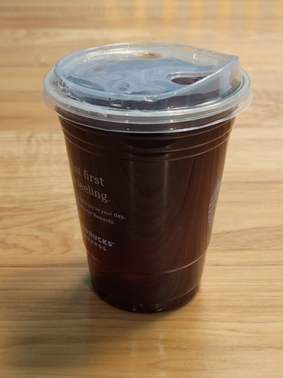

I've been a fan of the Starbucks Vanilla Sweet Cream cold brew since it came out and a lover of cold brew coffee since the days before Seattle's Best Coffee disappeared. I'm not willing to buy coffee out every day, so I learned to make cold brew at home and mix reasonable replicas of my Seattle's Best iced mocha and the Vanilla Sweet Cream between coffee outings.

Home cold brew is great, but it's annoying to make and easy to end up with a sour or bitter batch. 

Not long ago, I learned that Starbucks provides free refills. Buy **any** drink with the app, then  bring the cup back to the counter to get a [free refill of drip coffee, tea, or plain cold brew](https://customerservice.starbucks.com/app/answers/detail/a_id/1882/~/how-do-free-refills-work%3F). I can't drink a second cold brew without shaking, but then I realized I could bring it home instead.

Now I buy coffee out twice a week, and bring home a no-ice plain cold brew refill each time to make my home drinks for the other five days of the week.

I've tried basically every grocery store cold brew available, including the Starbucks carafes, cans, and pitcher brew-bags, but I've never found any at home option as good or consistent as the cold brew from the Starbucks cafes. 

With the refills, I get the best cold brew I can find, never have to brew at home, and don't pay any more than the two coffee outings I'm going to do anyway. I highly recommend it!

### Seattle's Best Coffee Iced Mocha

* 6 oz cold brew
* 8 oz milk
* 1 oz [Ghirardelli Chocolate Sauce](https://www.amazon.com/dp/B005JY8IQK)

### Starbucks Vanilla Sweet Cream Cold Brew

* 6 oz cold brew
* 0.35 oz heavy cream
* 0.70 oz [Starbucks Vanilla Syrup](https://www.amazon.com/dp/B07NPMFSCC)

