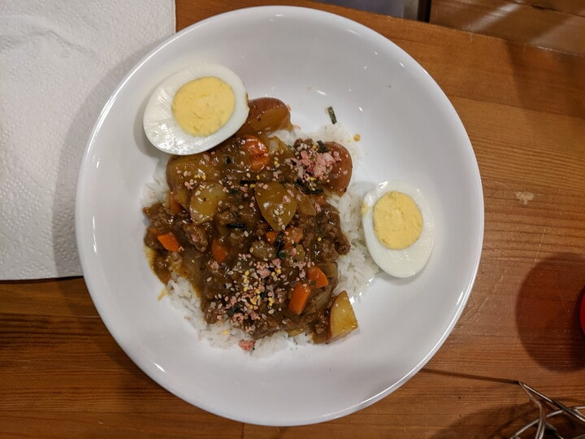
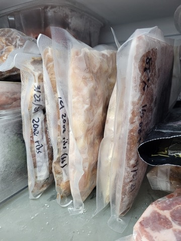
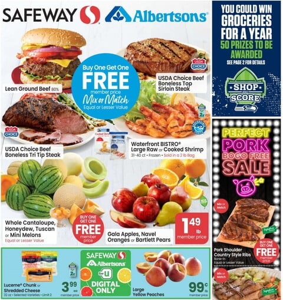

It's surprising, but keeping food costs down was a big part of [sticking to our budget]() and ultimately [retiring early](). Food is the [third highest](https://www.bls.gov/opub/reports/consumer-expenditures/2019/home.htm) spending category for US households (after housing and transportation), so it's a big part of most budgets. It's easier to change your food choices than to move to a new house or car, so if you want to save more, it's a good place to start.

Surprisingly, it takes some solid life experience to grocery shop successfully. We started out often coming home from work to an empty fridge. Next we had food, but not **all** of the ingredients needed for anything. Then we tried out buying things that spoiled before we got around to eating them. 

After a few years of this, we finally got things working. Most importantly, we **make a meal and grocery list** each week. At first it felt constraining to choose meals so long in advance, but it was better than shopping after work in order to eat. As we drifted toward meals without fast-spoiling ingredients, however, that flexibility came back. If we don't eat a meal from the list, we can usually have it a few weeks later. We generally buy everything for three or four dinners per week, and find that with leftovers, meals planned in earlier weeks, and occasional meals out fill the other nights.

For example, this week's meals:

* Crab Quiche with Orzo 
* Tortellini
* English Muffin Mini-Pizzas
* Japanese Curry

These days we have a stocked pantry with lots of the long-shelf-life basics needed to make things - pasta, rice, beans, flour, sugar, spices, and lots of canned things. We buy longer lasting vegetables like carrots, cabbage, and broccoli rather than salad mixes that expire within the week. Our freezer has a variety of meats, bought in bulk on sale and then portioned and sealed flat enough to quickly defrost.

In our most frugal days, we use the weekly grocery store ads while meal planning. If we feel like pork teriyaki for the week, we'll get pork shoulder regardless. If we aren't feeling too picky, however, and ground beef is on sale, we might lean toward hamburgers or beef stroganoff instead. Since ground beef freezes well, we stock up if we're running low even if we won't eat it that week. You can also shop sales by walking the aisles, but then you're much more vulnerable to impulse buys and you aren't next to your fridge and pantry to see what you already have for a just-in-time meal swap.

If you have a grocery list, you can take the next step and save even more by **only buying the things on the list**. For a long time we only allowed ourselves one "off-list-item" each per week. It meant missing out on some things, but it probably took another 20% or so off our typical grocery bill.

We also often shop at Costco these days. Costco has consistently great quality food and often the best prices, though they sell foods in large quantities, so you have to have the space to store it and you have to know what you eat regularly enough to get through it.

Costco is also excellent if you don't feel like cooking. Our family of four can eat out for under $10 at the food court, and they have the best hot dogs anywhere. If we don't want to eat there, we can bring home a $5 rotisserie chicken or one of the "ready-to-bake" meals near the meat section. 

So, to sum things up:

* Find meals you like to cook and eat that don't use quick-spoiling ingredients
* Make a meal and grocery list each week while at home
  * Meal plan from the weekly grocery store ads
  * Limit buying things that aren't on the grocery list
* Stock up on non-perishables and freezable ingredients when they're on sale
* Get a food sealer to portion out foods for easier use
* Costco has "ready to cook" and "ready to eat" food at great prices