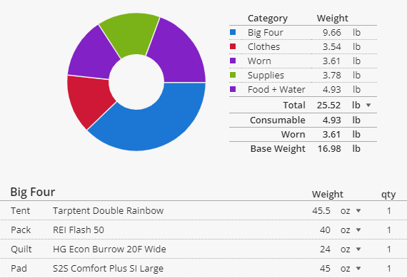

I've been updating my backpacking loadout and learning from the "[ultralight](https://reddit.com/r/ultralight)" backpacking community. I was struck by the parallels between backpack-packing and budgeting and how backpacking wisdom can apply to finance.

## Think About Your Values

[Andrew Skurka](https://andrewskurka.com/), a well-known backpacker, says there are two kinds of backpackers, ["hikers" and "campers"](https://andrewskurka.com/what-inspires-you-to-backpack/). "Hikers" want to travel light and get to the destination quickly. "Campers" bring many things and want the most comfortable journey. Neither philosophy is better, of course. Thinking deeply about your own preferences can help you choose a deliberate place on this continuum and ultimately enjoy your trips more. People who seem crazy to you may just have different philosophical priorities. Finally, when choosing companions to journey with, you'll be much happier if they have a similar philosophy to your own. 

The world of money is similar, though we don't often think of it in such clear terms. You can choose to spend as much as you earn to try to maximize comfort, or spend as little as possible to reach financial freedom faster.  Either choice is fine, like with packing, but you'll be happier if you make a deliberate choice in line with your values. When choosing a companion for your financial journey, you'll be a lot happier if they have similar goals to your own.

## Planning is Necessary

With backpacking and budgeting, you can carefully plan what you want to include or just throw everything in and hope you can carry it all. As with a budget, planning your packlist with a tool like [LighterPack](https://lighterpack.com) takes a block of up-front time, but is easy to maintain afterward. It's tempting to skip planning, but it will almost certainly identify things you can leave out altogether and things you can optimize. Whether you care about speed or comfort, including the right things provides more bang for your buck. 

You can just weigh your filled pack to see how far you are from your goals, but in order to optimize you need to list and weigh **everything** to know what you can improve and how much a given change will matter. Similarly, it's not too hard to estimate your overall spending, but you need more detail to optimize your spending.

## The Big Four

Many backpacking experts tell you to first look carefully at your "Big Four" - your backpack, shelter, sleeping pad, and sleeping bag. These are the heaviest non-consumable items you'll be carrying. They aren't the only things that matter, but if they are too heavy, you'll struggle to meet a weight goal. If you want a 15 pound "base weight" (pack without consumables), and your "big four" weigh 12 pounds, you're going to struggle.  Swapping out any of the Big Four items is expensive, but will make a huge difference in your hike.

In a budget, the parallel is the "Big Three" - housing, transportation, and food. These are typically the biggest spending categories. If you want a budget of $4,000 per month but your rent and car are already $3,000, you're going to struggle. Changing any of these items is difficult (moving, selling and buying a car, or working out a new diet), but can make a huge improvement in how easily you can "carry" your budget.

While the big items are important, "death by a thousand paper cuts" is a problem, too. Smaller items are still tracked on the list and still can't get out of hand.

## Measure Some Things in Groups

It's important to understand where all of the weight in your pack comes from, but you'll have some groups of tiny items that aren't practical to think about individually. You probably don't want to weigh every single bandage and pill in your first aid kit, but rather have overall goals about what needs it must fulfill and how heavy it should be overall. 

Similarly, a few categories in your budget are too much work to track purchase-by-purchase. For us, our "day-to-day" spending is like this (coffee, meals out, groceries, household items, movie rentals, ...). Instead of tracking these individually, we set an overall weekly budget for them and a separate account and debit card. We check our account balance to tell if we need to slow spending down (or if there's room for a splurge this week) with very little effort. If we're over budget for the week, we'll look at the specific purchases to see what happened, but otherwise we just worry about the overall balance.

## Removal is the Ultimate Optimization

It's fun to research and buy new, better gear, but nothing will save more weight in your pack than removing something entirely. Removing things is also fast and free, but hard. The backpacking community says that people "pack their fears", bringing things they are worried they'll need in addition to things they really do need. It takes a leap of faith to try going without something for the first time, and sometimes you'll cut something that you'll find really is necessary. If you pay attention to what you don't use on your trips, you can trim thoughtfully and bring a lighter pack each time. 

A lot of our spending is tied to our habits, and changing those habits is uncomfortable. Making changes like going without cable, eating out less, and doing more driving trips and less flying ones felt like losing something sometimes. Once we've made the leap, we often get used to the new routine quickly.

## Be Prepared for Emergencies

Even in an ultralight pack, there are a few critical redundant items people carry and a few items only used in emergencies. It's wise to have two ways to clean water, two ways to make fire, two light sources, and a backup way to find your way home (a compass and map) in case your phone battery dies. Having a backup plan for your most critical needs is important, because things do go wrong sometimes. Backpackers also bring a first aid kit and a communicator for emergencies, even though hopefully they won't be used.

The financial equivalents are an emergency fund and insurance. Money in an emergency fund ensures that a surprise expense doesn't keep you from paying critical bills (rent, car, utilities, food). It is money that isn't invested to grow, but it is available to make sure critical bills are going to be paid no matter what. Carrying appropriate insurance - car insurance, home insurance, medical insurance, and disability insurance - means that in a big disaster that could easily bankrupt anyone, you'll have others coming to help you.

## Conclusion

At their cores, budgeting and backpacking are both exercises in optimizing around your values, which is probably why I enjoy spending so much time on them. If, like me, you are interested in retirement and the outdoors, it's fun to think about how the wisdom from one of these worlds applies to the other. Backpackers like to say "hike your own hike", which means to remember that your journey is **yours**. Don't worry about how fast (or slow) others go. Don't worry about what other people think is most important. If your journey reflects your values, that's what really matters. Safe travels!

