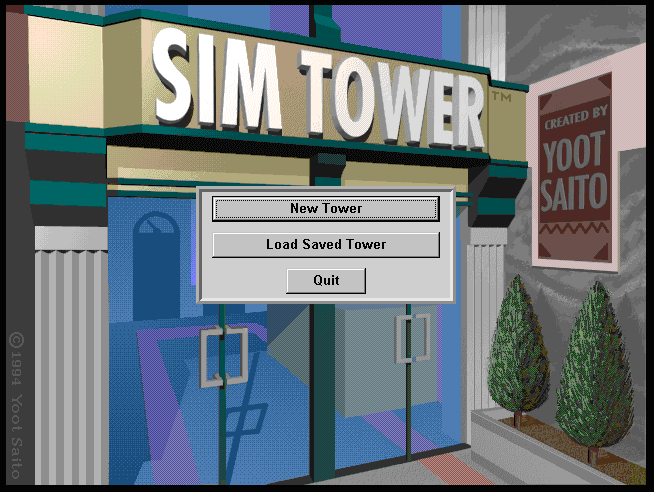
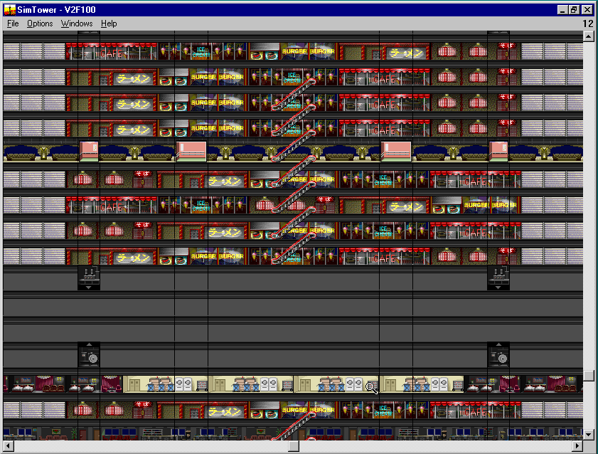
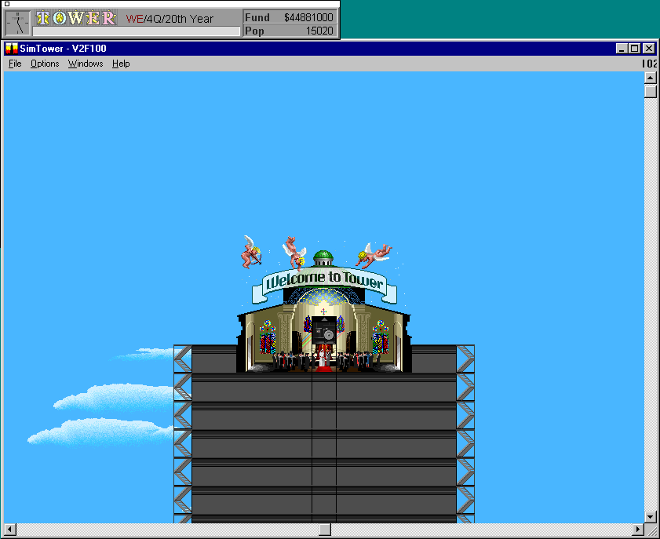
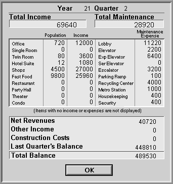

It's 1994, and Maxis is a big name in gaming. The excellent SimCity 2000 released last year, but we're looking at a lesser known title, SimTower. SimTower was not actually developed by Maxis, but instead by Yoot Saito, who was inspired by the 1989 SimCity. The game was released as "The Tower" in Japan and was relatively successful. Maxis learned about the game and offered to publish it in the US, branded as a "Sim"-title.

26 years later, I've been digging up old games and wanted to really beat SimTower this time. Being from 1994, SimTower is actually a Windows 3.1 title, so you have to install Windows on DosBox to run it. I installed Windows 95 to run it, which took a few hours of attempts and ended up being a nostalgic journey itself. I've written up the [steps that worked for me]().

Here's my first pass at "solving" SimTower. I was inspired by a very short and simple SimTower [walkthrough](http://blog.codekills.net/2009/03/15/how-to-beat-simtower/), though I ended up using a Retail Store / Fast Food mix for higher income with similar population.

See my [SimTower Reference]() for some tables I wish I'd had before playing SimTower again, cobbled together from a few different websites and corrected.

### Quick 'TOWER' Walkthrough

The map is 375 "segments" wide, but a 360 segment tower is much easier to fill evenly, so build a 360 segment lobby. Put three floors with 40 offices each on top. Add three stairways to serve them: after the 9th, 20th and 31st offices. 

Now, turn up the simulation speed and save up $60M.  For maximum speed, close the Map Window, shrink the Main Window, look at the sky, and turn on "Fast Mode". My 2020 laptop finished a quarter every 8 seconds like this, so it was only about a ten minute wait. Here's my [saved game](files/144_60M.TDT), in case you want to skip that.

Next, build an empty B1. Add matching stairs, two security offices on the left, and 10 Fast Food centered around the middle stairs. 

Once you get three stars, add an empty 5F, B2, and B3. Replace all stairs with escalators, going all the way from B3 to 5F. You can bulldoze the offices to place escalators there, and then rebuild the offices. On B1, add a Medical Center next to the Security Offices. Under B3, add two Recycling Centers.

Now we'll add "shopping floors", which have 15 Fast Food and 10 Retail Shops each. Make F5, B2, and B3 shopping floors. Wait for a quarter and confirm all of your facilities have a blue eval.

Time for a small hotel. Add an empty F6. Add four elevator shafts, after office 8, 16, 24, and 32, set to wait 30 seconds before departure. On F6, add four Housekeepings, six suites, and 40 twin rooms. The four elevators should serve all of the rooms efficiently.

Time for a Skylobby. Add empty floors up to F18. Build the lobby on F15. Add two express elevators will all eight cars each, set to wait 30 seconds, after offices 18 and 22. Build seven shopping floors with escalators on F11-F18. Add three more Recycling Centers on B4.

Build a second Skylobby on F30, with the same seven shopping floors from F26-F33, and new express elevators after offices 14 and 26. Make sure each pair of express elevators only stops at one of the Skylobbies. Add another three Recycling Centers on B4. Build a Metro Station on B4 near the right side escalator and add another escalator to connect it to the rest of the tower.

Almost done! You need one more shopping floor, but can't build any more escalators. Add four elevator shafts around F15, on top of the hotel ones. Add four cars to each and set them to wait 30 seconds. Connect them to F19 and build your last shopping floor there.

Finally, you can extend the middle two express elevators to floor 90, build a small Skylobby, build up to floor 100, add a Cathedral, build a two car elevator to get people from 90 to 100, and wait for the wedding. 

[Save - Offices and $60M](files/144_60M.TDT)  
[Save - Just Got TOWER](files/V2F100.TDT)

### Rationale

Why this design? Offices are a great source of income, and a two-star tower with stairs has zero expenses. After that, you need a lot of population and you need a reasonable income. Fast Food provides the best population-per-space, but the income is barely enough to cover lobby, express elevator, and escalator maintenance. Retail Shops have only slightly less population, but provide more than twice the income. A balance of 15 Fast Food and 10 Shops keeps your income reasonable and allows you to build 20 floors and 10 more Fast Food before hitting the 512 retail facility limit.

Putting Security, Medical, and Parking on B1 avoids any elevator transportation and allows you to build only one ramp, with more than enough space left for the 10 Fast Food you need to hit 15,000 weekday population.

You only need two hotel suites, but I built a full single floor to generate a little more income while keeping the elevators very simple and avoiding a service elevator.

### Tower Layout

| Floors | Facilities                                                   | Pop    | $/Qtr [K] |
| ------ | ------------------------------------------------------------ | ------ | --------- |
| 31-33  | Retail Shop x18, Fast Food x9                                | 2,325  | $855      |
| 30     | Skylobby                                                     |        |           |
| 26-29  | Retail Shop x18, Fast Food x9                                | 3,100  | $1,140    |
| 19-25  | Empty                                                        |        |           |
| 16-18  | Retail Shop x18, Fast Food x9                                | 3,100  | $1,140    |
| 15     | Skylobby                                                     |        |           |
| 11-14  | 15x Fast Food, 10x Retail Shop                               | 3,100  | $1,140    |
| 7-10   | Empty                                                        |        |           |
| 6      | 4x Housekeeping, 6x Hotel Suite, 40x Twin Room               | 92     | $468      |
| 5      | 15x Fast Food, 10x Retail Shop                               | 775    | $285      |
| 2-4    | 40x Office                                                   | 720    | $1,200    |
|        | Lobby                                                        |        |           |
| B1     | 2x Security, Medical, 10x Fast Food, 16x Parking Space, Ramp | 350    | $90       |
| B2-B3  | 15x Fast Food, 10x Retail Shop                               | 1,550  | $570      |
| B4-B6  | 8x Recycling Center, Metro Station                           |        |           |
|        | Total                                                        | 15,112 | $6,888    |

