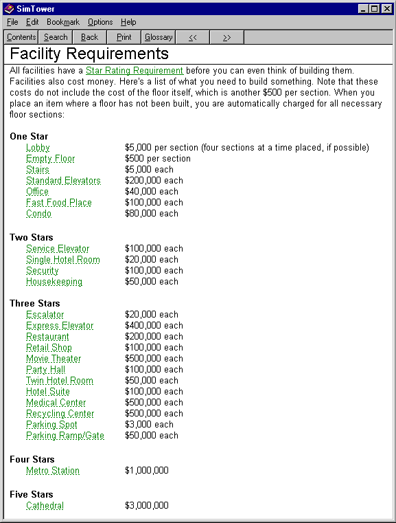

When playing through SimTower again, I was frequently looking for facts from the help and from online walkthroughs. Here's a double-checked, complete set of the details I was looking for when replaying the game, with more useful details together in one place than the original help.

Note that these details are for the PC 1.0 version of the game. I saw some conflicting information online which I suspect is for SimTower on other platforms.

### Facility Overview

| Name          | Stars | Cost [K] | Width   | Population | Pop/Seg  | $/Qtr [K] | $/Seg |
| ------------- | ----- | -------- | ------- | ---------- | -------- | --------- | ----- |
| Condo         | 1     | $80      | 16      | 3          | 0.19     | $0*       | 0     |
| Office        | 1     | $40      | 9       | 6          | 0.67     | $10       | 1.11  |
| Fast Food     | 1     | $100     | 16      | 35*        | **2.19** | $9*       | 0.56  |
| Hotel, Single | 2     | $20      | 4       | 1          | 0.25     | $6        | 1.50  |
| Hotel, Twin   | 2     | $50      | 6       | 2          | 0.33     | $9        | 1.50  |
| Hotel, Suite  | 2     | $100     | 10      | 2          | 0.20     | $18       | 1.80  |
| Restaurant    | 3     | $200     | 24      | 35*        | 1.46     | $18*      | 0.75  |
| Retail Shop   | 3     | $100     | 12      | 25*        | **2.08** | $15       | 1.25  |
| Party Hall    | 3     | $100     | 24 x 2h | 50         | 1.04     | $60       | 1.25  |
| Cinema        | 3     | $500     | 31 x 2h | 120        | 1.94     | $30       | 0.48  |

Condos have $150k one-time income when occupied, and no recurring income.
Retail Shops settle at 25 (weekday) and 30 (weekend) population.
Fast Food settles at 35 (weekday) and 48 (weekend) population.
Bonus Fast Food population from offices improves income but doesn't count in the Population count.
At normal population, Fast Food income is $3k/day ($9k/qtr) and restaurants make $6k/day ($18k/qtr).
Fast Food income is $3k per day with 40-48 customers, or $9k/qtr. 
If you have enough supporting offices, Fast Food can earn $5k on each weekday, so $13k for the month.

| Name             | Stars | Cost [K]    | Width   | Cost/Qtr [K]    |
| ---------------- | ----- | ----------- | ------- | --------------- |
| Lobby            | 1     | $5 / seg    | 1       | $0 / $0.3 / $1* |
| Stairs           | 1     | $5          | 8       | $0              |
| Escalator        | 1     | $20         | 8       | $5              |
| Elevator         | 1     | $200 / $80  | 4       | $10 / $10       |
| Service Elevator | 2     | $100 / $50  | 4       | $10 / $10       |
| Housekeeping     | 2     | $50         | 15      | $10             |
| Security         | 2     | $100        | 16      | $20             |
| Express Elevator | 3     | $400 / $150 | 6       | $20 / $20       |
| Medical Center   | 3     | $500        | 26      | $0              |
| Parking Ramp     | 3     | $50         | 16      | $10             |
| Parking Space    | 3     | $3          | 4       | $0              |
| Recycling Center | 3     | $500        | 25 x 2h | $50             |
| Metro Station    | 4     | $1,000      | 30 x 3h | $100            |
| Cathedral        | 5     | $3,000      | 28 x 4h | $0              |

Lobby maintenance is free for one and two stars, $300 per segment for three stars, and $1,000 per segment for four stars and above.

### Star Rating Requirements

| Stars | Population | Other Reqs                                         |
| ----- | ---------- | -------------------------------------------------- |
| 2     | 300        | None                                               |
| 3     | 1,000      | Security Office                                    |
| 4     | 5,000      | Hotel Suite, VIP Rating, Recycling, Medical Center |
| 5     | 10,000     | Metro Station                                      |
| 6     | 15,000*    | Cathedral                                          |

To get the six star "TOWER" rating, you must have over 15,000 population for a weekend midday wedding. Population for retail facilities updates each time they open, so your week**day** population must be over 15,000 to get six stars.

### Limits

| Item Type                       | Limit     |
| ------------------------------- | --------- |
| Elevator Shafts                 | 24        |
| Cars per Shaft                  | 8         |
| Stairs / Escalators             | 64 total  |
| Fast Food / Restaurants / Shops | 512 total |
| Parking Spaces                  | 512 total |
| Medical Centers                 | 10        |
| Security                        | 10        |
| Theater / Party Hall            | 16 total  |
| Metro Station                   | 1         |
| Cathedral                       | 1         |

### Q&A

#### How do you build escalators on the office floors?
It turns out that you can build escalators on empty floors, so just bulldoze the offices right behind the stairs, then replace the stairs with an escalator, and then rebuild the offices. Sims will take a maximum of four flights of stairs, but seven escalators, so you can build out three levels above and four levels below each lobby with escalators.

#### When does population update?
Population is static for offices and condos. Hotel Population goes up and down as guest check in and out. Population for retail locations updates when they open to reflect the number of "natural" customers the previous day. For example, if a Fast Food place has 48 customers on the weekend, the tower will count that population from 10am (opening) on the next day (weekday 1) until the opening two days later (weekday 2).

#### What is the math for fast food population, and how do offices affect them?
Fast Food, when newly built, has the following daily traffic: 10, 20, 20, 20, 35, 35, 35, 40, .... Weekends get 20% extra traffic. Rainy days get about half the normal traffic. Fast Food places normally have 35 weekday customers and 48 weekend customers. 

If office workers can get to the fast food place, five of the six office workers will visit a Fast Food place within range each weekday. Ideally, this means three offices can boost each Fast Food place to maximum revenue, but the distribution of bonus visitors is uneven, so you are likely to need four offices per fast food. These extra customers boost earnings (slightly), but are not counted again for the tower population, so they don't help you earn a higher star rating.

#### How far away do facilities have to be to avoid noise problems?
There must be at least **11** empty segments between the fast food and the office. Hotel rooms require **21** segments from an office. These gaps waste space quickly, so keeping whole floors all one type seems to work better.

#### Which facilities object to noise from one another?
Offices object to noise from commercial (fast food, restaurants, retail, cinema). Hotels and Condos object to noise from commercial and offices.

#### How do housekeepers work?
Each housekeeping facility has six housekeepers. They will only work on separate floors, so you need multiple housekeeping facilities and a service elevator to get several to clean one floor. Each housekeeper can clean 19 rooms, apparently, but I needed four housekeeping facilities to safely clean my 58 room floors and they didn't finish until after 2:00pm. 

#### What are the best express elevator settings?
Each express elevator shaft should only stop at the lobby and a single skylobby, so the cars just go back and forth. Two shafts with all eight cars each can serve each skylobby with the full eight full shopping floors. Configure the express elevators to wait 30 seconds to cause them to fill up more consistently.