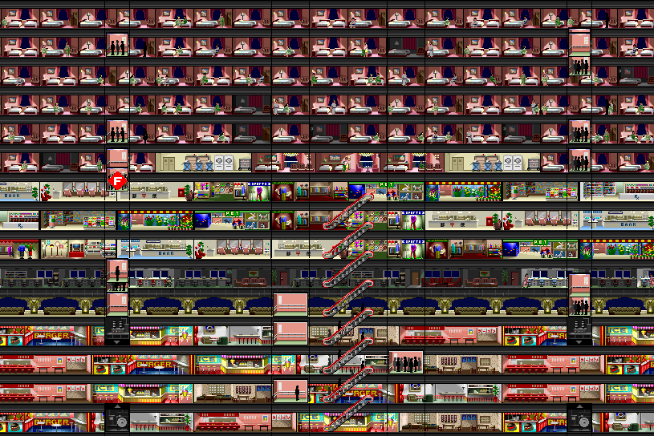
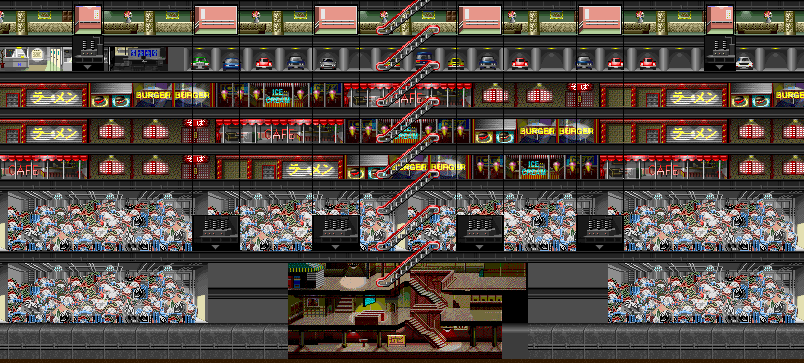
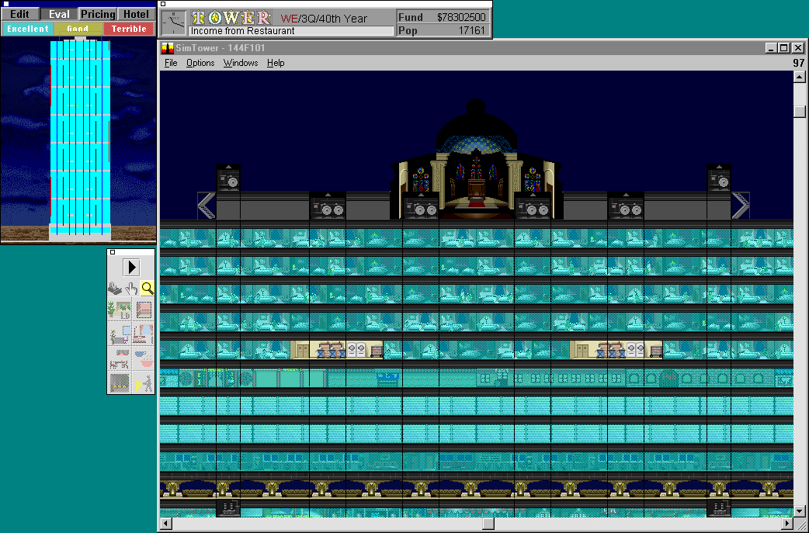
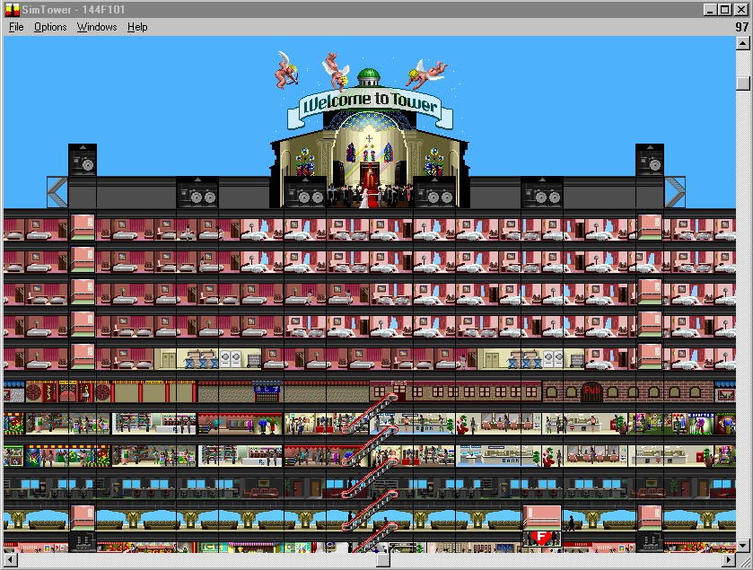
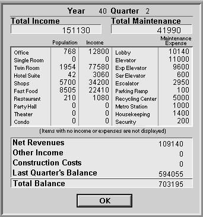

A few days after my [previous SimTower adventure](), I wanted to revise my tower design. My retail-heavy-attempt was straightforward and didn't take too many floors, but I thought it'd be fun to try to build consistently all the way up to the 100th floor cathedral, and to try to max out many of the in-game limits right when I reached it.

### Design

My first realization was that I'd have to have a narrower tower in order to build all the way up. In my previous attempt, I'd only built 18 retail floors and I was nearly at the limit of commercial facilities (512), escalators, and elevators.

If I want to build all the way to the 100th floor, I have to keep to one escalator per floor. This means a **maximum** width of about 19 offices, or 19 x 9 = 171 segments. I want to make all-one-thing floors this time to keep the design more simple, so a width which has an even number of offices, retail shops, fast food, or twin hotel rooms would be nice. 

I settled on a width of 144 segments - 16 offices, 12 retail shops, 9 fast food, or 24 twin suites.

I've got 7 lobbies to fill (1, 15, 30, 45, 60, 75, 90). I have 64 escalators, so I can place 9 per lobby (though I think Sims will only accept 7). I'll have to keep to three elevator shafts per lobby, so one express elevator and two normal shafts. This leaves me with three more shafts for service elevators. With a limit of 512 commercial spaces, that's a bit over 73 per lobby. If I use a 144-width-tower, this works nicely as four floors of fast food and three floors of shops, for 72 facilities.

I want offices throughout this time, but with only two elevator shafts I'll need them to be on escalators to avoid overwhelming my elevators. Since I have to keep my fast food and retail shops within four levels of the lobby, I only have one floor left for offices.

And in the empty floors I can't reach from escalators and in excess of my seven retail floors, I'll put hotel - high income and low traffic.

Each full 144-width hotel floor has 24 twin rooms. The bottom floor of each batch has two housekeeping, three suites, and 14 twin rooms.

Let's get to it!

### Lobby Layout

Here's the basic template for each lobby:

| Floors | Facilities     | Pop   | $/Qtr [K] |
| ------ | -------------- | ----- | --------- |
| 20-25  | 6x Hotel       | 274 | $1,260 |
| 17-19  | 3x Retail Shop | 900   | $540      |
| 16     | Office      | 96 | $160    |
| 15     | Lobby          |       |           |
| 11-14  | 4x Fast Food   | 1,260 | $324      |

So this is six hotel floors, four fast food, three retail shop, and one office. I kept two office floors above the first lobby, and B1 is parking, so there are only three fast food and two shop floors on the bottom lobby. The 90th floor lobby only has five hotel floors, since F100 is for the cathedral.

[Save - Offices and $60M](files/144_60M.TDT)  
[Save - Just Before Cathedral](files/144F99.TDT)

### Tribulations

This layout went up relatively smoothly, but it wasn't completely without problems. The elevators must be very carefully placed to get all of the shafts within the 144 width - the service elevators had to be at the outermost edges, and I had to rebuild the local elevators a few segments out from their original placement to fit all six express elevators with enough spacing.

Next, I eventually needed 10 Recycling Centers, so I had to bump the main lobby out to a width of 150 to fit them across with room for the Metro Station. (Don't forget to put the escalators to the Metro Station in before putting the Recycling Centers back!)

Finally, my topmost Retail Shop floor, floor 94, couldn't maintain enough traffic. Three floors of retail worked on the other lobbies, and no other facilities had bad reviews on the 90th floor lobby. I decided to replace the shops with restaurants, which didn't have any problems and still kept my weekday population over 15,000.

### Result

After a long night of building, I finally got it all done - it's a monster! I'm using all 24 elevator shafts, 59 out of 64 escalators, and 477 of the 512 commercial facility limit. The population peaks at 21,643 on the first weekday evening (counting weekend retail traffic and with the hotel rooms filled), and still manages a 15,527 weekday minimum.

