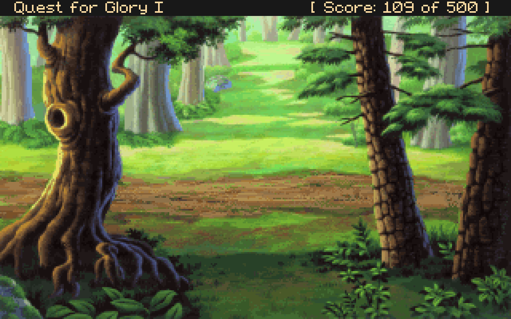

Quest for Glory 1 is one of my favorite role-playing games, and one of the first I played. Sierra walked the line between adventure and puzzle games beautifully in the series, making something that still feels unique. Ultimately, though, what keeps bringing me back is the setting and the story, told with impressive graphics, great music, and witty dialog that still hold up well so many years later.

I recently came back to play it again. You can find it on [GOG](https://www.gog.com/game/quest_for_glory), seven megabyte monster that it is. I highly recommend the excellent [Gamer Walkthrough](http://gamerwalkthroughs.com/quest-for-glory-1/) for it and a [map](https://www.oldgames.sk/images/oldgames/adventure/Quest.for.Glory.1-vga/Maps/qfg-map.jpg), which are great for hitting the highlights and solving the more subtle puzzles.

Even ten playthroughs in, walking out of town into the forest and hearing [Hero's March](https://www.youtube.com/watch?v=gDiAiF_dVQ8) gives me that feeling of nervous excitement and imminent adventure.

The beautiful art has permanently established this setting - castles, forest, waterfalls, mountains - as the definitive role playing setting for me. It wasn't until Fallout 3, many years later, that I found a setting outside this stereotype that could evoke a similar level of immersion and wonder in me.

Oh, man, the [seedy tavern theme](https://www.youtube.com/watch?v=sF617r584qU) and the Thieves Guild. It really feels like your choice of player class provides a lot of unique gameplay.

And, of course, [Erana's Peace](https://www.youtube.com/watch?v=AmjpRkyj2eM). It's profoundly calming to walk into this grove in the middle of the night, running from monsters that are much too powerful for you. I think some of my adulthood hiking and camping adventures are really about trying to find a place like this in the real world. =)

Like all games, not everything in Quest for Glory is great. Puzzles, as noted earlier, can be quite hard if you haven't talked to the right person. Magic is awkward to use outside combat. You rapidly run out of mana and stamina, so potions are important to avoid death due to overexertion. Combat is frustrating as it's quite hard to see enemy movements in time to dodge. Here's me about to get clocked...

Still, I'm amazed at how much I enjoy this game so many years later. I think it was released at just the right moment, when VGA graphics, SoundBlaster sound, and mouse interaction made games drastically more playable and immersive than they were just a few years earlier.

This isn't a walkthrough, but I can't help but leave a few tips:

* Sleep in Erana's Peace - full healing, fruit to eat, and flowers to sell.
* Play the daggers game with the Chief Thief to quickly earn money.
* Work in the stables and practice with the Weapon Master to quickly improve your skills.
* Practice lockpicking safely at the Healer's Hut (even in the daytime!)
* Battle the Goblins in their camp to finish training combat skills.
* Keep a few potions handy - running out of stamina can easily lead to death.

I took too many screenshots for one post, but you can find the [full set here](files/qfg1-screenshots.zip). In DOSBox, use Ctrl+F5 to get perfect native resolution screenshots, and ImageMagick -scale 400% to make pixel-perfect scaled versions. =)