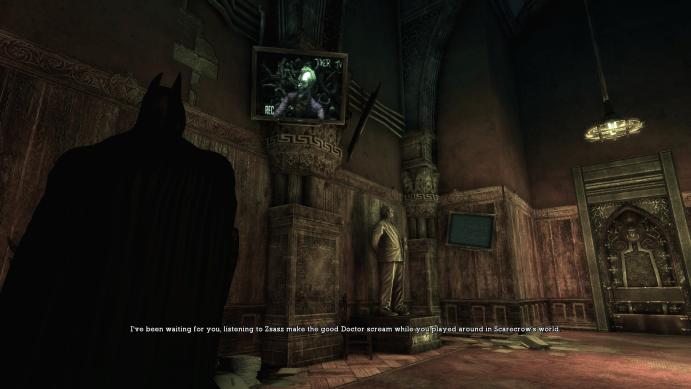
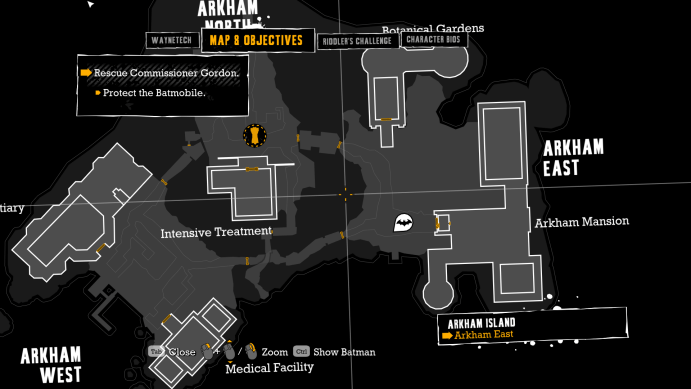
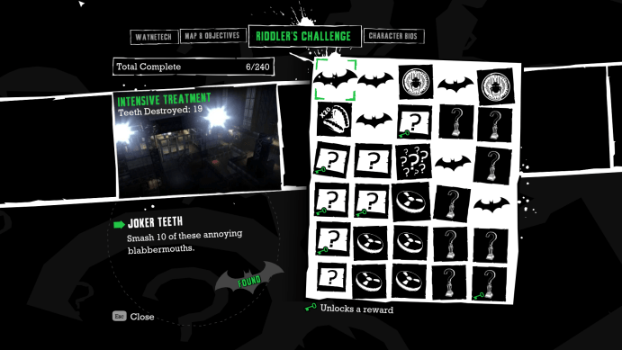
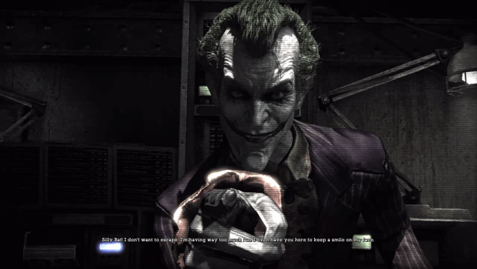

The latest in my series of game replays is Batman: Arkham Asylum, thanks to a recent GOG Sale that had it going for $5. 

As a kid, I loved the fantastic "Batman: The Animated Series" cartoon. It's well written, engaging, features a large cast from the Batman comic world, and has top notch voice talent. I'll always consider Mark Hamill's Joker and Kevin Conroy's Batman to be the definitive versions of the characters.

Batman **games**, on the other hand, were a mixed bag and often disappointing, like DCEU movies recently.

Fortunately, Batman: Arkham Asylum, a 2009 reboot by Rocksteady Studios which started the "Arkham" series, is great. Most importantly, they managed to get key writers and voice actors from "Animated Series" involved, so it really feels like I'm playing as the Batman I loved in the version of Gotham I remember. 

In Arkham Asylum, Batman delivers Joker to Arkham, only to have Joker take over the asylum for a "party" he's planned for Batman. Batman runs into a number of familiar villains along the way - Bane, Zsasz, Scarecrow, Ivy, Croc, Harley - but their involvement in the story makes sense rather than feeling like a "greatest hits" playlist with questionable segways. 

Perhaps the biggest benefit of the story is that since Joker controls the asylum, he's watching Batman's progress and taunting him through the whole game, putting the voice performances from Hamill and Conroy center stage.

Arkham Asylum is the first appearance of the "FreeFlow Combat System", which also features in the later Arkham games and the Middle Earth: Shadow series. Batman can easily outmatch a few thugs at once  even when you start the game, and if you take the time to really get good at the combat, he turns into an unstoppable beast. The combat is so fun that that there's a separate mode, Challenge Mode, which just drops you in a room with waves of goons to take out, and I've spent hours doing so with no particular goal I'm chasing. Take a look at [Combat Challenge](https://www.youtube.com/watch?v=fzgHAWwJ7RY) [videos](https://www.youtube.com/watch?v=Tr1I3O_rHko) on YouTube to fully appreciate what a skilled Batman can do.

<video width="640" height="360" controls>
 <source src="files/combat-challenge.mp4" type="video/mp4" />
</video>

Arkham Asylum also mixes things up with some rooms guarded by armed thugs which you have to take out with stealth rather than bare knuckle brawling. These "Predator Challenges" are very different from the combat and also very satisfying to complete, and again, they fit naturally in with the story.

Like the rest of the game, Rocksteady filled the Combat and Predator modes with a constant stream of relevent and hilarious Joker taunts, some of which play only in very particular situations. Hearing them again was a big reason I was excited to replay the game, especially since I couldn't find them collected on YouTube. Since I loved the Joker taunts so much and couldn't find them, I collected as many as I could, so I can hear them again even if I can't get the game to run. Enjoy.

<table>
<tr>
    <td>Favorites</td>
    <td>
        <audio controls>
            <source src="files/joker-phrases-favorites.mp3" type="audio/mpeg">
        </audio>
    </td>
</tr>
<tr>
    <td>All</td>
    <td>
        <audio controls>
            <source src="files/joker-phrases-all.mp3" type="audio/mpeg">
        </audio>
    </td>
</tr>
</table>

I really appreciate that I don't need the internet to get through Arkham Asylum, a rarity in modern games. The game provides you clear objectives, both in the map and via in-game dialog ("I should get back to the Morgue"). Available actions are shown onscreen along with the button to press (to grapple up, open a door, switch to "Detective Mode", and so on). The map shows you the rough positions of remaining collectibles, so you know where to look for them. There's even another pause menu tab with a list of the collectibles by building, so you know which buildings to return to. If you do look them up on the internet, the list means you know exactly which item to find helpful screenshots for.

Arkham Asylum didn't run perfectly for me out of the gate. I ran into an Unhandled Exception on startup on Windows 10 (FileNotFoundException for Microsoft.DirectX.Direct3D), but fixed it by installing the latest [DirectX End-User Runtime](https://www.microsoft.com/en-us/download/details.aspx?id=35). 

Arkham Asylum isn't perfect. Some visual details (like the faces) look dated, and it is missing some features I appreciate from later in the Arkham series, like the ability to really fly around the map with your grapple and cape. That said, Arkham Asylum holds up very well after all these years and is great fun to go back and play.

