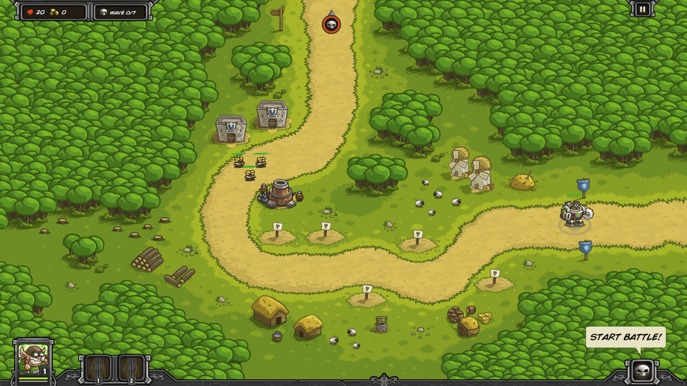

One artillery tower and two barracks can usually hold off all waves with no reinforcements, rain of fire, or hero involvement, and no upgrades active.

Consider building a mage tower below the artillery to handle any monsters who get through.

| Wave | Monsters                                                     |
| ---- | ------------------------------------------------------------ |
|      | 265G Build Artillery (first inside spot) Build 2 Barracks (first outside spots) |
| W1   | 3 Goblins (1 per sec)                                        |
| W2   | 3 Goblins (1 per sec) 3 Goblins (1 per sec)             |
| W3   | 3 Goblins (1 per sec) 3 Goblins (1 per sec) 3 Goblins (1 per sec) |
| W4   | 4 Goblins (2 per sec) 1 Orc                             |
| W5   | 3 Orcs (1 per sec)                                           |
| W6   | 5 Goblins (2 per sec) 2 Orcs (2 per sec) 5 Goblins (2 per sec) 2 Orcs (2 per sec) |
| W7   | 16 Goblins (4 per sec)                                       |

