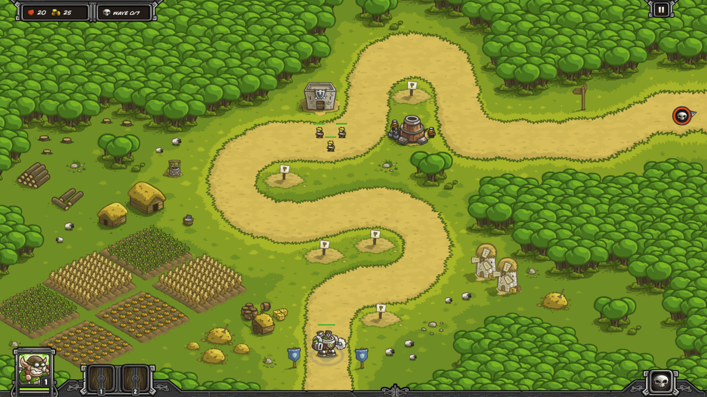
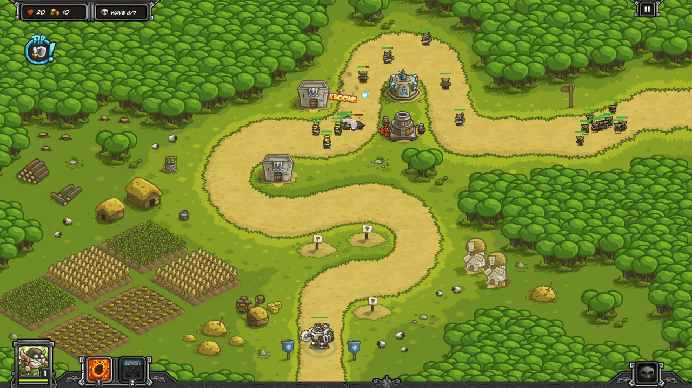
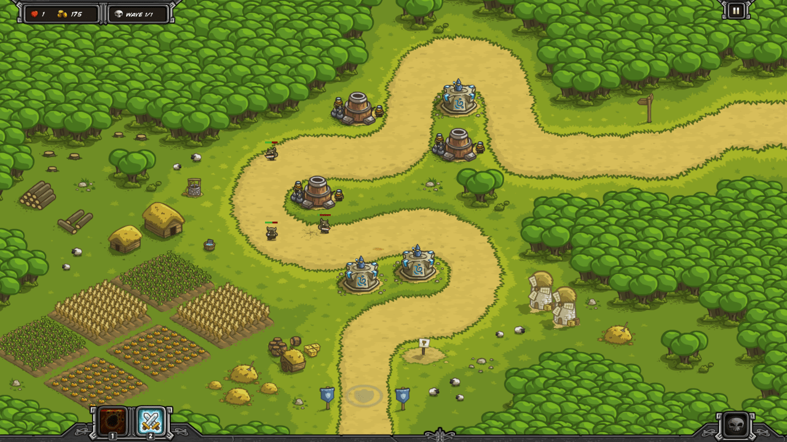

Unlock the first two artillery upgrades, "Concentrated Fire" (+10% damage) and "Range Finder" (+10% range) before this battle. 

You start with 220G. The artillery is better at the base of the first corner so that it hits large groups more evenly. Keep placing reinforcements with your soldiers to block larger groups.

If any monsters get through, use Rain of Fire or place reinforcements to finish them.

| Wave | Monsters                                                     |
| ---- | ------------------------------------------------------------ |
|      | 220G Build Artillery (base of first corner) Build Barracks (after first corner) |
| W1   | 5 Goblins (4 per sec) 5 Goblins (4 per sec) 10 Goblins (4 per sec) |
|      | Build Barracks (second corner apex)                          |
| W2   | 8 Goblins (at once) 8 Goblins (at once) 8 Goblins (4 per sec) |
|      | Build Mage (first corner apex)                               |
| W3   | 2 Orcs (0.5 per sec) 12 Goblins (at once) 2 Orcs (0.5 per sec) |
| W4   | 3 Wulf (at once) 3 Wulf (at once)                       |
| W5   | 6 Orcs (0.5 per sec) 10 Goblins (at once) 10 Goblins (at once) |
|      | Upgrade Artillery to L2                                      |
| W6   | 6 Orcs (0.5 per sec) 3 Wulfs (at once) 10 Goblins (at once) 3 Wulfs (at once) |
| W7   | 5 Wulfs (at once) 5 Wulfs (at once) 10 Orcs (at once) 20 Goblins (4 per sec) |

Complete Heroic mode right after the original level. The same tower layout and build order works, though you'll need a Rain of Fire to take out the Wave 3 group of Orcs.

To complete Iron, you'll need a different setup. You aren't allowed to build barracks, so put artillery where the two barracks were and keep reinforcements around to block. Some Orcs will get through near the end, so build Mages at the bottom to finish them off.

