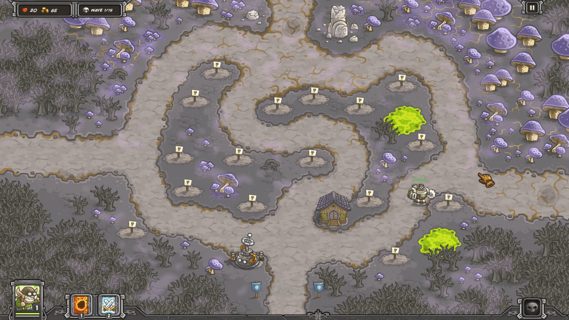
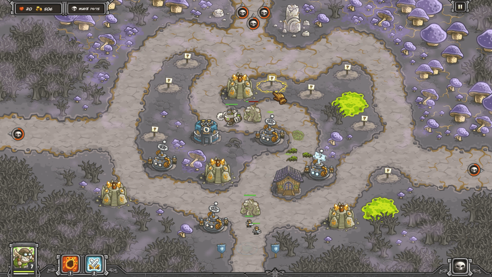

This is one of the hardest levels for me, especially on Heroic and Iron. Strong enemies come from everywhere, though the strongest ones come from the top and go through the middle path.

Bring Buzzsaw to block and insta-kill enemies. Use Tesla towers with L3 Overcharge to manage the Husks and Creepers. Once you have two Tesla towers on each path, the Rotshrooms also won't be able to get through. These combine nicely with the Sorcerer Towers, which provide four useful benefits here: their attack causes damage over time for the Husks and halves armor for the Treants, transmute takes out Swamp Things, and and Earth Elementals provide late game blocking.

| Enemy           | HP    | Speed  | Armor  | Mag. Def. | Gold | Damage | sec/hit   |
| --------------- | ----- | ------ | ------ | --------- | ---- | ------ | --------- |
| Husk            | 250   | Slow   | Medium | None      | 10   | 5-15   | 1.0       |
| Noxious Creeper | 1,000 | Slow   | None   | Medium    | 40   | 20-40  | 1.0       |
| Rotshroom       | 500   | Medium | None   | None      | 20   | 12-18  | 1.0       |
| Tainted Treant  | 1,000 | Medium | High   | None      | 60   | 20-40  | 1.0       |
| Swamp Thing     | 3,000 | Medium | None   | None      | 200  | 40-100 | 2.5 / 2.1 |

| Wave | Monsters / Action                                            |
| ---- | ------------------------------------------------------------ |
|      | 1,000G Build a Tesla tower (bottom spot). Put Buzzsaw and Reinforcements on the right. Rain of Fire the top just after the first three husks. Upgrade to Overcharge L3 as you can afford. |
| W1   | 12 Husks (top) 10 Husks (right)                         |
|      | Put Buzzsaw and Reinforcements near the exit. Rain of Fire the bottom when overwhelmed. Build an Artillery tower (right of elven house). Build an Artillery tower (left path, next to largest mushroom) |
| W2   | 3 Noxious Creepers (left) 20 Husks (top)                |
|      | Upgrade both Artillery towers to L2.                         |
| W3   | 10 Husks (left) 20 Husks (top) 10 Husks (right)    |
|      | Upgrade left Artillery to L3. Build Mage above Tesla tower. Build Mage right under top entrance. |
| W4   | 5 Rotshrooms (top, to left) 5 Rotshrooms (top, to middle) 5 Rotshrooms (top, to right) |
| W5   | 3 Noxious Creepers (left) 4 Noxious Creepers (top)      |
|      | Move Buzzsaw to middle path to execute Treant. Move Buzzsaw to exit afterward. Rain of Fire as Rotshrooms converge on exit. Upgrade left Artillery to Tesla. |
| W6   | 10 Rotshrooms (top, to left) 3 Tainted Treants (top, to middle) 10 Rotshrooms (top, to right) |
|      | Upgrade bottom Mage to Sorcerer.                             |
| W7   | 2 Tainted Treant (top, to left) 3 Tainted Treant (top, to middle) 6 Husks (top, to middle) 2 Tainted Treant (top, to right) 7 Husks (left) 7 Husks (right) |
|      | Upgrade left Tesla to Overcharge L3. Upgrade Sorcerer Transmute L1. |
| W8   | 19 Husks (left) 27 Husks (top) 19 Husks (right)    |
|      | Upgrade right artillery to Tesla. Upgrade right Tesla to Overcharge L3. |
| W9   | 8 Rotshrooms (top, to left) 2 Swamp Things (top, to middle) 12 Rotshrooms (top, to right) |
|      | Build Mage towers below left and right Teslas. Build Artillery in map center. |
| W10  | 4 Rotshrooms (left) 4 Rotshrooms (right) 12 Rotshrooms (top) 3 Tainted Treants (top, to middle) 3 Tainted Treants (top, to middle, at once) |
|      | Upgrade bottom Mages to Sorcerers.                           |
| W11  | 26 Husks (top, to left) 3 Swamp Things (top, to left) 26 Husks (top, to right) 3 Swamp Things (top, to right) |
|      | Upgrade middle Artillery to Tesla. Upgrade middle Tesla to Overcharge L3. |
| W12  | 6 Noxious Creepers (top, to middle) 12 Husks (left) 6 Tainted Treants (left) 2 Swamp Things (top, to left) 12? Husks (top, to left) |
|      | Upgrade to Transmute L1 on bottom two Sorcerers. Upgrade top Mage to Sorcerer. |
| W13  | 16 Rotshrooms (left) 20 Rotshrooms (top, to left) 15 Rotshrooms (top, to middle) 20 Rotshrooms (top, to right) 16 Rotshrooms (right) |
|      | Upgrade to Elemental L1 for middle path Sorcerers. Build a Musketeer left of the center Tesla. Upgrade Shrapnel Shot as possible. |
| W14  | 5 Noxious Creepers (top, to left) 9 Noxious Creepers (top, to middle) 5 Noxious Creepers (top, to right) 4 Noxious Creepers (left) 4 Noxious Creepers (right) |
|      | Move Buzzsaw to top to block boss. Rain of Fire boss as Buzzsaw blocks. Position Earth Elementals on middle path in Tesla range. Use Reinforcements to block Rotshrooms from boss death. |
| W15  | Myconid (boss, top, to middle) 8 Rotshrooms (top, to left) 8 Rotshrooms (top, to right) 3 Rotshrooms (right) 1 Noxious Creeper (right) 3 Rotshrooms (left) 1 Noxious Creeper (left) |
|      |                                                              |

For Heroic, use a similar layout. Start with the bottom Sorcerer, then the Tesla towers: bottom, right, left, and middle. Add the upper Sorcerer and lower left and right at the end. Add each tower after the previous one has been upgraded to  Overcharge L3 or Transmute L1.

