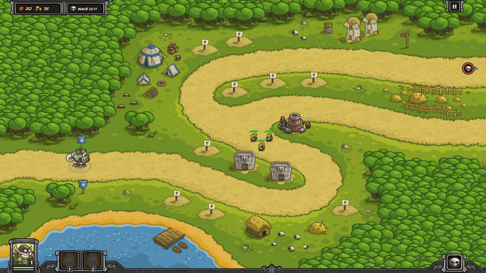

Pagras introduces the Ogre and the Shaman. Unlock the first two upgrades to Rain of Fire, Blazing Skies and Scorched Earth, before this level, to help kill these two units when needed.

Build a "kill zone" with three artillery and two supporting barracks and you can handle everything except the Ogres. Rain of Fire the two Shamans in Wave 10 and the two Ogres in Wave 11. Keep reinforcements in with your soldiers throughout.

| Wave | Monsters / Action                                            |
| ---- | ------------------------------------------------------------ |
|      | 300G Build Artillery (lower entrance apex) Build Barracks (after first corner) Build Barracks (bottom apex) Reinforcements with Soldiers |
| W1   | 8 Goblins (2 per sec) 8 Goblins (2 per sec) 8 Goblins (at once) |
|      | Call Wave 2 early Build Artillery (upper entrance apex) |
| W2   | 5 Orcs (0.5 per sec) 5 Goblins (1 per sec)              |
|      | Call Wave 3 early (last Orcs together and damaged)           |
| W3   | 12 Wulfs (upper and lower, 0.5 per sec each)                 |
|      | Build Artillery (next to barracks)                           |
| W4   | 20 Goblins (upper, 1 per sec) 5 Goblins (lower, 1 per sec) 15 Goblins (lower, 2 per sec) |
| W5   | 10 Wulf (upper, 0.5 per sec) 25 Goblins (lower, 2 per sec) |
|      | Upgrade Artillery to L2 (lower entrance apex) Call W6 early (last wulfs together) |
| W6   | 5 Orcs (upper, 0.5 per sec) 5 Orcs (lower, 0.5 per sec) |
| W7   | 9 Orcs (upper, 0.5 per sec) 20 Goblins (lower, 1 per sec) 2 Shamans (upper, 1 per sec) |
|      | Upgrade Artillery to L2 (upper entrance apex)                |
| W8   | 25 Goblins (lower, 1 per sec) 5 Orcs (upper, 0.5 per sec) 1 Shaman (upper) 7 Orcs (upper, 0.5 per sec) 1 Shaman (upper) |
|      | Upgrade Artillery to L2 (left one)                           |
| W9   | 30 Goblins (upper, 1 per sec) 6 Orcs (lower, 0.5 per sec) 2 Shamans (lower, 0.5 per sec) 15 Goblins (lower, 2 per sec) 10 Wulf (lower, 1 per sec) |
|      | Upgrade both Barracks to L2 Separate soldier rally points slightly (to avoid Ogre area damage) |
| W10  | 1 Ogre (upper) 2 Shamans (upper, 1 per sec) **Reinforcements and Rain of Fire Shamans as they appear** 20 Goblins (upper, 2 per sec) |
|      | Build Mage Tower (bottom center, backup) Build Barracks (bottom left, backup) |
| W11  | 1 Ogre (upper) 1 Ogre (lower) **Rain of Fire Ogres once together** 8 Orcs (upper, 0.5 per sec) 8 Orcs (lower, 0.5 per sec) 2 Shamans (upper, at once) 2 Shamans (lower, at once) 10 Goblins (upper, 2 per sec) 10 Goblins (lower, 2 per sec) |