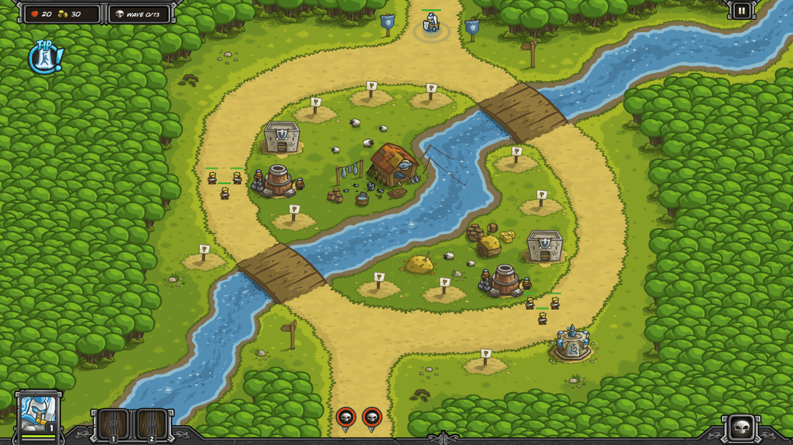

Twin River Pass is a step up in difficulty. The top of the map doesn't work as a single kill zone, because there aren't enough close tower positions. Instead, a left and right kill zone are needed, and they should be positioned where three or four towers can deal damage while soldiers block.

We will be using mages heavily in this map, so unlock the first two mage upgrades before this level, "Spell Reach" (range +10%) and "Arcane Shatter" (attacks damage armor). 

There are many Shamans on this map, but our mage towers don't hurt them much. We'll time our Rain of Fires to take them out. One Barracks per side is edgy, so we'll add reinforcements, alternating adding them to the left and right sides.

| Wave | Monsters / Action                                            |
| ---- | ------------------------------------------------------------ |
|      | 520G Build Barracks (right of hay cart) Build Artillery (left of barracks) Build Mage (left of artillery) Build Barracks (three up from left bridge) Build Artillery (under left Barracks) |
| W1   | 10 Goblins (left, 2 per sec) 10 Goblins (right, 2 per sec) 3 Orcs (left, at once) 3 Orcs (right, at once) |
|      | Build Mage (under left artillery) Build Mage (just after left bridge, left side) |
| W2   | 2 Orcs (left, at once) 2 Orcs (right, at once) 4 Goblins (left, 2 per sec) 4 Goblins (right, 2 per sec) |
|      | **Rain of Fire** entrance just as first Shaman enters Build Mage (under right artillery) |
| W3   | 20 Goblins (left, 4 per sec) 5 Orcs (right, 0.5 per sec) 2 Shamans (both sides) |
|      | Upgrade Mage to L2 (left side under artillery)               |
| W4   | 20 Goblins (left, 2 per sec) 30 Goblins (right, 2 per sec) |
|      | **Rain of Fire** entrance just as first Shaman enters Upgrade Mage to L2 (right side next to artillery) |
| W5   | 20 Goblins (left) 9 Orcs (right) 2 Shamans (left and right) |
| W6   | 4 Bandits (left, 1 per sec) 5 Bandits (right, 1 per sec) |
|      | Upgrade Mage to L2 (left side, left of bridge)               |
| W7   | 4 Wulfs (left, 1 per sec) 4 Wulfs (right, 1 per sec) 4 Bandits (left, at once) 4 Bandits (right, at once) 5 Wulfs (left, 1 per sec) 5 Wulfs (right, 1 per sec) |
|      | Upgrade Mage to L2 (right side, bottom) **Rain of Fire** as Shamans enter |
| W8   | 4 Orcs (left, 1 per sec) 4 Orcs (right, 1 per sec) 1 Ogre (left) 1 Ogre (right) 2 Shamans (left, at once) 2 Shamans (right, at once) |
|      | Upgrade Mage to L3 (left side under artillery)               |
| W9   | 4 Bandits (left, 1 per sec) 4 Bandits (right, 1 per sec) 4 Bandits (left, 1 per sec) 4 Bandits (right, 1 per sec) 7 Orcs (left, 1 per sec) 7 Orcs (right, 1 per sec) |
|      | Upgrade Mage to L3 (right side next to artillery) **Rain of Fire** as Shamans enter |
| W10  | 4 Orcs (left, 1 per sec) 4 Orcs (right, 1 per sec) 5 Bandits (left, 1 per sec) 5 Bandits (right, 1 per sec) 3 Shamans (left, at once) 3 Shamans (right, at once) |
|      | Upgrade Artillery to L2 (right side)                         |
| W11  | 4 Brigands (left, 1 per sec) 4 Brigands (right, 1 per sec) |
|      | Upgrade Artillery to L2 (left side) **Rain of Fire** as Shamans enter |
| W12  | 8 Bandits (left, 1 per sec) 8 Bandits (right, 1 per sec) 4 Brigands (left, 1 per sec) 4 Brigands (right, 1 per sec) 3 Shamans (left, 1 per sec) 3 Shamans (left, 1 per sec) |
|      | Upgrade Mage to L3 (right side bottom) Upgrade Mage to L3 (left side bottom) |
| W13  | 3 Brigands (left, 2 per sec) 3 Brigands (right, 2 per sec) 8 Bandits (left, 1 per sec) 8 Bandits (right, 1 per sec) 4 Brigands (left, 2 per sec) 4 Brigands (right, 2 per sec) 2 Shamans (left, 1 per sec) 2 Shamans (right, 1 per sec) |