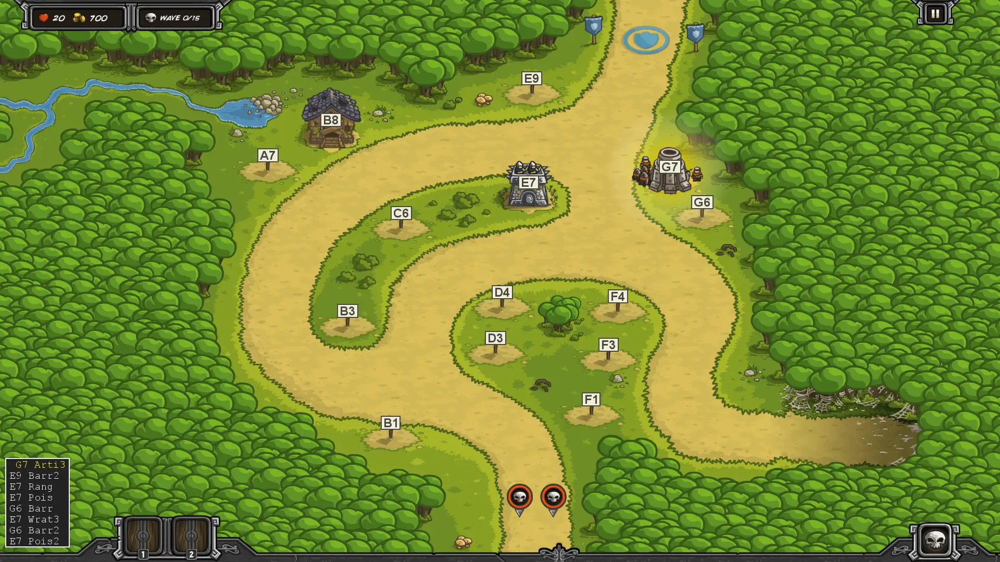
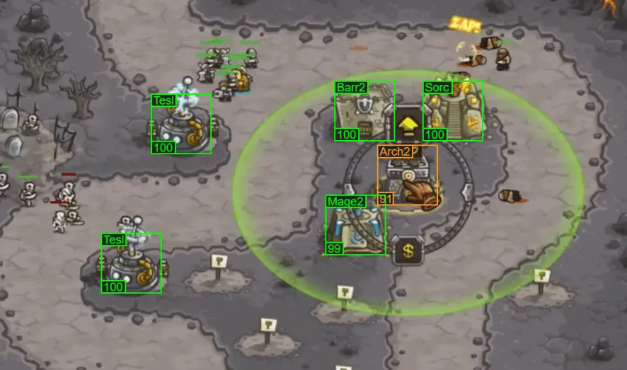
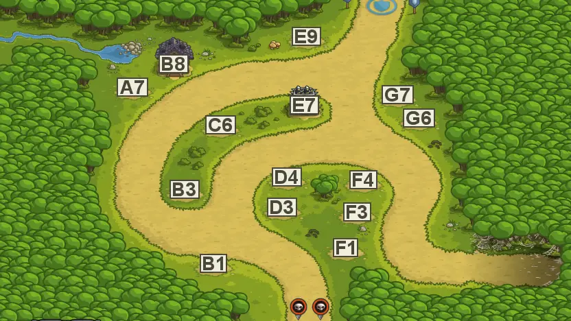

## Introduction

I love the tower defense game Kingdom Rush. More than anything else, it has just the right amount of complexity - just enough towers and abilities to give you options, and just enough tactical play to keep you busy between build steps. The difficulty rises smoothly across the levels, slowly asking more of you as you improve. It's great fun and has massive replayability. Thanks to a vibrant community, YouTube walkthroughs are there to help if you get stuck or need new strategic ideas.

Unfortunately, following a walkthrough while you play is really awkward. You're constantly pausing and resuming the game and walkthrough as you play. You have to watch closely or you can easily miss an ability upgrade. You really can't skip around or have the walkthrough playing "off to the side" as you play.

Refining your own strategies as you play is similarly difficult. It's hard to remember everything you did during a 20 minute level, and then to think about what went wrong and how to improve on top of that. I found myself making a lot of the same mistakes on replays and getting frustrated. 

I needed an easy way to write down the steps I took in a level, tweak the plan on paper, and then follow my plan on my next attempt.

So I built a "chess-like" Kingdom Rush syntax to transcribe my games. 

```
L5

G7 Arti3
E9 Barr2

# Upgrade provided Arch3 to a Ranger's Hideout
E7 Rang
E7 Pois1

# Redirect to blocking and killing the spiders
G6 Barr
E7 Wrat3
G6 Barr2

# Poison for stronger bandits
E7 Pois2
```

It was satisfying to be able to write my strategies and iterate on them, but the text plans were still hard to follow as I replayed the levels. I needed something much easier to follow than a walkthrough video - just the build steps, easy to "step through", easy to pick out the last change, and easy to see ability upgrades.

So I built a Kingdom Rush Animator which takes the text syntax and animates it on the level map. It shows just the build steps, so they're short. The last step is highlighted so you can find it at a glance while playing. Ability upgrades are drawn next to the towers, so you can't miss them. You can watch the animations like a video or tap through them like a slideshow as you play.



With the animator, life was much better. I could transcribe my games, iterate on the strategy, and then follow it easily on a replay. The one problem left was transcribing the games. My goal was to stop watching walkthrough videos, but now I had to watch my own games to write down what I had done. By the time I was done, it was harder to remember what went wrong that I wanted to change for the next play through.

So I built an AI-powered scanner to transcribe my gameplay videos for me.



Now I just record a game, drag-and-drop the video to the browser for a transcript, tweak the script for next game, and follow the animation to try it. These tools make it much easier for me to see what I did and make intentional changes, getting better playthroughs on each iteration. They transform the game for me, and so I wanted to share them. Enjoy!

## Syntax Guide

Kingdom Rush syntax is used to write a plan for how to play a given level, the same way that Chess Algebra is used to document chess games. The syntax has a **long form**, intended for human use, and a **short form** for computers (in URLs or stored in JSON, for example).

In the long form syntax, a **plan** consists of a **level** followed by a series of **steps**, each on a separate line. Each **step** is a **tower position** followed by an **action**.

Let's look at an example:

```
L5

G7 Arti3
E9 Barr2

# Upgrade provided Arch3 to a Ranger's Hideout
E7 Rang
E7 Pois1

# Redirect to blocking and killing the spiders
G6 Barr
E7 Wrat3
G6 Barr2

# Poison for stronger bandits
E7 Pois2
```

Let's break it down.

The first line, L5, indicates that this plan is for level five, Silveroak Forest. The list of level names and numbers is below. They are numbered in the same order as they appear in the game and are shown in the Ironhide strategy guide.

The next line is empty - empty lines are allowed anywhere. I put an empty line after the "initial build" (everything before the first Wave) and when there is a significant time gap between steps.

The third line, "G7 Arti3", means to build a level three artillery tower at position G7. The tower positions don't have any names by default, so I came up with an algorithm to assign "chess-square-like" names to each of them. They are always one letter (A-H) followed by one number (1-9). Positions use later letters moving from left to right, and higher numbers going from the bottom to the top of the map.

Here's L5 with the positions labelled:



So, "G7 Arti3" means to build a level three artillery tower at G7, which is near the top right part of the map. 

Why "Arti3"? I've made every **action** in the syntax four letters long, because that was short but enough that I could read them clearly. I don't remember the names of all of the towers, so the lower level towers are just a category ("Arti" for artillery) followed by the upgrade level (three). The top-tier towers are described by the first four letters of their names, like "Tesl" for the Tesla tower. See below for a table with all of the tower names.

Why did I jump straight to a level three Artillery? I could say to build a level one artillery first, but it's shorter just to say the final level to upgrade it to before doing an action somewhere else.

The fourth line says we need a level two barracks at E9, blocking the exit. The syntax doesn't tell you where to put the Rally Point for the soldiers, but I haven't found a case where that isn't obvious.

These two towers are all we can afford before sending out enemies, so I've left an empty line after this.

Next we have a comment "# Upgrade provided Arch3 to a Ranger's Hideout". You may put comments on any line after the first to help explain your strategy (to your future self or others).

After that, "E7 Rang" says to upgrade the provided archer tower to a Ranger's Hideout.

"E7 Pois1" says to buy the level one "Poison Arrows" ability for the tower. This helps take out the more armored bandits coming on the left side. The ability upgrades, like the top-level towers, are all identified by the first four letters of the upgrade name. See below for the full list. Abilities are followed by a number to indicate which level of the ability to unlock.

The plan then says to build another Barracks at G6, fully upgrade Wrath of the Forest on the Ranger's Hideout, upgrade the Barracks to level two, and then buy Poison Arrows level 2.

At the end of the level, we have something like this:


## Syntax: Towers and Abilities

| Barracks                                                     | Archer                                                       | Mage                                                         | Artillery                                                    |
| ------------------------------------------------------------ | ------------------------------------------------------------ | ------------------------------------------------------------ | ------------------------------------------------------------ |
| Barr                                                         | Arch                                                         | Mage                                                         | Arti                                                         |
| Barr2                                                        | Arch2                                                        | Mage2                                                        | Arti2                                                        |
| Barr3                                                        | Arch3                                                        | Mage3                                                        | Arti3                                                        |
| **Holy** Order<br />   **Heal**ing Light<br />   **Shie**ld of Valor [1]<br />   **Holy** Strike | **Rang**er's Hideout<br />   **Pois**on Arrows<br />   **Wrat**h of the Forest | **Arca**ne Wizard<br />   **Deat**h Ray<br />   **Tele**port | **BigB**ertha<br />   **Drag**onbreath Launcher<br />   **Clus**ter Launcher |
| **Barb**arian Mead Hall<br />   **More** Axes<br />   **Whir**lwind Attack<br />   **Thro**wing Axes | **Musk**eteer Garrison<br />   **Snip**er Shot<br />   **Shra**pnel Shot | **Sorc**erer Mage<br />   **Poly**morph<br />   **Summ**on Elemental | **Tesl**a x109<br />   **Supe**rcharged Bolt [2]<br />   **Over**charge |

The [1] and [2] above denote abilities that only have one or two levels to unlock, rather than three.

## Syntax: Levels (Maps)

| Level | Name               |
| ----- | ------------------ |
| L1    | Southport          |
| L2    | The Outskirts      |
| L3    | Pagras             |
| L4    | Twin River Pass    |
| L5    | Silveroak Forest   |
| L6    | The Citadel        |
| L7    | Coldstep Mines     |
| L8    | Icewind Pass       |
| L9    | Stormcloud Temple  |
| L10   | The Wastes         |
| L11   | Forsaken Valley    |
| L12   | The Dark Tower     |
| L13   | Sarelgaz's Lair    |
| L14   | Ruins of Acaroth   |
| L15   | Rotten Forest      |
| L16   | Hushwood           |
| L17   | Bandit's Lair      |
| L18   | Glacial Heights    |
| L19   | Ha'Kraj Plateau    |
| L20   | Pit of Fire        |
| L21   | Pandaemonium       |
| L22   | Fungal Forest      |
| L23   | Rotwick            |
| L24   | Ancient Necropolis |
| L25   | Nightfang Swale    |
| L26   | Castle Blackburn   |

To see the named tower positions for every level, see [Maps](https://relentlessoptimizer.com/KR/maps). You can click on the map tile to see a high quality version of the labelled map.

## Short Syntax

The short syntax is a very compact form of the normal syntax, with some optimizations to further reduce length. You don't need to write the short syntax - the animator will convert long syntax for you. If you want the details, however, keep reading.

Here's the example from above translated to the short syntax:

```
L5:G7t3 E9p2 E7r4 x G6p E7y3 G6p2 E7x2
```

Just like the long syntax, it's a level and then a sequence of steps. In short form, the level has a colon ':' right after it.

The steps are, again, a position name and an action. The position names don't need shortening, so you see the same "G7" as in the long form, "G7 Arti3".

In short form, the actions are also reduced to one letter and one number. The letters are "P" for Barracks ("Paladins"), "R" for Archers ("Rangers"), "S" for Mages ("Sorcerers"), and "T" for Artillery ("Tesla"). The numbers are the levels, like before, but levels "4" and "5" are the two top level towers (the one on the left and right, respectively, in the Steam release). 

So, "t3" is "Arti3" (Artillery level 3), and "r4" is "Rang" (Ranger's Hideout). 

All abilities are shortened to "x", "y", or "z", matching the left-to-right order in the Steam game UI. So, "x" means the Poison Arrows when applied to a Ranger tower.

Why is the "x" sitting by itself as the fourth step? Two things. First, if a step applies to the same tower position as the previous step, you can leave it out. Since we just built the Ranger's Hideout on E7, the step to add Poison Arrows can omit it. Second, if the level of a tower or upgrade is one, it can be omitted. 

You can also omit the level of a tower or upgrade if it's one level higher than the last level. This means that the upgrade to Poison Arrows level two at the end could also just be "x".

I'm showing the short syntax here with spaces between the steps for clarity, but they don't need to be there, so the shortest version of the short form is:

```
L5:G7t3E9p2E7r4xG6pE7y3G6p2E7x2
```

You can see the animation for a plan by passing the short form in the query string to the Kingdom Rush Animator, like this:

[https://relentlessoptimizer.com/KR/animate/?p=L5:G7t3E9p2E7r4xG6pE7y3G6p2E7x2](https://relentlessoptimizer.com/KR/animate/?p=L5:G7t3E9p2E7r4xG6pE7y3G6p2E7x2)

## Converting to Short Syntax

Drag-and-drop a file with a long syntax plan onto the [Kingdom Rush Animator](https://relentlessoptimizer.com/KR/animate). It will translate it to the short form and add it to the URL for you.

## Error  Checking Plans

If you want to write plans manually with error checking, go to the [Kingdom Rush AI Scanner](https://relentlessoptimizer.com/KR/scan/), click "write yourself", and type the plan into the text area on the right side. The plan will be parsed and validated as-you-type, and errors will be shown at the bottom right.

If you try to animate a plan with errors, the animator will tell you the problems in red. It's easier to understand and fix them in the long form, however, so working in the scanner is a lot more pleasant.

## Recording Playthroughs and AI Plan Transcription

You can hand-write the syntax, and it's easy to edit an editing plan, but transcribing the plan from a play video is annoying. 

Instead, I wrote an [AI Scanner](https://relentlessoptimizer.com/KR/scan/) which transcribes videos for you. It currently only finds the towers themselves (not ability upgrades), so if you want the ability upgrades, you have to write those in yourself. (Working on it..)

The AI Scanner works internally with 1920x1080 frames, so, for best results, play at 1920x1080 resolution. On Windows, you can install the "Xbox Game Bar" app from the Microsoft Store. Once it's installed and running, you can use "Win+Alt+R" to record gameplay. Just drag and drop the video from your Videos\Captures folder to the [AI Scanner](https://relentlessoptimizer.com/KR/scan/) and it will transcribe it for you.

You can hand-edit the plan on the right-side pane if needed, either to fix transcription mistakes or refine the strategy for next play. The link at the top right is a permalink to the animator for that strategy. 

If you want to see what the AI Scanner understood about a given frame, you can click on the progress bar at the top to seek to that part of the playthrough, AI analyze the frame, and see what the scanner saw.

The AI shows a box around each tower position where something was detected. It shows what it detected on the top left, and how confident it was (as a percentage) on the bottom left.


Here you can see it's 100% confident of most of the towers, but unsure about the Arch2 under the cursor (likely because the cursor and upgrade button are partially covering it). The AI will only transcribe a step if it is at least 95% confident there's a different tower there.

## Animator

The Animator is designed to help you visualize and follow a Kingdom Rush plan much more easily than watching a YouTube walkthrough.

YouTube Walkthroughs are annoying because:

* There's a lot of action in between the build steps to sit through.
* It's easy to miss what the last build step was.
* It's **really** easy to miss ability upgrades (unless you watch the moment they were unlocked).
* You don't know the next step until you unpause to watch ahead.

The Animator is designed to fix all of these problems. It shows just the build steps, so there's nothing to skip past. It highlights the most recent step with a gold outline so that you can quickly tell what just changed. Ability Upgrades are drawn under each tower at all times, so you can tell what abilities have been unlocked. Finally, the script is shown on the bottom left, so you can see what step the video is showing, what will happen next, and what happened in previous steps.

You can watch the plan like a video or step through it deliberately as you play. Press spacebar to pause the animation, then use the left and right arrows to go through steps one-by-one. Up and Down quickly go to the start and end. All of these actions can also be triggered by tapping or clicking on the image. Tap or click once to see the controls and again to step or seek around.

## My Workflow

I designed the syntax and built the animator and scanner to help me play Kingdom Rush more effectively. When playing, I usually:

* Open the labelled map for reference.
* In the game, plan my before-Wave 1-steps and write them in the long syntax.
* Restart the level and start recording.
* Play until I beat or fail the level.
* Drag-and-drop the video onto the scanner for a transcription.
* Edit the long form syntax to plan my next attempt.
* Drag-and-drop the long form plan to the animator and leave at the last frame.
* Repeat until the strategy seems solid.

## Walkthroughs

I've saved strategies for most of the levels; go to [Maps](https://relentlessoptimizer/KR/maps) and click the links on the bottom right to see my current playthroughs for each level and mode.

## Video Transcoding


## Feedback Welcome!

If you have ideas about how to improve the syntax, animator, or AI scanner, please [contact me](https://relentlessoptimizer.com/about/). I plan to extend the AI to identify ability upgrades (but I have to scan far more frames to find them).

I'm especially interested in ways to visualize the build order better. If I could make a single image that shows the final built towers **and** the order of the steps (or a few steps), I think that would be the ideal guide to follow when playing.