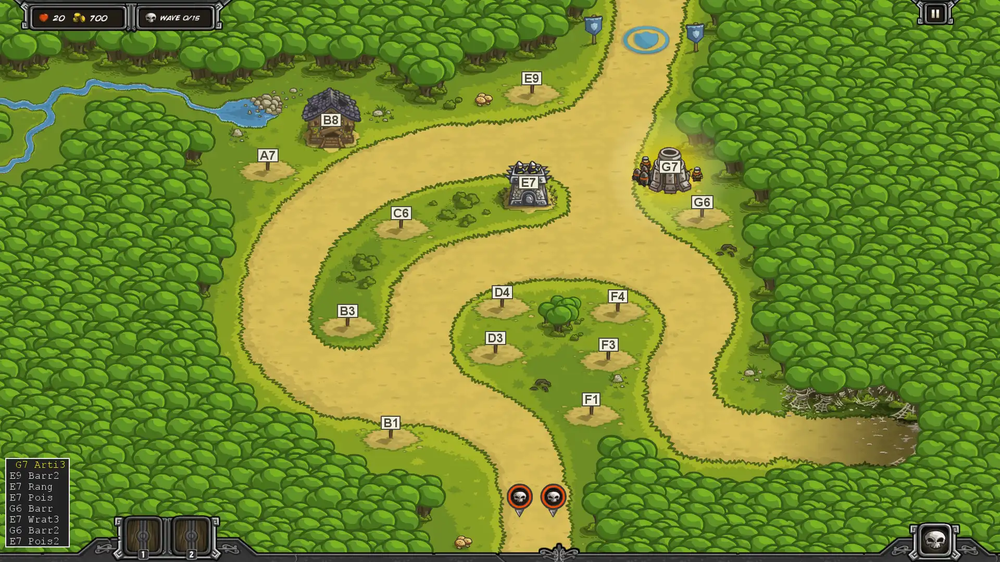
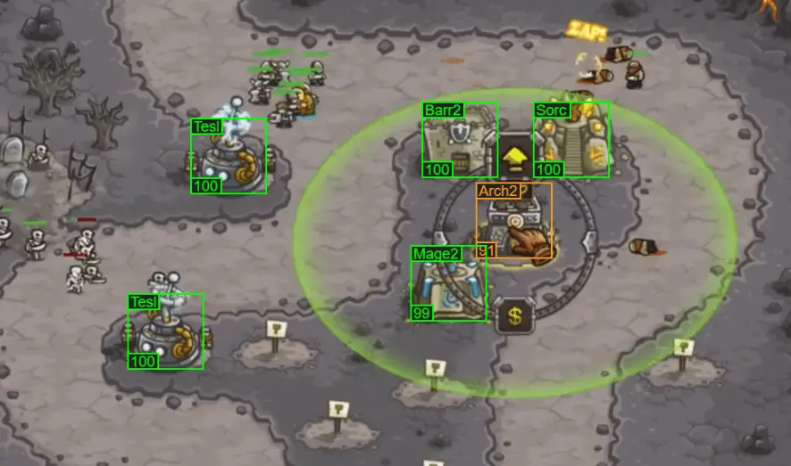

I love the tower defense game Kingdom Rush. More than anything else, it has just the right amount of complexity - just enough towers and abilities to give you options, and just enough tactical play to keep you busy between build steps. The difficulty rises smoothly across the levels, slowly asking more of you as you improve. It's great fun and has massive replayability. Thanks to a vibrant community, YouTube walkthroughs are there to help if you get stuck or need new strategic ideas.

Unfortunately, following a walkthrough while you play is really awkward. You're constantly pausing and resuming the game and walkthrough as you play. You have to watch closely or you can easily miss an ability upgrade. You really can't skip around or have the walkthrough playing "off to the side" as you play.

Refining your own strategies as you play is similarly difficult. It's hard to remember everything you did during a 20 minute level, and then to think about what went wrong and how to improve on top of that. I found myself making a lot of the same mistakes on replays and getting frustrated. 

I needed an easy way to write down the steps I took in a level, tweak the plan on paper, and then follow my plan on my next attempt.

So I built a "chess-like" [Kingdom Rush syntax](https://relentlessoptimizer.com/KR/help/#kingdom-rush-syntax) to transcribe my games. 

```
L5

G7 Arti3
E9 Barr2

# Upgrade provided Arch3 to a Ranger's Hideout
E7 Rang
E7 Pois1

# Redirect to blocking and killing the spiders
G6 Barr
E7 Wrat3
G6 Barr2

# Poison for stronger bandits
E7 Pois2
```

It was satisfying to be able to write my strategies and iterate on them, but the text plans were still hard to follow as I replayed the levels. I needed something much easier to follow than a walkthrough video - just the build steps, easy to "step through", easy to pick out the last change, and easy to see ability upgrades.

So I built a [Kingdom Rush Animator](https://relentlessoptimizer.com/KR/animate) which takes the text syntax and animates it on the level map. It shows just the build steps, so they're short. The last step is highlighted so you can find it at a glance while playing. Ability upgrades are drawn next to the towers, so you can't miss them. You can watch the animations like a video or tap through them like a slideshow as you play.



With the animator, life was much better. I could transcribe my games, iterate on the strategy, and then follow it easily on a replay. The one problem left was transcribing the games. My goal was to stop watching walkthrough videos, but now I had to watch my own games to write down what I had done. By the time I was done, it was harder to remember what went wrong that I wanted to change for the next play through.

So I built an [AI-powered scanner](https://relentlessoptimizer.com/KR/scan/) to transcribe my gameplay videos for me.



Now I just record a game, drag-and-drop the video to the browser for a transcript, tweak the script for next game, and follow the animation to try it. These tools make it much easier for me to see what I did and make intentional changes, getting better playthroughs on each iteration. They transformed the game for me, and so I wanted to share them. Enjoy!
