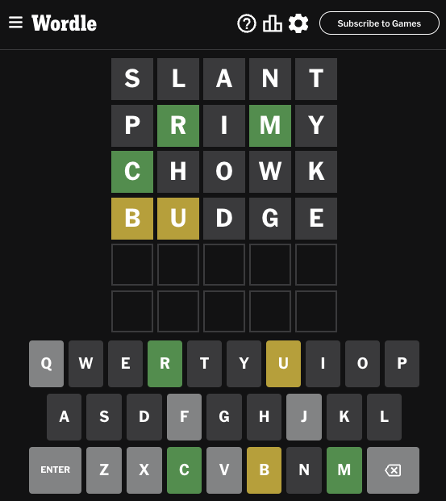

I've seen a [lot](https://i-kh.net/2022/04/22/my-lazy-wordle-strategy/) [of](https://www.cnbc.com/amp/2022/09/14/this-is-the-best-wordle-starting-word-according-to-mit-researchers.html) "best first Wordle guesses" [posts](https://betterprogramming.pub/forget-luck-optimized-wordle-strategy-using-bigquery-c676771e316f) [online](https://jonathanolson.net/experiments/optimal-wordle-solutions), but while they may provide the most theoretical information, I had trouble using them as a human. Here are my adventures coming up with the best starting words for my own play style.

TL;DR: **SLANT, PRIMY, CHOWK, BUDGE**

You can always guess all four and safely solve in your remaining two guesses, though 1.1% of the time a careful fifth guess is required.

## Attempt One: Top Letters

Last year, I decided to come up with standard starting guesses. I found out how common each letter was in the answers and then came up with words (manually) which contained the top letters: **LATER, COINS, DUMPY**. 

These guesses worked relatively well, but they have two problems: First, I often found mostly vowels and couldn't switch to specific guesses. Second, I didn't have a fourth guess if I needed one, and I had used up all of the vowels, so I would be wasting at least one letter in the fourth guess.

## Attempt Two: Minimize the Worst-Case Answer Count

For my second try, I wrote some Rust code to try every pair of valid guess words against each answer. I put the answers into buckets based on the responses to my guesses, and looked for the pair which left the fewest guesses in the biggest bucket.

There are a number of pairs that tie at 16 worst-case possible answers. I chose the hilarious "**ROAST, INCEL**" from that list and then continued with "**DUMPY**" to cover remaining letters.

These are more effective than **LATER, COINS, DUMPY**, but really had exactly the same problems. I needed a different scoring mechanism that was designed more for what helps me finish the puzzles as a human player.

## A New Guess-Scoring Strategy
So, what had I learned from trying to use the previous guess sets?

### Consonants > Vowels

I typically play standard guesses until I know at least three letters, and then try to come up with specific guesses. It's much easier for me to come up with words given several consonants ("Y, L, C") than mostly vowels ("A", "E", "R"). 

If I'm coming up with standard opening guesses, I want to focus on finding the top consonants with only a single vowel in each guess.

### Yellows are Fine

It's nice to get a green letter, but if I use standard guesses until I know three or more letters, there often are only a few plausible ways the letters could be ordered. If I get one green letter, often my yellow letters have only one possible placement.

So, if I'm "scoring" possible first guesses, I care about finding known letters but I wouldn't weight green letters much higher than yellow ones. They're definitely more helpful, but not five times as helpful.

### Blacks in Packs

To a computer, a black response (the answer does not contain 'T') is often very useful. I, however, can't come up with guesses that don't have a letter, so I can't use the black responses effectively until almost all of the letters have been eliminated. What I'm really doing is trying out each of the remaining possible letters in with my known ones.

In my first guesses, I want to cover as many distinct letters as possible (to get to enough black letters to use them) but I wouldn't rank a guess based on how many answers the first few black responses eliminate; I can't use that information effectively.

### The Strategy
With these concepts in mind, I switched to scoring guesses based on the number of yellow and green responses they uncover across the answer set. For each letter in a given guess, I score one point for every answer containing that letter (yellows + greens, effectively) and two more points for each answer with that letter in that exact position (scoring three total points for each green).

If a later guess uses a letter again, it only gets points for the new greens found. If a later guess tries the same letter in the same position, it doesn't get any points at all.

This focuses on yellow and green responses over black ones, but what about vowels? In order to de-emphasize vowels, I quartered the scores for each vowel. For example, 'E' occurs 1,230 times across the answers, but I cut the yellow score for 'E' to 1,230 / 4 = 307 instead. This moves 'E' from being the most valuable letter to 12th, ensuring that the search will (grudginly) include vowels but focus on consonants until most of them have been guessed.

## V3: Consonant Scoring
I updated my Rust code to look for the two words with the highest consonant score and came back with **SHALT, CRONY** (9,460 points). Looking for two more words to get the most remaining points identifies **BLIMP, FUDGE**, for a total score of 13,955.

**SHALT, CRONY, BLIMP, FUDGE** were great guess words and I used them for quite a while. They cover all of the top consonants, mostly in the most-likely positions (S is usually first in answers, for example). They guess only one vowel per guess until the fourth. If I know several consonants and need to know the vowels, I guess **FUDGE** third, either revealing a vowel or indicating 'I' by process of elimination.

The one thing I didn't love about these guesses is that they try 'L' twice. I wanted to see if I could cover all five vowels and 15 distinct consonants in my four starting guesses.

I decided to reduce the green score from 3x yellows to 2x yellows and try again...

## V4: Revised Consonant Scoring

There are too many valid words to try every combination of three or four words, so again I started by looking for a pair, which found **SLANT, CREPY**. Looking for two more words yields **SLANT, CREPY, DOUGH, BIOME** which still has a repeated letter - the O.

I searched for two words after just **SLANT**, which yielded **PRIMY, CHODE**, and then another run for a fourth word: **BURGH**. These again have a repeated letter (H). These four together also scored worse in my new scoring system than my earlier **SHALT, CRONY, BLIMP, FUDGE** (11,169 vs 11,316).

Finally I decided to search again on a base of **SLANT, PRIMY** and got **CHOWK, BUDGE**. This, finally, has no repeated letters and a better total score than my previous picks, at 11,417!

## V4 Analysis and Usage
How well do **SLANT, PRIMY, CHOWK, BUDGE** work in actual play?

First, you can always play these four words and then safely solve the puzzle in your last two guesses.
91.6% of the time, you'll know at least four of the answer letters afterward.
92.2% of the time, there is only one possible answer left.
98.9% of the time, you can guess any possible answer and it'll be correct or leave you with a single remaining option.

The last 1.1% of the time (in 25 of 2,309 games), you need a specific fifth guess to be certain of the answer. If you only know these letters, here are the fifth guesses:
A, T, R, E: "after"
T, R, O, E: "otter"
A, N, T, U: "ajiva"
L, A, C, O: "falls"

You often won't need to guess all four words; after **SLANT, PRIMY** you'll know four or more letters 52% of the time. If you several consonants and want to know the vowel, guess **BUDGE**. The answer must have an **O** if none of the other vowels are in it.

These four guesses contain each vowel once and the top 15 consonants except W instead of F (#21 in for #19). 

All but five of the letters are guessed in their most likely positions, maximizing the chance of green responses for them. This is the best case, because in four guesses you get to guess 20 letters, four in each position. The top 20 letters have 7 that occur mostly in 1st position, 5 that are 2nd, and 5 that are 5th, so we have 3 + 1 + 1 = 5 letters which will have to be guessed in non-ideal positions.

How optimal is this? Since humans play differently, this is great for me but isn't ideal for everyone. I also had to "mess with" the search a bit to get guesses that didn't reuse letters and there are too many combinations to search for the four optimal words in one pass (14,855^4 / 4! options). However, those shortcomings aside, these seem to be very effective words. =)
