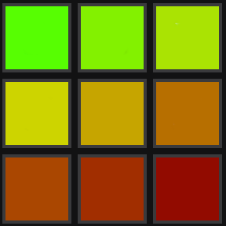
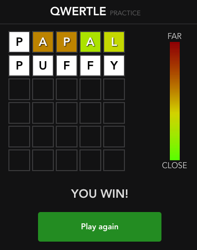
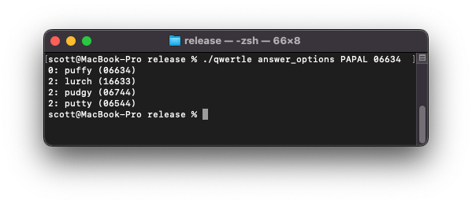

Last week on [Hacker News](https://news.ycombinator.com/), someone [announced](https://news.ycombinator.com/item?id=39136123) a new Wordle variant, [QWERTLE](https://qwertle.friedman.in/). As an avid Wordle player and optimizer, I was excited to try playing and solving this new game.

In Qwertle, as in Wordle, you have six tries to guess a five letter word. However, instead of getting a green, yellow, or black response per guess letter, you get a gradient color indicating how far the answer letter is from your guess letter on the QWERTY keyboard. If you guess 'CLINT' and the answer is 'FABLE', the 'C' will be bright green, telling you that the first letter of the answer ('F') is one key away from 'C'.

On the first day, I tried playing my favorite Wordle guesses - CLINT, SOARE - but found that they are not good for Qwertle. 'S', for example, is one letter away from A, W, E, D, and Z, meaning a huge number of words will get the same bright green response to the 'S'.

I realized that the best guess letters would be at the edges of the keyboard. 'P', for example, is a full nine keys away from 'Q', maximizing the number of distinct color responses for it. There are also fewer possible letters at each distance, since all letters are only on one side of 'P'. For example, the only letters five keys away from P are T, G, and V. 

If you can get ten distinct responses for each guess letter, you could get 10,000 different combinations for a five letter guess. A great guess might distinguish all of the 2,315 different original Wordle answers, allowing a player to solve **every** QWERTLE game in two guesses.

I wrote some [Rust Code](https://github.com/ScottLouvau/experiments/tree/main/qwertle) to compute the distances between a given guess and  answer, and then used it to find the best potential guess. From the answers, the best guess is PAPAL, which has 2,118 distinct responses for the 2,315 original Wordle answers. There are 1,942 responses with one answer, 157 pairs, 17 triples, and 2 sets of four possibilities. 

If I identify the distance colors correctly, PAPAL should solve Qwertle in an average of **1.095** turns.

I then played the game in an In Private tab to find the color palette for each key distance, in perfectly horizontal keys away:



Next, I made a table of the letters at each distance away from my chosen guess:

| 0     | 1     | 2     | 3     | 4     | 5     | 6     | 7     | 8     | 9     |
|-------|-------|-------|-------|-------|-------|-------|-------|-------|-------|
| p (0) | lo    | ik    | muj   | bhny  | tgv   | cfr   | dex   | swz   | aq    |
| a (1) | wsq   | edxz  | rcf   | tvg   | hyb   | unj   | imk   | ol    | p     |
| p (2) | ol    | ik    | umj   | nbyh  | tgv   | rcf   | edx   | swz   | aq    |
| a (3) | swq   | edzx  | crf   | tgv   | hby   | nuj   | imk   | lo    | p     |
| l (4) | kop   | nmij  | hbu   | ygv   | tcf   | rdx   | esz   | aw    | q     |

I originally put the letters in each cell in alphabetical order, but found it was much better if I put the most likely letters first. So, for example, three keys away from a leading 'P' is 'muj', because 'M' is the first letter of many more answers than 'U' and 'J'. On the other hand, three keys from a middle 'P' yields 'umj', because 'U' is the more likely than M and J to be the third letter of an answer.

So, to play, guess PAPAL. Find the closest palette color for each response and write the "distance code". Next, find the letters in the table for those distances, and then look for combinations of the letters that are valid words. If you aren't finding anything, look back at the colors for the next most likely distance and consider those options instead.

Here's an example game:

```
PAPAL 06634
P UNJ RCF CRF YGV
  HYB TGV

PURCY
PURRY
PUFFY
```

I got the first P correct, so the distance is zero. The other letters looked closest to 6, 6, 3, and 4 to me. I wrote the distance code (06634) and below it, the possible letters at each position. The top letters in each position form PURCY, which doesn't look good. I saw PURRY, but don't think that's a word either. I didn't immediately see a valid word, so I considered other distances the colors might be. The two 6s might be 5s, so I wrote the distance 5 letters as well. Looking again, I saw PUFFY in the original options, and it turned out to be the answer.



This probably makes QWERTLE too easy to be fun for some players, but I enjoy the much simpler game of taking the letter options and trying to see the answer word quickly. It's also fun to solve a long set of games in a row using the practice mode.

I've published my [Rust Code on GitHub](https://github.com/ScottLouvau/experiments/tree/main/qwertle), along with [Apple Silicon and Windows x64 binaries](https://github.com/ScottLouvau/experiments/releases/tag/qwertle-0.1.0). You can use the code to build the distance table for your favorite guess, or ask it directly about the most likely letters or closest complete answers given a guess and distance score. Enjoy!

