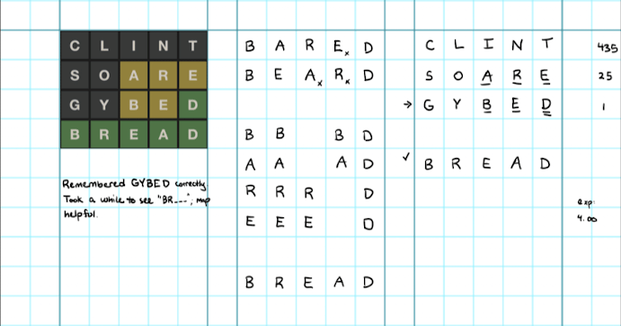
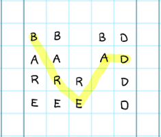
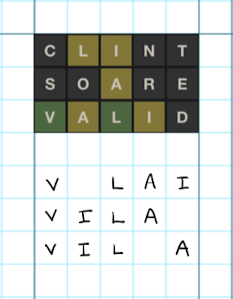
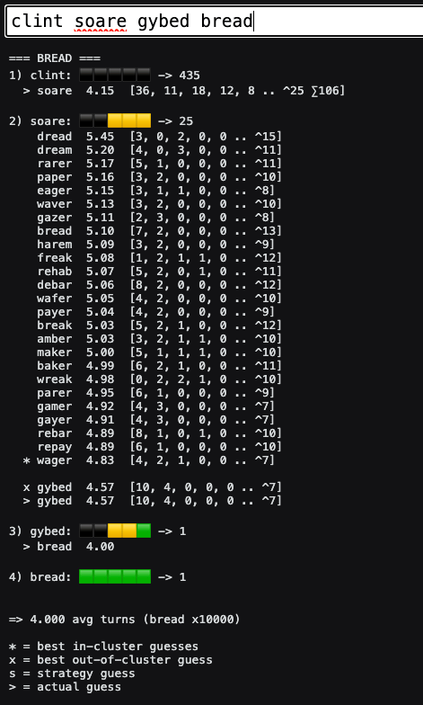

I enjoy playing Wordle and optimizing my play. [Initially]() that meant choosing the best starting guesses, but I have also worked on **how** I play the games. I originally tried to solve the puzzles in my head, but quickly found that I play much better on paper.

Here's a sample game, played in GoodNotes on my iPad:


### The Columns
I fill the columns out from right-to-left, because I'm left handed (smudge avoidance). The right column has my guesses, the middle column is working space, and the left column has a screenshot and any discussion about how the puzzle went. Post-game analysis metrics are in the right margin.

In my guesses, one underline means a yellow response, and two means green. I leave an empty line between my standard guesses and specific ones for the current puzzle. In this case, my strategy includes a third pre-planned guess in this situation (are -> GYBED), so I put an arrow next to it. If my guess was the answer, I put a check mark next to it.

In my working space, I think about words with the found letters in them, looking at the remaining letters on the Wordle game keyboard. If I think of a word which uses an eliminated letter or a letter in a disallowed position, I write it down (so I don't repeatedly think of it) and put a small X next to the invalid letters.

### Maps and Orders
If I can't come up with valid options quickly, I may draw a "**map**" of the known letters. I make one line per yellow letter, with all of the remaining positions that letter could appear in. I put any green letters in every line in the positions where they are. I try to put the most likely first letter first. Once I have a map, I imagine lines going across the columns, forming possible words. In this case, it helped me think of "BR__D" which somehow wasn't coming to mind.



If there aren't many places left where the known letters can be, I might also write down all of the **orders** left for them. For example, in the below case, I have four known letters with two greens, and only three possible orders left:



By writing them out, I was able to see the answer, VILLA, and the problem - I wasn't thinking about double letters in the answer.

### Post-Game Analysis
After I find the solution, I analyze my game using some Rust code I wrote, using the answer list from the original Wordle game (2,315 answers). 

The analysis tells me how many possible answers were left after each guess, what the best next guess was, and how many turns my strategy was expected to take to solve that particular puzzle.

In the BREAD case, there were 435 answers left after CLINT found nothing, 25 answers after SOARE found yellow a, r, e, and only one answer left after GYBED. My strategy should've taken four turns for BREAD, which is what happened.

Here's the analysis of the BREAD game:



Most of this is too complicated to explain in this post. I'll just say that this line:
`> gybed  4.57  [10, 4, 0, 0, 0, ... ^7]`

Says that GYBED was my actual next guess. It should take 4.57 turns, on average, to solve for all 25 answers that are still possible. The thing in brackets is called a **Cluster Vector** - it's complicated. Check out [Dave Rusin's amazing Wordle analysis](https://web.ma.utexas.edu/users/rusin/wordle/) if you want to learn about them.

### The GoodNotes Template
I play two games each day (the New York Times version, and the original Wordle code, which I saved before NYT bought Wordle), so my overall GoodNotes template has two sections on each page to fit them. If you want to try it, here's the [template](img/wordle-template.pdf).

I pre-filled a copy of my template with my first guess. You can do that in GoodNotes by:
- In Notebooks View, click the gear, Notebook Templates, Add, and browse to the pdf
- Make a new Notebook using the template
- Hand-write your standard guesses onto the page
- Share -> Export Page as PDF
- Re-do the import as a template.

### Conclusion
I've found that playing on paper helps me to work through all of the possible options and choose better guesses when there are several options left.

My "maps" and "orders" are good tools for helping me to write something that should "look like" the answer, but I'm still wondering if there are other visualizations that would work even better.

If you play on paper and have a different way of working, I'd love to hear from you!

### Footnote - "V12" Strategy
I've revised my strategy several times since my post about it. My current one is:

```
1. CLINT
 -> guess if 3+ found AND at least one green AND not only "int" (any colors)

2. SOARE
 -> guess *except* the following cases (lowercase = yellow and UPPERCASE = green):

_               -> DUMPY
a, i            -> DUMPY
re, or, ar, la  -> DUMPY
ArE, IrE, SEA   -> DUMPY

Ore             -> MAWKY
are             -> GYBED

orE, ire        -> PAVED
O, TaN          -> DOUGH
NO, cat, East   -> BUMPH
```

This strategy only requires memorizing six words in addition to the standard two guesses, and I was able to memorize the situations without too much trouble.

If you play it correctly, and guess random possible answers, you should solve all (original) Wordle puzzles in **3.65** turns on average. (8,450 turns for all 2,315 games)

My record after 200 games is **3.715** turns (743 / 200), because I make some errors and guess valid, but non-answer, words relatively often. :/