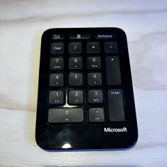

I was delighted to play some of my old DOS favorites on my Steam Deck, but quickly ran into a number of problems with the EmuDeck > RetroArch > DOSBox-Pure path. After trying the various options, I found a setup that works well and wanted to document it here.

## Goals
I wanted my DOS games to:
- Run reliably without crashing and without video or audio stutter.
- Exit directly back to SteamOS.
- Scale to good resolutions for each display I use. (Built-In, Desk Monitor, TV)
- Run fullscreen from Game Mode or windowed in Desktop Mode.
- Work correctly with the Keyboard and Mouse by default.
- Work with the Steam Deck controls for mouse-only play.
- Work with my NumPad keyboard for "few key only" games for couch play.

I was eventually able to get this all to work with "original" DOSBox from the Discover Store. The other variants I tried - DosBox-Pure, DosBox-X, and DosBox-Staging - all failed at least one of the above goals.

## My Preferred Setup

### Installing (original) DOSBox
- Press the Steam Button
- Under Power, choose "Switch to Desktop"
- Open the Discover Store (pinned near the bottom left)
- Search (top left of app) for "DOSBox"
- Find the option called just "DOSBox" and click "Install"

### Game Location
All games need to be under **/home/deck/Documents** for DOSBox to access them, unless you use [Flatseal](https://flathub.org/apps/com.github.tchx84.Flatseal) to add extra permissions. I made a **/home/deck/Documents/DOS** folder and then put one folder per game inside.

### Configuration (dosbox.conf)
DOSBox allows you to pass `--conf XYZ.conf` **multiple times**, with the settings in later ones overriding earlier ones.

We can use this to create: 
- A dosbox.conf **per screen resolution** with common settings
- A dosbox.conf **per game** to run the game and with setting overrides
- A **bash script per game** as an entry point that can be added to Steam

Here's a sample of each:

#### res-1280x800.conf
```
# Integer Scales for 320x240 games
# ===
# windowresolution=1600x1200 (5x, best for 3440x1440 Ultrawide Monitor)
# windowresolution=1280x960  (4x, best for 1920x1080 TV)
# windowresolution=960x720   (3x, best for 1280x800 built-in display)

[sdl]
windowresolution=960x720
autolock=false
output=openglnb
mapperfile=game-default-mapper.txt

[render]
aspect=true
scaler=normal

[cpu]
core=dynamic
cycles=100000
```

Take out the "mapperfile" line if you don't add any keyboard mappings. The "openglnb" output mode works well and doesn't do any post-scaling. I prefer `autolock=false` to not capture the mouse when playing in Desktop Mode.

### game-Anvil.conf
```
[autoexec]
mount C "~/Documents/DOS"
imgmount d -t iso -fs iso "~/Documents/DOS/ANVIL/Anvil.iso"
c:
cd \ANVIL
ANVIL
exit
```

This variant of DOSBox didn't handle relative paths, so use `~` to refer to /home/deck. Add "exit" after everything to quit back to SteamOS cleanly.

If you need to override settings, put the `[autoexec]` section last; some DOSBox variants don't know how to parse the autoexec section and won't read any settings after it.

### Anvil of Dawn.sh
```
#!/bin/sh
resolution=$(xdpyinfo | grep dimensions: | awk '{print $2}')
flatpak run com.dosbox.DOSBox -conf "/home/deck/Documents/DOS/DosBox/res-$resolution.conf" --conf "/home/deck/Documents/DOS/DosBox/game-Anvil.conf"
```

`xdpyinfo` works nicely on the Steam Deck to find the current screen resolution. If you use this script design, you will need a "res" configuration file for each screen resolution you use.

After you create the script, you need to make it executable. Right-click in the file explorer, click Properties, go to the Permissions tab, and check "Is executable". (You can also run `chmod +x [XYZ.sh]` from the Terminal.)

### Keyboard Mapper File
Run DOSBox with `--startmapper` to run the [Keyboard Mapper](https://www.dosbox.com/wiki/Mapper). You can click buttons with the mouse to set up mappings for them, and then click Save to save the file out. Use `mapperfile=mapper-file-path.txt` to reference it from a dosbox.conf.

I used the Keyboard Mapper to map keys on my little numpad keyboard to keys I need (ESC, Enter, Backspace, WASD) for games which only need a few keyboard keys.



### Adding to Steam
Once you have created a script to run each game, you can right-click on them in the File Explorer and pick "Add to Steam" to add them as non-Steam Games.

You don't need any Compatibility settings for them, because DOSBox runs directly on SteamOS.

You can use Decky and the SteamGridDB plugin to find artwork for the games so that they look nice in the Steam Library. The art isn't always as good as what EmuDeck finds; I need to figure out where EmuDeck caches them so that I can use EmuDeck to locate the art and then SteamGridDB to apply it.

### Running in Desktop Mode
Games will run nicely in a window in Desktop Mode when double-clicked. You can click and drag onto the Desktop and choose "Link Here" from the context menu to make a shortcut.


## DOSBox Pure Problems and Solutions
I ran into quite a few problems trying to run under DOSBox-Pure in RetroArch. I'm documenting the problems here so that people encountering them can find this post. I've included workarounds and fixes when I figured them out for anyone who wants to stick with DOSBox-Pure, but I recommend switching to DOSBox as described above for a better experience.

### EmuDeck couldn't find my DOSBox games
I had to look into the [README](https://github.com/schellingb/dosbox-pure?tab=readme-ov-file#dosbox-pure) to figure out that DOSBox-Pure expects games to [each be in a ZIP file](https://github.com/schellingb/dosbox-pure?tab=readme-ov-file#load-games-from-zip) to be found by the EmuDeck "Steam ROM Manager" scan process.

### DOSBox-Pure didn't find my dosbox.conf files
The README said that a dosbox.conf file found in the root of the ZIP will be run. I couldn't get it to run until I realized that zipping a folder from Windows or SteamOS Desktop Mode puts everything into a top-level folder.

In SteamOS, you can ZIP a folder into the root of a zip by running this command in the Terminal:
```
cd [YourGameDirectory]
zip -0 -r "[YourGame].zip" *
```

### Specific Keyboard keys didn't work (Q = 1, W = 2, ...)
When trying to run command line commands, I figured out that specific keyboard keys didn't work. Q mapped to 1, W to 2, S to space, and A, Z, and X to nothing.

These turn out to be RetroArch mappings. There's a [Game Focus Mode in the DOSBox-Pure README](https://github.com/schellingb/dosbox-pure?tab=readme-ov-file#dosbox-pure), but I didn't want to press Scroll Lock every time I start a game.

Instead, you can remove the keyboard mappings in RetroArch.

- In a RetroArch DOSBox game, press in both thumbsticks to get to the RetroArch UI.
- Go to Settings -> Input -> RetroPad Binds -> Port 1 Controls.
- Press "Clear" to remove the bindings for Left-Ctrl, Left-Alt, Left-Shift, Space, 1, 2.
- Select "Save Controller Profile"

Games worked afterward, but the mapping removals broke some of my SNES and Genesis controls in RetroArch; ultimately, it's nicer to just keep DOS games separate.

### DosBox.conf autoexec 'exit' causes hang
I want my games to quit nicely back to SteamOS on exit. If you don't add a specific "exit" command to dosbox.conf, quitting a game just leaves you at a prompt. If you do add "exit", DOSBox-Pure hangs with diagonal lines over the last rendered screen.

You have to press the Steam Button and pick "Exit Game". I didn't find a workaround for this issue.

