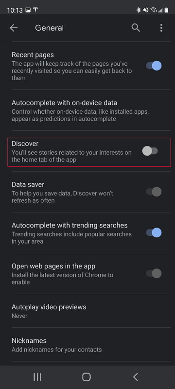
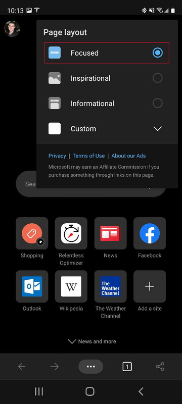

The Samsung Galaxy Watch 4 recently came out, and it inspired me to try going phone-free, carrying only the watch. I spend too much time glued to my phone, and I wanted to take back my attention, but I know I need to be reachable. For me, the core problem is the endless scrolling apps - Reddit, YouTube, Google News, and a few pages-of-links websites I obsessively visit. 

## The Goal

More abstractly, my goal was to have a cellular-connected device which can call, text, message, unlock my car, play music, have maps, make NFC payments, take notes, and that's about it.

Skipping the details, the Galaxy Watch 4 can't quite do all of that. It doesn't have all of the apps I need, overheats quickly during calls, and the screen is likely too small for realistic notes and conversations. It's tantalizingly close, and maybe new apps and software updates will get it there.

I still wanted to do my phone-free experiment, however, and had the obvious insight that it was much easier to "dumb down" my phone than find a "just smart enough" device. So, I took all of the offending apps off my phone and lived with it for two weeks. No Reddit, no YouTube, no Google News, no Google, no Amazon, no browser. My rule was that I could use those things if I wanted, but I had to dig out my laptop to do so.

## How It Went

First, I was amazed about immediately I noticed the difference and how big the difference was. The moment that I didn't have my phone to look at every time I was bored, I was bored. When I went to pick up the kids from school, I just sat and looked around and thought about things waiting for the bell to ring. When I watched shows at night, I couldn't browse at the same time, so I just paid attention to the show. When I wanted to look something up, I had to just go without knowing it or try to remember it.

It was a shock to realize just how often I would instinctively reach for my phone during a given day. I realized that most of the things I look up or learn while browsing I just don't need to know. Without the phone, I had much more patience, energy, and attention to spend on the things and people around me. I spent more time playing catch with my kids and checking out things they made and wanted to show me. I thought more about what I wanted to do with my evenings and what I wanted to watch, and didn't settle for borderline activities that were merely good enough "for the background". In short, it's been great, and I wish I'd done it sooner.

## The Aftermath

So, now that the two weeks is up, what have I kept as-is and what am I bringing back?

In short, I want to continue not using my phone for scrolling through content.

I want to use Google for answering important questions, but not browsing stories. I want Amazon to quickly buy things, but not to browse product options or deals. I want YouTube to control my TV queue, but not to watch when I'm away from my couch. I want the browser to deal with links in emails, but not to surf.

To hopefully achieve this, I've left these apps off my home screen, giving me a few more seconds to decide if a given use is really necessary. I turned off automatic content from them where possible. Google and the browser no longer show stories by default. Since I've added them back, I'm amazed to think about how much my phone distracted me **from itself**, nudging me toward a story while I'm trying to search for something. At least that isn't happening anymore. Outlook mails still sometimes interrupt me when I go to check my calendar, but I can't see how to make the default "view" the calendar when the app starts like I do on the desktop Outlook.

|  |  |
| ------------------------------------------------------------ | -------------------------------------------------------- |

## Conclusion

A comedian once said that as a kid he would run out his door carrying nothing, but as an adult the mere idea of going out without his keys, wallet, and phone gave him panic attacks. I look forward to the day where watches get "just smart enough" that I can go through life with completely empty pockets if I want. 

In the meantime, my experiment reminded me that phones are tempting but malleable. You can knock enough of the "smart" out of your smartphone to make it what you want it to be, keeping things you need (like payments and maps) without things you don't (like stories and videos) if you want.

If you find your phone excessively distracting, I can't recommend a two week break highly enough. =) 

