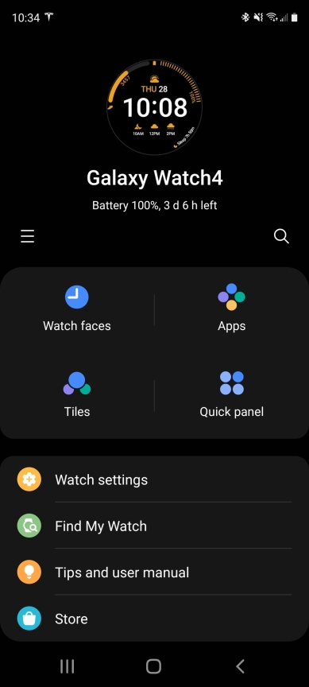

My Samsung Galaxy Watch 4 battery ran out on the first day by 4:00pm, and I was pretty disappointed. After a few device resets and a lot of measurements, however, my watch is now using only about a third of the battery per full 24 hour day. Here's what I learned.

TL;DR: 

* Reset your Watch to fix excessive battery usage

* Do not install the Spotify app

* Turn off "Always On Display" and the gesture settings for best results

  

I bought the Galaxy Watch 4 44mm LTE non-Classic, hoping to [try phone-free life](). On the first day, I quickly installed the apps I wanted (Gboard and Spotify), turned most things on (Always On Display, continuous health measurements) and the battery died by 4:00pm. :/ 

I went back to the default settings (Always On Display off, gestures off, and default health measurement intervals). This improved my situation to about 50% battery use during a 12 hour day and about 25% overnight while I slept. Still pretty disappointing. 

After five days or so, I saw a few really good days with only 36% use during the 12 hour day. I made the mistake of turning on Developer Mode to try making a custom watch face. My battery life went right back to the 50% day / 25% night usage, even after turning Developer Mode off as best I could.

I eventually decided it was time to try a device reset. You can [keep your Mobile Plan settings](https://www.att.com/device-support/article/wireless/KM1452763/Samsung/SamsungSMR885U/) during a reset, but I had to re-configure AT&T NumberSync (the watch-shares-your-phone-number feature). NumberSync setup is very unreliable - I see constant web page redirects from AT&T - but if I leave one Chrome tab signed in to AT&T and open another tab directly to the [NumberSync setup URL](http://m.att.com/myatt/#/passthrough/manageNumberSync), it eventually works.

Since I'd read that Spotify caused problems with earlier watches, I left it uninstalled on this go-around.

To my surprise, the battery life was **instantly drastically better**. I had 80% battery left after a 12 hour day, and after my evening recharge woke up the next day with 90% left. (So, down from 36% daytime and 24% overnight use to 20% daytime and 10% overnight).

After more tests, I found that if I turn on Always On Display, daytime use goes up to 36%. If I want to leave my phone at home, daytime use goes to 45%. However, if I go back to bringing my phone and turning AoD off, I'm right back to the 20% day / 10% night use I wanted.

...until I installed Spotify. My battery shot up to 50% day / 25% night, and uninstalling Spotify didn't fix the issue - it was right back to the terrible initial battery life I'd seen. I reset the Watch again (with a slightly smoother NumberSync setup this time) and am back to the 20% day / 10% night use I'd like to see. 

If you're having problems with Galaxy Watch 4 battery life, try resetting your device. I suggest leaving the default settings and apps for a few days to see what your "vanilla" usage is, and then add things slowly so that if one particular thing is wrecking your battery life, you can find out what it is. In my case, apparently it was Spotify. 

