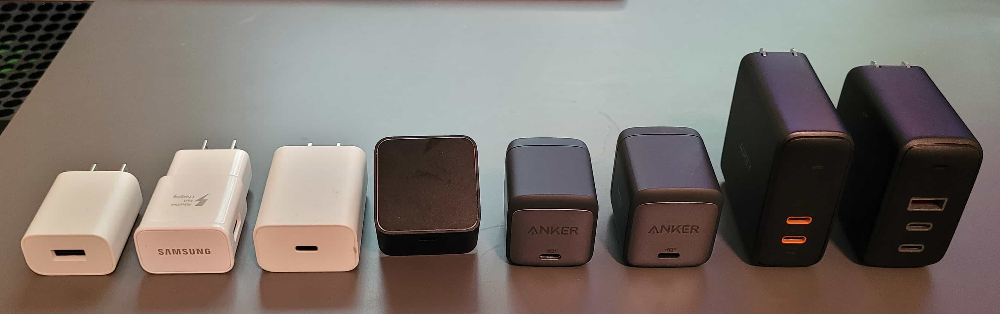

I recently started using an M1 MacBook Pro 14". I wanted to know which of my cables and chargers work with it and how fast it charges from them. My previous laptop, an ASUS Zephyrus G14, only charges from 20v (60w+) USB-C chargers, so I was expecting the same. I was shocked to find out that the MacBook will charge from **every charger I have**, at any voltage!

Here are all of the chargers which worked with the M1 MacBook, from right to left (high to low power):

| Charger                                                   | Model      | Ports  | Outputs                                                |
| --------------------------------------------------------- | ---------- | ------ | ------------------------------------------------------ |
| Aukey Omnia 90w                                           | PA-B6S     | 2C, 1A | 5v 3A, 9v 3A, 12v 3A, 15v 3A, 20v 4.5A, 3.3-11v 5A PPS |
| Aukey Focus 63w                                           | PA-D5      | 2C     | 5v 3A, 9v 3A, 12v 3A, 15v 3A, 20v 3A                   |
| [Anker Nano II 65w](https://www.amazon.com/dp/B08T5QN2TR) | A2663      | 1C     | 5v 3A, 9v 3A, 15v 3A, 20v 3.25A                        |
| [Anker Nano II 45w](https://www.amazon.com/dp/B08T5QVTKW) | A2664      | 1C     | 5v 3A, 9v 3A, 15v 3A, 20v 2.25A, 3.3-16v 3A PPS        |
| KTEC 27w                                                  | KSA-27A    | 1C     | 5v 3A, 9v 3A                                           |
| Google Pixel 18w                                          | G1000-US   | 1C     | 5v 3A, 9v 2A                                           |
| Samsung 15w                                               | EP-TA20JWE | 1A     | 5v 3A, 9v 1.67A                                        |
| Google Stadia 7.5w                                        | G1001      | 1A     | 5v 1.5A                                                |

Every cable I tried works as well, though of course you can only charge over 3A from a high power (5A) marked cable. It seems to charge at the peak rate possible with everything except the USB-A chargers, from which it only draws 5w (5v 1A).

Side Note: Having a [USB power meter](https://www.amazon.com/gp/product/B07X3HST7V) is really nice for knowing whether devices are using a charger the way you expect.

I plan to carry my [Anker Nano 45w](https://www.amazon.com/dp/B08T5QVTKW) around, which is tiny but enough for MacBook peak power consumption (~40w) and a full charge in a few hours during normal use (~6w). It's nice to know that even an 18 watt phone charger will keep it going and provide an overnight charge in a pinch!