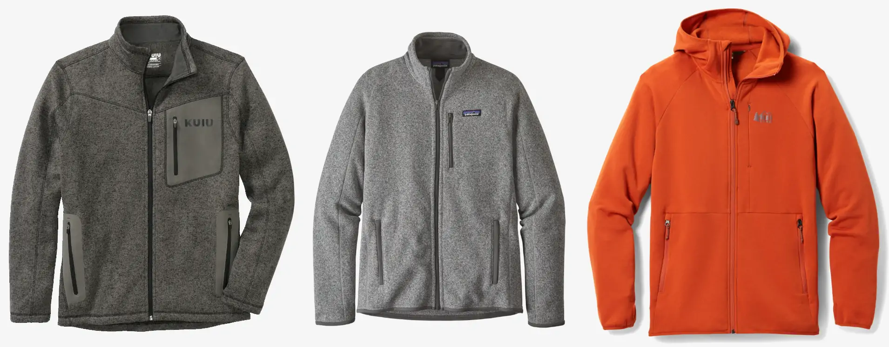
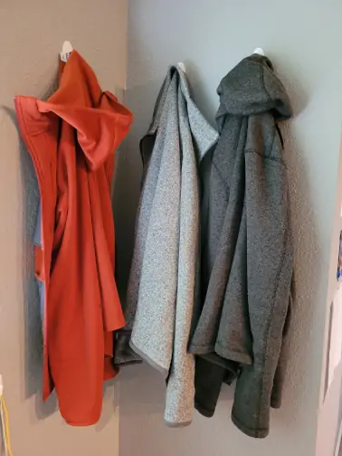

For most of my life, I've bought clothes on sale which seemed "good enough". My outerwear lasts a really long time, though. As a few favorites finally wore out, I decided that I should really just get exactly what I want and get rid of the rest. With that, my quest for some perfect sweaters began.

## Goals

After so many years of picking things off the sale rack, it was satisfying to think about what I really want in a sweater and what I've liked in my recent favorites. Overall, my goal is to find three sweaters which are ideal for indoor use, outdoors in very mild (65-75F) temperatures, or for layering under a jacket. In addition, I want:

##### Fleece
I wore soft shells everywhere for a long time, but I would get sweaty indoors if it was too warm, they made noise every time I shifted in my chair, and people would sometimes ask if I wanted to "hang up my jacket". Fleece sweaters fix all of this - they are much more breathable, quiet, and normal indoor wear. Cotton feels cold when I first put it on, and gets and stays a lot wetter in rain. 

##### Warm
Ultimately, I want my sweaters for indoor use first. My office can be 65-72F or so, so I want something which is great over a shirt in that whole range. I am usually cold, so this means a mid- to heavyweight fleece.

##### Full Zip
Pullovers try to pull my shirt off as I remove them. I also like being able to unzip my sweater when it's otherwise a bit too warm for it.

##### No Hood
Hoods are nice for extra outdoor warmth, but annoying against a chair or an outer layer.

##### Relaxed Fit, Hip Length, Long Enough Sleeves
I want a sweater that fully covers my waist and wrists. I've had too many sweaters that were a bit too short and I want something that really feels the right size.

##### Durable
I'm willing to spend for a nice sweater, but want it to last a decade or longer. It shouldn't pill or wear through too quickly.

##### Coordinated and Fashionable
I'm too lazy to make sure my clothing colors match and my clothes aren't too fancy or casual for whatever I'll be doing. I want to pick colors that work with all of my pants and a wide variety of situations, so I can just grab any of them and go. Knit exteriors have a nice look, though they may be less durable.

## Winners

[KUIU Base Camp Full Zip](https://www.kuiu.com/products/base-camp-full-zip-sweater-charcoal) | $100 | 21 oz   
When shopping for a great backpacking mid-layer, I stumbled upon KUIU. I got the "Base Camp" sweater because it was on sale and it quickly became a favorite. It's just the right warmth, a comfortable fit, and I like the look. It pills a lot, especially on the bottoms of the sleeves, so durability is a concern. I got a "sweater shaver" and shaved the pills off, and it's looking nice again. Mine is hooded, but since I already have it, I'm keeping it until it wears out.

[Patagonia Better Sweater Fleece Jacket](https://www.patagonia.com/product/mens-better-sweater-fleece-jacket/25528.html?dwvar_25528_color=STH) | $140 | 21 oz  
My previous favorite was a (hooded) Better Sweater, which somehow I lost. It had the same nice knit exterior, perfect warmth, and great fit. I bought an unhooded one to replace it. I especially like that the sleeves articulate well - when I raise my arms overhead, the bottom of the sweater doesn't ride up much. The collar for the unhooded version feels a bit tall, but otherwise it's great.

[REI Hyperaxis 2.0](https://www.rei.com/product/166946/rei-co-op-hyperaxis-fleece-jacket-20-mens) | $130 | 17 oz  
As I was trying on my candidates at REI, the Hyperaxis caught my eye, so I decided to try it on and immediately loved it. It's made of Polartec Power Stretch Pro, which is warmer than I expect for the weight. The Hyperaxis has a hood, but the material is thin enough I think it might sit flat out of the way. It does not have a knit face, so it looks more casual, but it might also be a lot more durable than my knit choices.

## Close Contenders

[Arc'teryx Covert Cardigan](https://arcteryx.com/us/en/shop/mens/covert-cardigan) | $180  
The Covert Cardigan is extremely similar to the Better Sweater. It has a nicer cut (particularly at the shoulders) and a trimmer but comfortable fit. The collar doesn't feel too tall, but the arm articulation isn't as good as the Better Sweater. I picked the Better Sweater instead, but it's close between the two.

[Arc'teryx Kyanite AR](https://arcteryx.com/us/en/shop/mens/kyanite-ar-jacket) | $160  
The Kyanite, like the Hyperaxis, is made from Polartec Power Stretch Pro, so it doesn't have the nice knit look, but is likely to be much more durable. I couldn't find it in store to try out.

[Kuhl Interceptr](https://www.kuhl.com/kuhl/mens/outerwear/interceptr-pro-fz/) | $130  
The Interceptr looks and feels great, but was a much slimmer fit with tight sleeves.

[REI Groundbreaker 2.0](https://www.rei.com/product/177504/rei-co-op-groundbreaker-fleece-jacket-20-mens) | $50 | 13 oz  
The Groundbreaker has a soft, "traditional fleece" exterior rather than a knitted one. It seemed to catch on my inner layers more as I removed it. Since it was $35 (!!) during the REI Spring Sale, I picked one up as an "at home only" sweater.

## Other Possibles

[Rab Quest Fleece Jacket](https://rab.equipment/us/quest-jacket) | $100

[Outdoor Research Vigor Plus Jacket](https://www.outdoorresearch.com/us/shop-by-activity/mens-vigor-plus-fleece-jacket-283183) | $150

## Conclusion

So far, going down from about ten "pretty good" sweaters to three great ones has been really nice. I put three hooks next to my bed and grab the one I feel like with little thought. My frugal instincts struggled with the prices, but if they last as long as my previous sweaters, it will be cheaper than cycling through "pretty good" $25 Costco options which don't love and donate after a year or two. We'll see.

