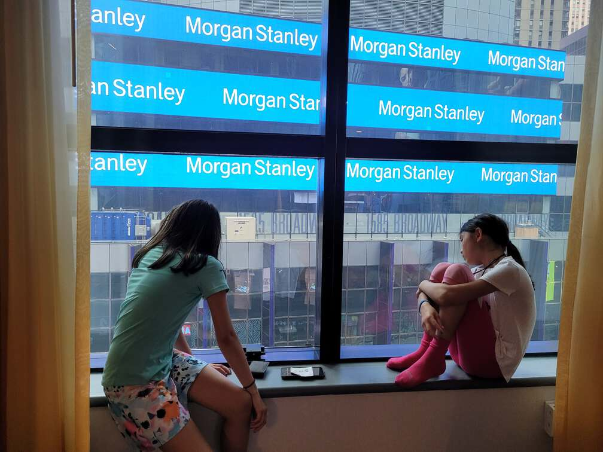
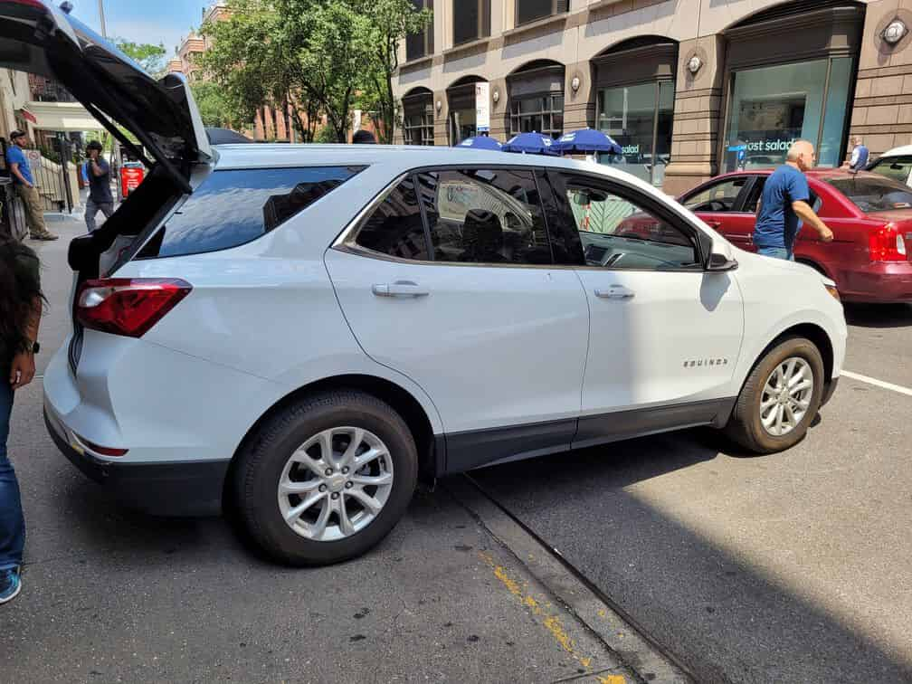
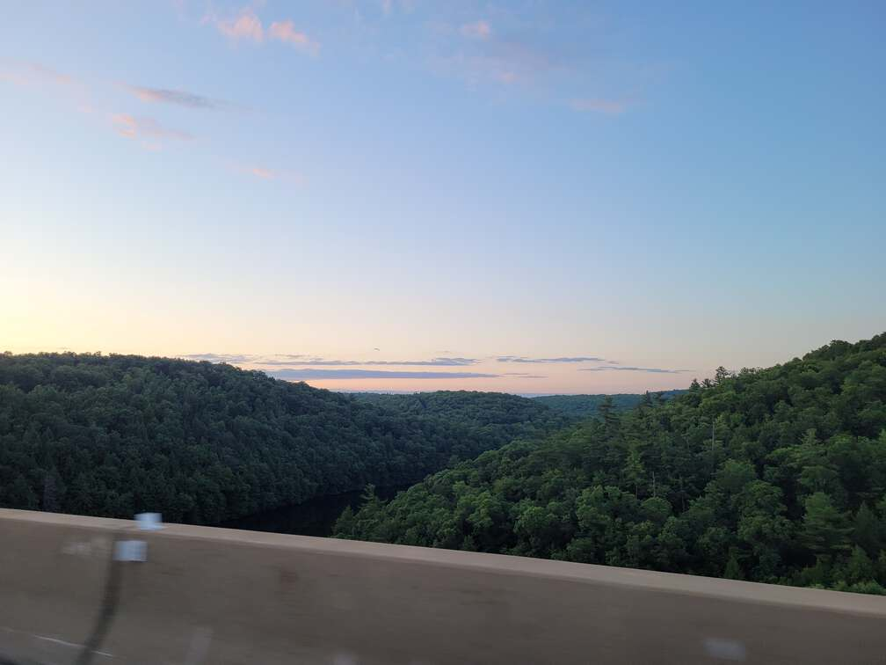
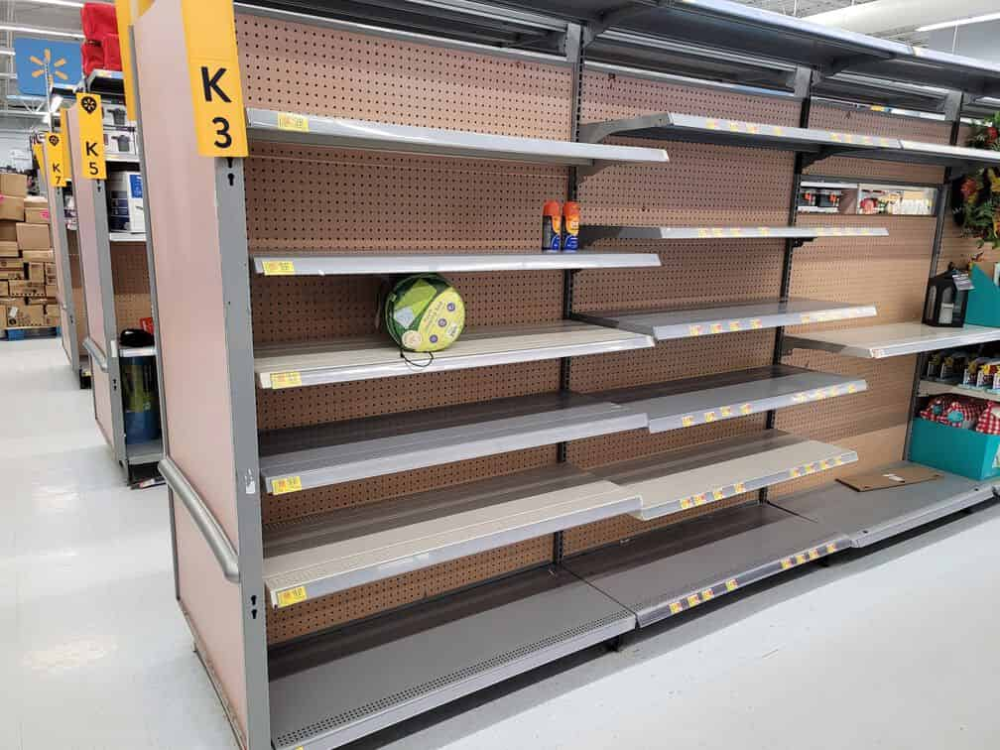
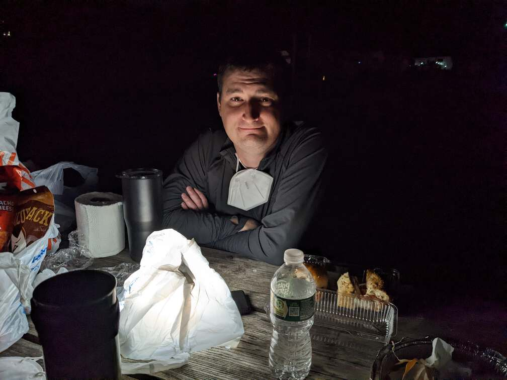
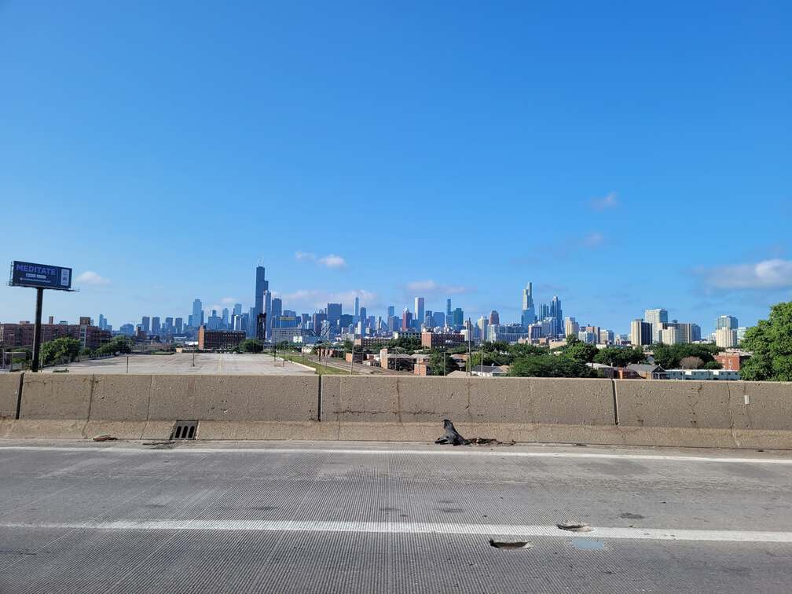
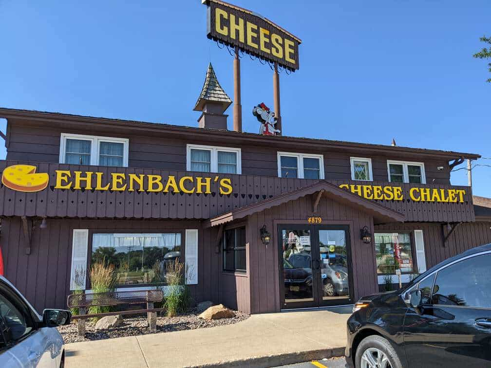
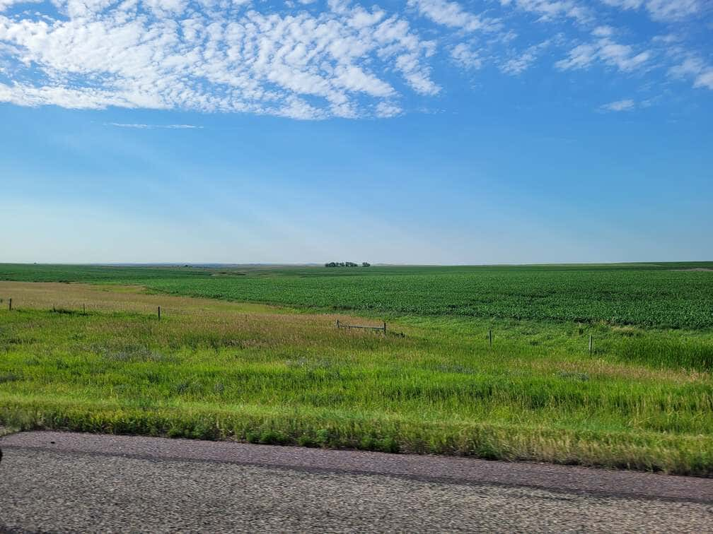
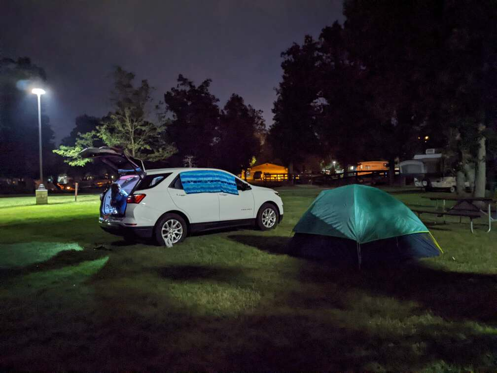

After two years of minimal travel, we decided to fly to New York City, and I promptly got COVID while there. Our return turned into a surprise COVID road trip; this is the story.

## Isolation

We brought KN-95 masks and wore them consistently for the flight and subway rides. About half the people around us had masks, and there were a few unmasked coughing people just about everywhere. (This is why we can't have nice things). I was congested despite taking a Zyrtec on the third day, and to my dismay my COVID test came back positive. We told the hotel staff, who were very supportive, and I isolated in the room and wore my KN-95 whenever my family was back. They had all gotten Omicron in January, so we were hopeful that they would dodge what I had. I got very familiar with the Times Square signage I could see from the window. Did you know that the Krispy Kreme rotating sign is a digital screen, not neon tubes, and it has some fake "burned out" bits to look more real? I changed my flight to ten days after my first symptoms and booked another hotel for the extra days, and toodled around on my laptop during the days. The Delta Airlines person who helped me was great, despite Delta's reputation - no cost except the fare difference and I was all set in a few minutes.

## The Pivot

After being symptom-free for the rest of our visit, one of my daughters reported a sore throat the night before they were supposed to return home. We tested her in the morning and found that she, too, was positive. Our first hotel reservation was over. I tried to call the second hotel to get a room with two beds and a longer stay, but they cancelled my reservation when they found out we had COVID. We called the NY Department of Health. The nurse told us that the COVID-isolation-hotel program had ended. We couldn't fly and no hotel would take us, so we could either book a hotel without telling them, or find some other way home. Hotels in New York (even over on Long Island) are expensive, and even at insane 2022 prices, a one-way car rental from Manhattan to Seattle was cheaper, so we quickly decided to drive home instead.

## Escape from Manhattan

We found a Budget rental car location just a few blocks from the hotel, and just ten streets up and three avenues across to the Lincoln Tunnel. How bad could it be? We left the hotel just after noon, and after a surprisingly long wait to talk to one of the least friendly car rental workers I've ever met (and that's saying something), we had a car. Budget didn't have the car they said was available an hour earlier, but said they had a Ford Edge. A few minutes later, a Chevy Equinox came down the car elevator (!) and we were off. Unlike Delta, Budget continues to live up to it's well-earned terrible reputation.

I expected driving in Manhattan to be insane, and despite the short and simple route, it lived up to that. I guess the idea that driving should have rules sort of breaks down in big cities. There's no empty street parking anywhere, so delivery trucks just stop in the middle of the street anywhere, any time. The remaining cars are the car version of an angry mass of overcaffeinated people pushing and jostling to get through wherever they can. Many cars had "bumper diapers" which serve the same purpose as diapers for babies - absorbing the small accidents which are inevitable in the situation. I think Manhattan should do away with streets altogether, with elevated moving walkways for humans (4 mph "local", 8 mph "express", and 12 mph "angry New Yorker" speeds) above a narrow lane for stopped trucks and psychotic bicyclists to share.

Our Manhattan drive ended with a three-to-one lane merge with jostling busses and a cement mixer during a 50 foot turn into the tunnel, and we had escaped.

## Day One

Escaping Manhattan felt great, but ultimately it's the same drivers with the same loose sense of driving rules on the other side of the Hudson. Still, dense city gave way to green within an hour or so, and things seemed to calm down. We were surprised by the endless round green trees of the (aptly named) Garden State, and the East Coast as a whole. We're used to the often brown hills of California and the pointy evergreens of the West, and so this terrain seemed just a bit alien.

The point of driving home was to avoid hotels, so we would need places to camp and some gear. We have nice gear at home, so we stopped at Walmart to get just some very cheap basics. We found a $30 two-kid backyard tent and three $12 sleeping bags. Walmart didn't have reasonable sleeping pads, so at the next Walmart we bought two more sleeping bags to sleep on. We also picked up a fuzzy blanket, a few pillows, and a $10 pocketknife, comprising the most minimal and questionable camping setup we've ever tried to use.

The shopping stops took some time, especially because we sent only one non-sick family member into the store. On the next leg of the drive we picked a private campground in Emlenton, PA, which we reached at dusk. As we set up the tent and ate dinner at the camp table with an improvised bag-on-phone lantern, the kids spotted fireflies and managed to catch one in a bottle. For the first time since the positive COVID test, it felt like a happy adventure.

The girls slept in the car and Darinee and I in the tent. I could only fit in the tent diagonally, and sleeping bags  under us were a poor replacement for real sleeping pads. We got three and four hours of sleep that night, according to our FitBits, and then packed up and were off.

## Day Two

We set off around 8:00am, but had a bit more shopping to do. We picked up an electric kettle and a car USB charger along with more snacks, and made our way toward Chicago on I-80/I-90 West. Our rental car was supposedly equipped for electronic tolls, but we'd seen a worrying message going through the last toll booth entering Pennsylvania ("GO - TOLL NOT PAID"), so we wanted to avoid tolls for the remainder of the trip. It remains to be seen how and what we get charged for the tolls early in the trip.

The second day also gave us a chance to appreciate the rental car. We knew we wanted an SUV to sleep at least a few of us inside, but I'd expected the gas mileage to be awful, like pickup trucks I'd researched a year or two earlier. It wasn't. Somehow the 170 hp four-cylinder engine was enough power for passing and fast driving but was also managing just over 30 mpg for the drive. The seats were comfortable, the ride height and suspension very pleasant, and the Equinox has shallow storage under the whole trunk, making a perfect place for food storage where you can instantly find and get to anything.

We also discovered that COVID really takes a lot of the stress and decision-making out of road trips. We didn't want to stop anywhere or go into any stores, so we only stopped at gas stations, rest areas, and campgrounds, for the most part. We enjoyed the scenery and midway through the day the kids tired of their tablet and phone and just started talking to each other and making up games. As they debated the rules for an apparently hilarious extended rock-paper-scissors, we switched from I-80 to US-30 to avoid tolls near Chicago and learned why the toll road was worth it.

US 30 calls itself a highway, but it's really more like a big street, like WA-161 on the way to Mount Rainier. The speed limit is relatively high, but there's an incessant stream of traffic lights as you plow right through the endless suburbs of Chicagoland. Traffic was light but progress was slow. Mercifully our route took us right by some proper Chicago Deep Dish Pizza (Lou Malnatti's), which we enjoyed in a beautiful Target parking lot nearby amid the gentle sound of Chicago muscle car traffic. It was a surprisingly pleasant picnic dinner, considering.

After we ate, and before any Target staff might come out to complain, we headed off. We chose a route right through the Chicago and Milwaukee downtowns, to at least get the sight of some other big cities on our way past. Traffic was dense but steady in Chicago, and while we saw quite a bit of the downtown and elevated train system, we didn't get close enough to see Lake Michigan. We ended up bypassing the Milwaukee to make it to a county campground near Madison, Wisconsin, once again arriving at dusk. Despite the quality of our sleeping setup, we passed out quickly and slept soundly.

## Day Three

In most places we've camped, if you arrive after the entrance station is closed, you find a site, camp for the night, and pay in the morning. Apparently that's not the case in Wisconsin. They have a great website showing up-to-the-moment campsite availability (which is awesome), but you need to pay before you set up. We got a warning in the morning and called to pay by phone, then went off looking for some proper cheese before getting back to the highway.

We chose to follow I-90 through South Dakota, and enjoyed the 80 mph speed limits of the region. The mileage of the Equinox dropped to 27 mpg at 90 mph (roughly the prevailing speed) but we made great time. We watched the farms go by and finally saw the ceaseless and apparently un-irrigated green fields give way to the more familiar brown of our own side of the country. 

We pulled into a city park in Spearfish, South Dakota to end our third day. The city was gearing up for a festival of some sort, so the campground was relatively busy. Unlike the formal design of most state campgrounds, it was really just a big field where you park and pitch wherever you want.

We were lucky to camp without any bad weather thus far, but after a beautiful purple sunset, a thunderstorm broke our streak. I slept in the car with the windows down and towels blocking bug and rain entry while the girls and Darinee filled up the tent. It was exciting for a while as the storm raged by, but returned to calm relatively quickly.

## Day Four

At this point we were pretty sure we would need two more days to finish the trip, as we had not been managing the full 12 hour driving days needed to make it in four. We headed out before the festival traffic got too heavy, got coffee and shockingly great pastries at a coffee shop in town (Ruby's Roost, if you're ever there), and were back on the highway around 8:30am.

We decided to brave a long detour away from I-90 on US-212 for a shorter path. Like US-30, it was a mistake. They don't believe in doing road closures a mile or two at a time in South Dakota, apparently, instead closing a good ten or twenty miles at a time, with stoplights and pilot trucks to escort wagon trains of hapless vehicles slowly through. When we finally returned to I-90 near the Little Bighorn monument, we'd probably lost as much time to traffic as we had hoped to save in distance, if not more. We ran into several closed Rest Areas as well, delaying our first driver swap until the early afternoon.

Back on I-90, we made quick time with the fast drivers of Montana (who also consistently move over to allow you to pass) and made it to Bozeman to pick up cold drinks by early afternoon. At this point, Google Maps told us we could somehow be home by midnight, and we decided to go for it. We made a gas and dinner stop in Missoula and a quick top-off just after Spokane to make it all the way back.

## Retrospective

Four days, 2,951 miles, and 99.7 gallons of gas later, we'd made it. The math says the Equinox managed 29.6 mpg for the trip, which is amazing given the tall frame and our high speeds. We were pleasantly surprised that small SUVs are much more efficient these days than we'd thought. Apparently, this crazy trip used half of the fuel that four seats on the plane would use, somehow.

The next evening I drove to the airport to return the car and pick up our own (belatedly) from parking. You get some funny looks wandering the airport with absolutely no luggage, but people do seem to get the sense you're anxious to get done with your travels. Driving back home in the Model 3 reminded me how shocking the acceleration really is, how close to the ground the ride feels, and how it's almost as unpleasant to drive in Seattle as in other big cities. I guess open roads and polite passing is really an urban-versus-rural thing more than anything.

While I wouldn't recommend anyone take a COVID road trip intentionally, if the planes and hotels don't want you, it's a workable way to get home. It turns out you can sleep on just about anything after a night or two of terrible sleep, and camping road trips, no matter the circumstances, always seem to come with some fun memories.
