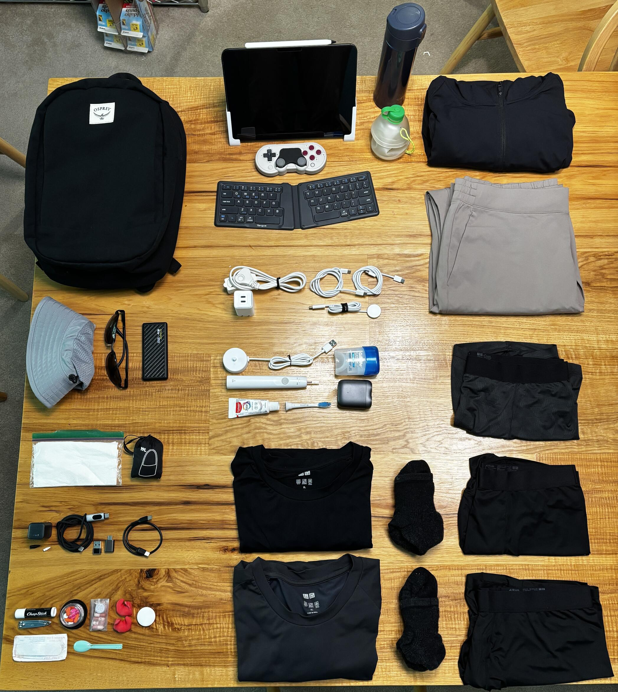
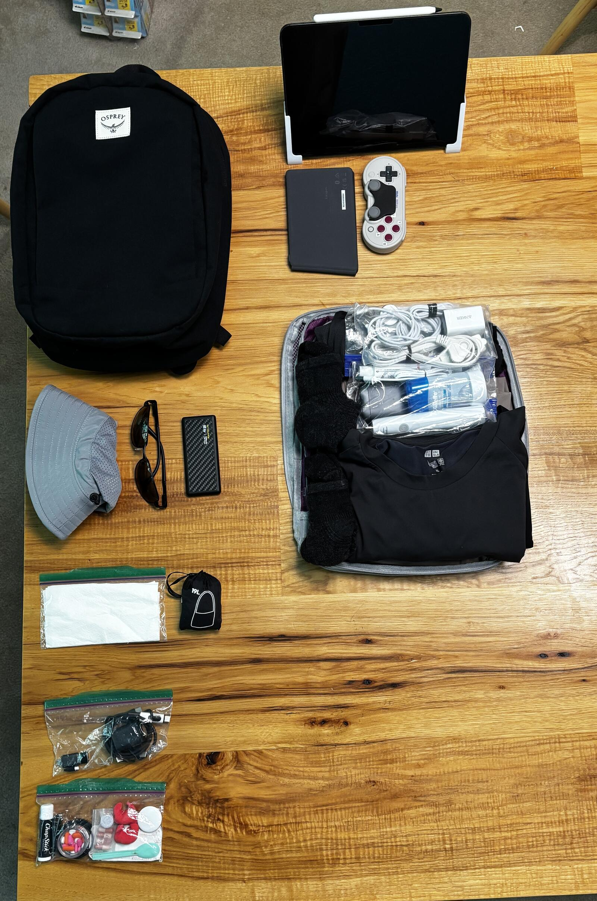
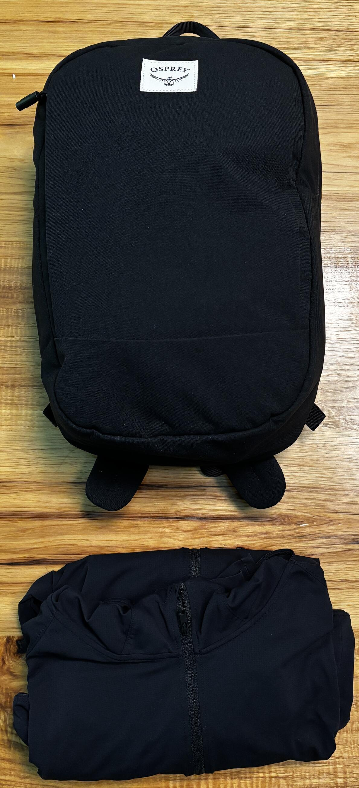

I love traveling light and the one bag concept, but had never actually fit everything into a single bag. I’m picky about certain items - I want my iPad setup, ice water in a vacuum bottle, and my Sonicare toothbrush. On past trips, I learned I also needed a good daypack - two comfortable straps, back ventilation, and some internal structure. I didn’t think a daypack would fit in another bag, so I figured I was stuck with a rolling suitcase plus daypack. Then, on my last trip, I got some great quick-drying clothes and tried out “hotel sink laundry”, and found that it worked! Everything was dry by morning.

I then wondered if I could pack light enough to fit in the daypack only, and I think I’ve got a loadout that will work. I’ve tested it on a weekend trip, but still have to try a real international trip with it.

[LighterPack Loadout](https://lighterpack.com/r/0xa108)

#### Pack: Osprey Arcane Small Daypack
I picked the Arcane as an at-home every day pack. I figured I needed about 10L for my iPad setup, a sweater, water bottle, and my charging and medical basics.

I love the clean and simple look, few straps, big main pocket, and just enough organization. It’s comfortable to carry long distances even with ten pounds in it. It also has a slim depth when not fully packed, so I think it’ll work well in crowds and busy subways.

The Arcane is definitely personal item sized. I’m hoping I can put my feet beside it under an airplane seat, keeping maximum room to stretch, but I haven’t tested that yet.

The Arcane is:
- 12L, 15.4 x 10.6 x 6.7" (39 x 27 x 17 cm)
- 1.18 lbs (534g)

#### Clothes: Mostly UNIQLO Dry-EX
I discovered UNIQLO and Dry-EX clothes in Japan and love them. They’re lightweight, look like normal urban wear, and wick sweat so quickly that I don’t look sweaty even when I really am. Crucially, they also dry quickly enough for “hotel sink laundry” to work.

I like the Dry-EX T-Shirts over the AIRism ones, which didn’t wick sweat as quickly. I found Dry-EX Tapered Pants, which look like chinos and feel like sweatpants. The AIRism Boxer Briefs (not the Boxers, and not the seamless ones) are also excellent - lightweight, small to pack, quick drying, and comfortable.

I didn’t love the UNIQLO socks, so I’m sticking to my Darn Tough 1/4 Hiker Midweights.

I want to bring as few sets of clothes as possible, but I don’t want to do laundry every day. I'm packing one pair of pants, three boxer briefs, and two shirts and pairs of socks. If I can do sink laundry, I can do it only every third day, washing three sets of everything and wearing the fourth pair of boxers to sleep. If I have to do laundry elsewhere, it’s every other day.

#### Outerwear
For hot conditions, the UNIQLO Dry-EX Full Zip Hoodie is warm enough for the plane or an air conditioned space, and can provider sun protection for my arms, if necessary. I also have sunglasses and a sun hat, which I like wearing much more than sunscreen.

For rainy conditions, I would swap to my waterproof sun hat, the Outdoor Research Seattle Rain Hat, and either bring my tiny rain jacket, or buy an umbrella at my destination.

For colder weather, I wear the Full-Zip, and pack my Outdoor Research Superstrand Puffy. I would swap the sun hat for a beanie for additional warmth.

#### Hotel Charging
I brought just one device charging setup on past trips, but got tired of packing and unpacking it every day. Now I have a minimal setup which stays in the bag, and a larger set for in my lodging.

My hotel charging kit is a two port Anker Nano 47w charger. I have a cable for my phone and a watch charger. I also bring a flat extension cord. It doesn't fall out of loose power outlets, allows me to use outlets farther away, and means I can share an outlet with other people if they're scarce.

#### Toiletries
A friend told me about the Xiaomi S200 Shaver, which is tiny and USB-C rechargeable. It’s great. 

I really prefer electric toothbrushes despite the higher weight. The Sonicare 1100, the cheapest model ($20 as of Oct 2025), is a bit shorter and lighter than the other Sonicares, and the charging base uses USB-A.

Finally, I carry travel deodorant and my daily prescriptions for the duration of the trip.

My clothes, hotel charging, and toiletries all fit in a medium packing cube. This makes it super easy to pack and unpack when moving hotels - one cube in or out and I'm ready.

#### iPad
I use my iPad for reading at night, handwritten notes during the day, and as a simple computer for during-trip planning and purchases. The 11” is big enough for two windows side-by-side and supports external displays. Traveling phone-only is tempting, but I feel very limited by my phone screen when trying to plan my days or book things.

Apple’s keyboard options are quite heavy, so I found a very light Bluetooth option instead - the Targus Ergonomic Folding Keyboard (138g). I put rubber bumpers on iPad to allow it to lay flat on surfaces, and my wife 3D printed custom plastic stands to hold it at either my ideal desk or nightstand angles.

I wanted a controller for gaming on the airplane, and found the 8bitDo SN30 Pro. It’s 114g and flat, enabling non-touch gaming for modest additional weight. I can even use the iPad and SN30 to game on hotel TVs.

#### Every Day Carry
The remaining items are the ones I want with me when I'm wandering around a city:

- Sun Hat and Sunglasses for sun
- Sweater for cold (indoors or out)
- Ice Water in Zojirushi 16 oz bottle to drink
- eCharging: NiteCore 5K Power Bank, Anker 30w Charger, cables, adapters
- eKit: Pills, Band-aids, Hair Ties, Nail Clippers, Custom Earplugs
- Collapsible Bag for purchases or trash
- A few Napkins
- Passport
- Candy (on planes) or Snacks (if I'll be out long enough)
- Phone, Earbuds, Pen, Wallet (in pockets)

#### Weights
If I leave my iPad in the hotel, my travel every-day loadout is 3.1 lbs (1,423g) excluding water and food, and another pound (480g) with the water bottle filled. I find I can walk four miles with four pounds or less very comfortably in the Arcane.

If I bring the iPad but no water bottle, it’s 3.8 lbs (1,718g). 

If I bring the iPad and full water, it’s 6.0 lbs (2,711g). While still very light, this is enough weight to impact my speed - I can walk 4.0 mph with four pounds, but stay closer to 3.5 mph with six.

When I’m carrying everything (on the plane and between hotels), it’s 7.75 lbs (3,512g) without food or water. Still shockingly light for everything I need to travel, and well within personal item weight limits.

#### Testing and Conclusion
I took this loadout on a recent weekend trip, and without any laundry to do it’s especially easy. I definitely need more outerwear for the colder fall weather in the Northwest, but I had all of the basics I needed.

One of the ideas I'm most excited about is really trying to combine by at-home and on-trip every day carry items. I realized I want very similar things with me, and if I have my travel things in the same places in the same bag every day, I know exactly where everything is and I feel very confident that I have everything I need in a typical day. 

If you have a similar setup, or have found great alternatives to things I carry, I’d love to hear about them!

