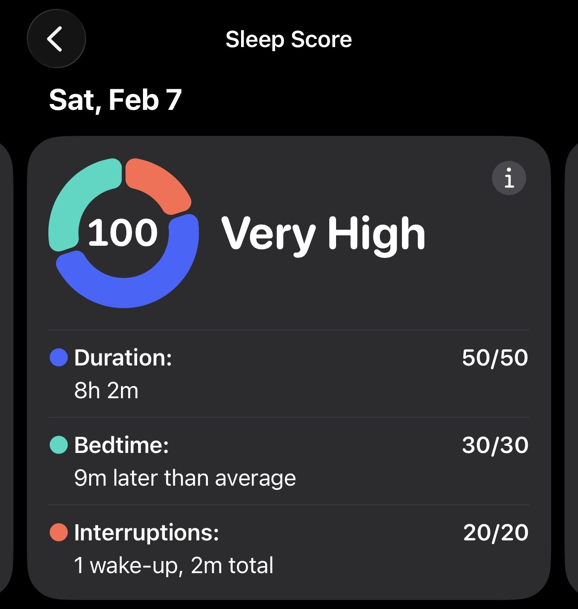
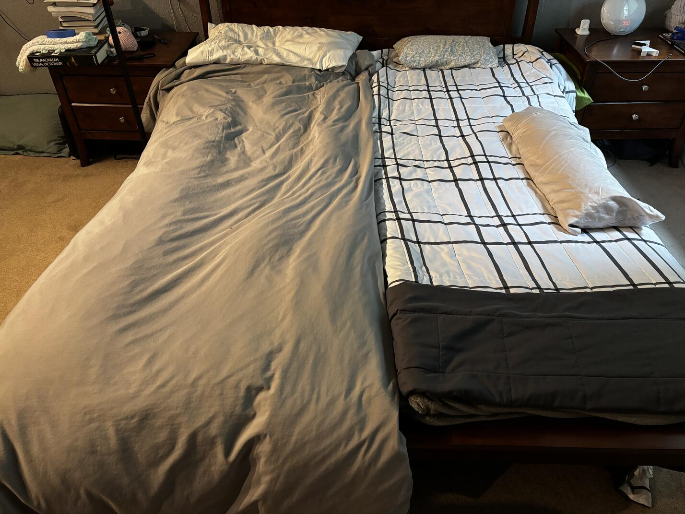

My wife and I weren't sleeping well. Our four-year-old mattress quickly formed hip dents, despite every-other-week rotation. We each preferred different firmnesses and bedding warmths, too, but the ~$1,600 base price of adjustable mattresses was unappealing.

While procrastinating on that, I had a weird idea: Could I sleep better on a camping pad, if I got it "just right"? I wasn't sleeping well anyway, so I decided to find out.

I set up an [Exped MegaMat](https://www.expedusa.com/products/megamat?variant=47704145363161) next to our bed. I tried to judge "just right" bedding and inflation, and slept a few nights on it to see if I would acclimate. I didn't. The warmth was a lot better, but my back still ached each morning. My Apple Watch showed lots of interruptions, and that's how I felt.

I decided to test inflation levels systematically. I needed an inflation level which worked on both my side and stomach. On my side, my spine can't be curved sideways too much. On my stomach, it can't be too arched or too flat. 

I started at the "neutral" level the pad self-inflates to if left open. I tried a night on that, then added five pumps with the included hand pump each night. N+10 and N+15 were both quite good. I tested more precisely, and settled on N+11. After a rough week of testing, I had my first few nights with no aching back and much higher sleep scores (94, 95, 96). Awesome! 

I didn't want to sleep on the floor forever. Fortunately, the [MegaMat Long X-Wide](https://www.expedusa.com/products/megamat?variant=47704145363161) is half of queen size (77.6" x 30.3" vs. 80" x 60"). We bought two from REI on sale ($200 each), and put them side-by-side in our bedframe. Underneath, we have a layer of plywood for support, and a layer of EVA foam tiles (gym floor mats) to protect the pads from splinters and be softer if we "bottom out".

Three months in, I never wake up with lower back pain anymore. I still need to avoid late-night carbs and get my hydration right, but I hit my first perfect sleep score on the pad.

Like an adjustable mattress, we each set our own firmness. The pads are isolated enough that we don't feel each other moving. We can incline each side separately with foam layers underneath.

We even brought them on our last trip and replicated our home setup where we were staying. Our next camping trip should be the best we've ever slept in a tent.

We don't know how long the pads will last, but there are no springs or thick foam to wear out. Exped has a [five year warranty](https://www.expedusa.com/pages/warranty-and-repairs), too. The two pads also cost only 1/4 as much as a "base model" adjustable mattress. We got 4" thick MegaMats, but Exped has a 6" version, too.

If you're struggling with bed firmness, or just want to sleep better the next time you camp, getting a nice sleeping pad and systematically testing inflation might be worth a try!

