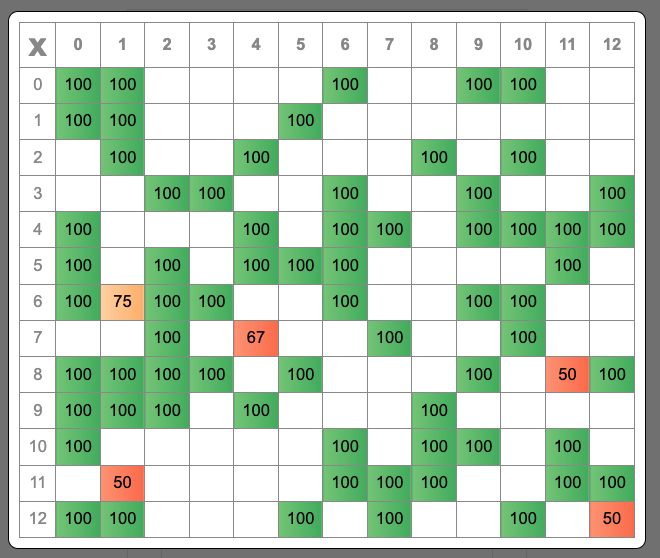

# Math Facts

[MathFacts](https://relentlessoptimizer.com/math) is a free, ad-free, privacy respecting app to help kids practice math facts. 

* Supports addition, subtraction, multiplication, and division.
* Low stress - no timer, no response to wrong answers.
* Motivating with sounds, animation, a goal bar, and a practice calendar.
* Problems you had trouble with are given again to finish your daily goal.
* Identify struggles and improve with local-only telemetry.
* Use 'Share' to send your practice record to your teacher easily.

## Sending a Link

You can pass the operation to practice, the daily goal, and the sound volume in the link to MathFacts to get your students to the right settings instantly.

| Purpose | Name | Value | Example |
| ------- | ---- | ----- | ------- |
| Operation | o | + - x ÷ | o=÷ |
| Daily Goal | g | 10, 20, ... 100 | g=40 |
| Volume [%] | v | 0-100 | v=0 |
| Lower Operand  | l | Single Number or Low-High | l=2 |
| Upper Operand  | u | Single Number or Low-High | u=10 |

Operands are also restricted by operation: 0-12 for addition and multiplication, 1-12 for division, 0-20 for subtraction.

### Examples 
60 multiplication problems per day with sound off (0%):
https://relentlessoptimizer.com/math?g=60&o=x&v=0

Practice subtract 2 facts under 10. (2 - 2, 3 - 2, 4 - 2, ..., 10 - 2)
https://relentlessoptimizer.com/math?o=-&l=2&u=2-10

Practice divide by 3 facts within 30. (10 x 3)
https://relentlessoptimizer.com/math?o=÷&l=3&u=3-10


## Telemetry

MathFacts tracks how you're doing to help you to improve. Tracking is stored only in your browser - it's for you only.

### Speed (Speedometer Icon)

Click the Speedometer icon to see how fast you were at solving each problem. Your median time (in seconds) to solve each problem is shown. 


In this table, it took me a median of 4.9 seconds to answer 2 x 5. (The column for '2' and row for '5'). I haven't been asked 5 x 2 yet (column '5', row '2' is blank).

Times under two seconds are dark green. 2-3 seconds are lighter green. 3-6 seconds are orange. Longer times are red. There are 169 possible problems in the 0-12 set, so it will take a while for every problem to be asked.

This table is for multiplication, as shown by the 'x' in the top left corner. Click top left 'x' to see telemetry for the other math operations.

### Accuracy (Checkmark Icon)

Click the checkmark icon to see accuracy telemetry. The table shows my "correct the first time" percentage for each problem.



This table shows that I got "1 x 6" correct only 75% of the time. (Looking at the column "1", row "6"). I have not been asked "6 x 1" yet, because the cell in column "6", row "1" is empty.

For each problem given, when the answer box has the right number of digits in it, the problem is considered right or wrong based on the number in the answer box. Only the first attempt is counted each time a problem is given.

It's easy to get problems wrong by mis-typing, so accuracy data won't be meaningful until a large number of problems have been solved.

## 'Share' Icon Reference

The 'Share' button generates text like this:

```
2022-09-12 | 40 | +

📅
⬛⬛⬛🟨⬛🟨⬛
⬛⬛

🎯 🟦🟦🟨🟦🟩🟩🟨🟦🟦🟦🟩🟩🟦
⚡ 🟦🟦🟦🟦🟦🟦🟦🟦🟦🟦🟦🟩🟦
```

This is designed to be something you can email to a teacher to quickly show proof of practice time and to give your teacher a very brief summary of your speed and accuracy over the last two weeks. Sending an email or photo of your results makes it easy to send them to your teacher without anyone having to create accounts or manage passwords.

Here is what each part of the report means:

### Top Line

```
2022-09-12: The report was generated on September 12th, 2022.
40: The current goal (problems per day) is 40.
+: The current operation being practiced is addition.
```

### 📅 Shows work on this device in the last two weeks.
```
⬛: No goals reached. (< 40 problems solved)
🟧: 1x Goal Reached (40 problems; 'Bronze').
⬜: 2x Goal Reached (80 problems; 'Silver').
🟨: 3x Goal Reached (120 problems; 'Gold').
```
In the above example, I did at least 120 problems last Wednesday and Friday.


### 🎯 Accuracy per Group \[0-12\]

The first box is for zero facts (N+0 and 0+N). The second is for one facts (N+1, 1+N), all the way up to 12.

```
⬛: No problems done for group
🟦: >= 95% correct
🟩: >= 90% correct
🟨: >= 75% correct
🟥: < 75% correct
```
Some answers will be incorrect just due to typing errors. Each problem given is marked "initially incorrect" if the first answer with the right number of digits was not the correct answer. (So, "4 x 3" is incorrect if the first time two digits are in the answer box, the value wasn't "12".)

The example above shows accuracy between 75% and 90% for +2 facts and +6 facts, though in my case, they were just typing mistakes.


### ⚡ Speed per Group \[0-12\]

The first box is for zero facts (N+0 and 0+N). The second is for one facts (N+1, 1+N), all the way up to 12.
The 75th percentile time-to-correct-answer is chosen. This indicates how quickly the student solved most problems for the fact group.

```
⬛: No problems done for group
🟦: Under two seconds
🟩: Under three seconds
🟨: Under six seconds
🟥: Longer
```
The example above shows that all groups were solved in under two seconds except +11 facts, which took between two and three seconds.


## US "Common Core" Math Fact Standards

http://www.corestandards.org/Math/Content/OA/

"2.OA.B.2
Fluently add and subtract within 20 using mental strategies. By end of Grade 2,
know from memory **all sums of two one-digit numbers**."

"3.OA.C.7 
Fluently multiply and divide within 100, using strategies such as the relationship
between multiplication and division (e.g., knowing that 8 × 5 = 40, one knows 40
÷ 5 = 8) or properties of operations. By the end of Grade 3, know from memory
**all products of two one-digit numbers.**"

---

## Attribution

All sounds are from http://www.freesoundslibrary.com, some with (slight) editing.
License: Attribution 4.0 International (CC BY 4.0).

Icons are from https://fonts.google.com/icons.
LICENSE: Apache License 2.0 [http://www.apache.org/licenses/LICENSE-2.0]

## Cheat Sheet

#### Audio Transcoding

'MPG Air Horn' from http://www.freesoundslibrary.com
Transcoding: ffmpeg -i \<inFile\> -c:a mp3 -b:a 96k -ac 1 \<outFile\>
-t 00:00:01 [transcode from start offset; place before -i argument]
-ss 00:00:05 [transcode this duration]

#### Bundle \[sort of\]

```
  npm install parcel
  parcel build --public-url ./ index.html

Make an all-inlined version:
---
  <script type="module">
    import value from "./math-facts.js";
    console.log(value);
  </script>
  <style>
    @import "./math-facts.css";
  </style>
```